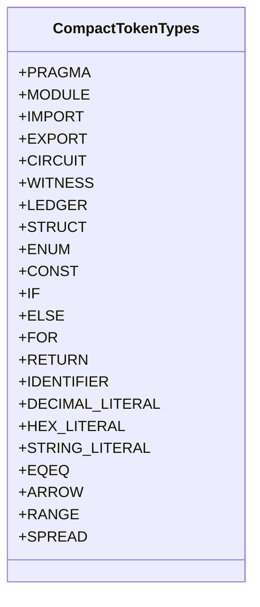
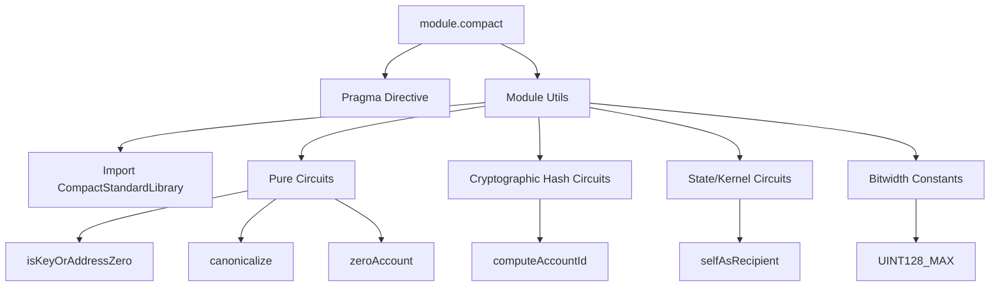

# Software Requirements Specification (SRS)
## Compact Smart Contract Language: Lexical, Syntactic, and Semantic Grammar Specification

**Document Identifier:** SRS-COMPACT-LANG-2026-V1  
**Target Language:** Compact (Midnight Network DSL for Zero-Knowledge Smart Contracts)  
**Specification Baseline:** Compact Language Reference v0.26.x / Midnight Network  
**Primary Reference Sample:** [`module.compact`](file:///C:/Users/shaki/IdeaProjects/midnight-plugin/module.compact)  
**Status:** Approved / Comprehensive Technical Specification  

---

## Table of Contents
1. [Introduction](#1-introduction)
   - 1.1 Purpose
   - 1.2 Scope & Target Audience
   - 1.3 System Overview: The Midnight Compact Paradigm
   - 1.4 Definitions, Acronyms, and Abbreviations
2. [Lexical Specification (Tokens & Symbols)](#2-lexical-specification-tokens--symbols)
   - 2.1 Character Set, Whitespace & Comments
   - 2.2 Identifiers and Naming Rules
   - 2.3 Comprehensive Keyword Inventory
   - 2.4 Built-in Primitive & Composite Types
   - 2.5 Literal Tokens
   - 2.6 Operators and Punctuation Symbols
   - 2.7 Complete Token Type Enumeration Table
3. [Syntactic Grammar Specification (Formal EBNF)](#3-syntactic-grammar-specification-formal-ebnf)
   - 3.1 Program Structure & Directives (`pragma`, `include`)
   - 3.2 Modularization (`module`, `import`, `export`)
   - 3.3 Type Declarations (`struct`, `enum`, `type` alias)
   - 3.4 State Declarations (`ledger`, `witness`)
   - 3.5 Behavioral Routines (`circuit`, `constructor`, `external`)
   - 3.6 Statements & Control Flow (`if`, `for`, `return`, `const`)
   - 3.7 Expressions & Operator Precedence Ladder
   - 3.8 Pattern Matching & Parameter Lists
   - 3.9 Generics System (`#N` Nat vs `T` Type)
4. [Deep-Dive Case Study: Dissection of `module.compact`](#4-deep-dive-case-study-dissection-of-modulecompact)
   - 4.1 Header Pragmas & Documentation Comments
   - 4.2 Module Encapsulation & Standard Library Imports
   - 4.3 Pure Circuits, Return Types, and Ternary Branching
   - 4.4 Sum Types (`Either<L, R>`) & Structural Instantiation
   - 4.5 Builtin Cryptographic & Runtime Intrinsic Invocations
   - 4.6 Large Hexadecimal Literals & Bit-Width Constants
   - 4.7 Lexeme-to-Token Concrete Trace Table
5. [Tooling & Compiler Construction Requirements](#5-tooling--compiler-construction-requirements)
   - 5.1 Lexer Implementation Requirements
   - 5.2 Parser Implementation & AST Construction Requirements
   - 5.3 Symbol Resolution & Scoping Requirements
   - 5.4 Error Resynchronization & Diagnostics Requirements
6. [Verification Matrix & Acceptance Criteria](#6-verification-matrix--acceptance-criteria)

---

## 1. Introduction

### 1.1 Purpose
This Software Requirements Specification (SRS) defines the formal lexical, syntactic, and structural requirements for the **Compact programming language**. It serves as an authoritative, self-contained reference for language engineers, compiler developers, static analysis authors, and IDE tooling contributors who need to construct:
1. **Lexical Scanners** (tokenizers generating typed token streams).
2. **Syntactic Parsers** (recursive-descent, LALR, PEG, or Grammar-Kit engines).
3. **AST / PSI Node Hierarchies** (syntax trees representing declarations, expressions, and statements).
4. **Symbol Indexers & Type Checkers** (lexical scope traversal, name binding, and type verification).

### 1.2 Scope & Target Audience
This specification covers the full grammar surface of Compact contracts running on the Midnight privacy blockchain, with explicit focus on practical contract authoring demonstrated in production files such as [`module.compact`](file:///C:/Users/shaki/IdeaProjects/midnight-plugin/module.compact). This document is intended for technical presentations, stakeholder reviews, toolchain design meetings, and developer onboarding.

### 1.3 System Overview: The Midnight Compact Paradigm
Compact is a statically-typed domain-specific language designed specifically for the **Midnight blockchain network**. Unlike conventional smart contract languages (e.g., Solidity, Move), Compact bridges two computational domains:
- **Off-Chain Private Computation (Witnesses & Private Circuits):** Computes proofs over private user data using zero-knowledge cryptography without disclosing raw inputs.
- **On-Chain Public Consensus (Ledger State & Public Circuits):** Updates immutable state preserved on the blockchain ledger.

Key architectural characteristics:
- **Zero-Knowledge Circuits:** Declared via `circuit` and `pure circuit`.
- **Private Witness Inputs:** Queried off-chain via `witness`.
- **Sealed Ledger State:** Persistent contract data declared with `ledger` or `sealed ledger`.
- **Strict Determinism:** Bounded loops (`for (const i of start..end)`), restricted recursion, explicit bit-widths (`Uint<N>`, `Bytes<N>`), and total functions.

### 1.4 Definitions, Acronyms, and Abbreviations
- **AST:** Abstract Syntax Tree.
- **BNF / EBNF:** Backus-Naur Form / Extended Backus-Naur Form.
- **Circuit:** A verifiable computation compiled into arithmetic constraints (R1CS/Plonk).
- **DSL:** Domain-Specific Language.
- **PSI:** Program Structure Interface (IntelliJ IDEA's semantic AST model).
- **Pure Circuit:** A circuit that does not read or mutate on-chain ledger state.
- **Witness:** An oracle or client-side secret provider supplying private data into a zero-knowledge proof.

---

## 2. Lexical Specification (Tokens & Symbols)

The lexical analyzer converts raw UTF-8 Compact source files into discrete tokens.

### 2.1 Character Set, Whitespace & Comments

```text
Source Text -> [ Whitespace / Comment Stripper ] -> Token Stream (IElementType)
```

1. **Character Encoding:** Source files must be valid UTF-8 encoded text.
2. **Whitespace:** Horizontal tab (`\t`), space (`0x20`), carriage return (`\r`), and line feed (`\n`) serve as token separators and are classified as `WHITE_SPACE`. Whitespace is not syntactically significant except as a separator.
3. **Line Comments:** Begin with `//` and extend to the end of the line:
   ```compact
   // SPDX-License-Identifier: MIT
   // OpenZeppelin Compact Contracts v0.4.0-alpha.1
   ```
4. **Block Comments:** Begin with `/*` and terminate with `*/`. Can span multiple lines:
   ```compact
   /**
    * @module Utils
    * @description A library for common utilities used in Compact contracts.
    */
   ```
5. **Lexical Error Handling:**
   - `UNTERMINATED_STRING`: String literal missing closing quote before end of line/file.
   - `UNTERMINATED_BLOCK_COMMENT`: Block comment lacking matching `*/` before EOF.
   - `BAD_CHARACTER`: Any character not conforming to Compact's lexical alphabet.

---

### 2.2 Identifiers and Naming Rules

Compact follows standard TypeScript/JavaScript identifier grammar:

```ebnf
LETTER       ::= [A-Za-z]
DIGIT        ::= [0-9]
IDENT_START  ::= LETTER | "_" | "$"
IDENT_PART   ::= LETTER | DIGIT | "_" | "$"
IDENTIFIER   ::= IDENT_START (IDENT_PART)*
```

**Conventions:**
- **Types, Structs, Enums, Contracts, Modules:** `PascalCase` (e.g., `ContractAddress`, `ZswapCoinPublicKey`, `Utils`, `Either`).
- **Circuits, Witnesses, Variables, Parameters:** `camelCase` (e.g., `isKeyOrAddressZero`, `keyOrAddress`, `secretKey`).
- **Global Constants:** `UPPER_SNAKE_CASE` (e.g., `UINT128_MAX`).
- **Generic Nat Parameters:** Preceded by `#` in declarations (e.g., `<#N, T>`).

---

### 2.3 Comprehensive Keyword Inventory

Compact keywords are strictly reserved words. They are partitioned into functional domains:

#### 2.3.1 Module & Compilation Directives
| Keyword | Category | Syntactic Function / Role |
| :--- | :--- | :--- |
| `pragma` | Directive | Compiler version constraints (`pragma language_version >= 0.26.0;`). |
| `include` | File inclusion | Merges declaration scope from an external `.compact` file. |
| `module` | Modularization | Scoped encapsulation namespace (`module Utils { ... }`). |
| `import` | Import | Brings declarations from modules or files into local scope. |
| `export` | Export | Exposes declarations or modules outside their enclosing scope. |
| `from` | Import helper | Designates source module in selective imports (`import { X } from Y;`). |
| `prefix` | Import modifier | Namespaces imported symbols (`import Lib prefix lib_;`). |

#### 2.3.2 Contract & Zero-Knowledge Declarations
| Keyword | Category | Syntactic Function / Role |
| :--- | :--- | :--- |
| `circuit` | Routine | Declares a zero-knowledge arithmetic circuit. |
| `pure` | Modifier | Annotates a circuit that has no ledger state access or side effects. |
| `witness` | Routine | Declares a client-side oracle supplying private ZK inputs. |
| `ledger` | State | Declares persistent on-chain public state variables. |
| `sealed` | State modifier | Marks ledger state writeable only within constructor / initialization. |
| `constructor`| Routine | Special initializer routine executing upon contract deployment. |
| `contract` | Interface/Decl | Declares an external contract interface. |
| `implements` | Conformance | Binds a contract to an interface (`contract implements IToken;`). |
| `external` | Decl modifier | Declares foreign contract callable definitions. |

#### 2.3.3 Type System & Data Definition
| Keyword | Category | Syntactic Function / Role |
| :--- | :--- | :--- |
| `struct` | Data definition | Heterogeneous composite product type (`struct Point { x: Uint<32>; }`). |
| `enum` | Data definition | Enumerated finite sum type (`enum State { Ready, Pending }`). |
| `type` | Type alias | Aliases existing or generic types (`type Id = Bytes<32>;`). |
| `new` | Type modifier | Defines a nominal newtype distinct from underlying representation. |
| `as` | Type cast | Explicit type casting/coercion operator (`expr as TargetType`). |

#### 2.3.4 Statements & Control Flow
| Keyword | Category | Syntactic Function / Role |
| :--- | :--- | :--- |
| `const` | Binding | Immutable local variable declaration (`const zero = default<T>;`). |
| `if` | Branching | Conditional execution branch (`if (condition) { ... }`). |
| `else` | Branching | Alternate conditional execution branch. |
| `for` | Iteration | Bounded iteration loop (`for (const i of 0..10)`). |
| `of` | Iteration helper | Binds element or counter in `for` loops. |
| `return` | Routine control| Returns a value or terminates circuit execution. |

#### 2.3.5 Builtin Expression Keywords & Runtime Primitives
| Keyword | Category | Syntactic Function / Role |
| :--- | :--- | :--- |
| `default` | Intrinsic | Instantiates the canonical default value for a type (`default<T>`). |
| `assert` | Constraint | Asserts boolean invariant; fails proof/tx on false (`assert(x > 0, "err")`). |
| `disclose` | Privacy boundary| Explicitly publishes private witness data into public output. |
| `emit` | Ledger event | Emits an off-chain verifiable notification event. |
| `pad` | Intrinsic | Right-pads a string/bytes literal to a fixed bit length. |
| `slice` | Intrinsic | Extracts fixed-size sub-slice from a vector or bytes. |
| `map` | Functional | Maps a pure function over a Vector. |
| `fold` | Functional | Accumulates a Vector into a single scalar value. |

#### 2.3.6 Reserved Keywords (Prohibited as Identifiers)
To guarantee future compatibility with TypeScript and EVM tooling, Compact reserves the following tokens:
```text
await, break, case, catch, class, continue, debugger, delete, do, extends, finally,
function, interface, let, null, package, private, protected, public, static, super,
switch, this, throw, try, typeof, var, void, while, with, yield, argument, eval,
event, in, instanceof
```

---

### 2.4 Built-in Primitive & Composite Types

Compact provides built-in first-class types tailored for zero-knowledge arithmetic:

```ebnf
BuiltinType ::= "Boolean"
              | "Field"
              | "JubjubScalar"
              | "Secp256k1Base"
              | "Secp256k1Scalar"
              | "Uint" "<" NatLiteral ( ".." NatLiteral )? ">"
              | "Bytes" "<" NatLiteral ">"
              | "Opaque" "<" StringLiteral ">"
              | "Vector" "<" NatLiteral "," Type ">"
              | "[" ( Type ( "," Type )* ","? )? "]"
```

#### Detailed Built-in Type Descriptions
| Built-in Type | Syntax Example | Meaning & Zero-Knowledge Role |
| :--- | :--- | :--- |
| `Boolean` | `Boolean` | Canonical truth value (`true` or `false`), represented as 1-bit boolean constraint. |
| `Field` | `Field` | Native cryptographic scalar field element of the Midnight curve (BLS12-381 / Jubjub). |
| `Uint<N>` | `Uint<128>`, `Uint<32>` | Unsigned integer bounded strictly to $2^N - 1$. Emits range-check constraints. |
| `Uint<Min..Max>` | `Uint<1..100>` | Unsigned integer restricted to a specific minimum and maximum range. |
| `Bytes<N>` | `Bytes<32>` | Fixed-size byte array of exactly $N$ octets. Standard for cryptographic hashes/keys. |
| `Opaque<"name">` | `Opaque<"string">` | Host-level opaque handle (used for foreign interfaces, strings, or host types). |
| `Vector<N, T>` | `Vector<1, Bytes<32>>`| Fixed-length homogeneous vector of $N$ elements of type $T$. |
| `Tuple` | `[Uint<32>, Boolean]` | Fixed-size heterogeneous product of ordered types. |
| `JubjubScalar` | `JubjubScalar` | Scalar field element for the Jubjub twisted Edwards curve (Schnorr signatures). |
| `Secp256k1Base` | `Secp256k1Base` | Base field element for the Secp256k1 curve (Bitcoin/Ethereum compatibility). |
| `Secp256k1Scalar`| `Secp256k1Scalar` | Scalar field element for Secp256k1 ECDSA signatures. |

---

### 2.5 Literal Tokens

1. **Boolean Literals:** `true`, `false`.
2. **Decimal Literals:** Unsigned base-10 integers: `0`, `42`, `1000`.
3. **Hexadecimal Literals:** Base-16 values with `0x` or `0X` prefix:
   ```compact
   0xFFFFFFFFFFFFFFFFFFFFFFFFFFFFFFFF   // Used in module.compact for UINT128_MAX
   0x1a4F
   ```
4. **Binary Literals:** Base-2 values with `0b` or `0B` prefix: `0b101010`.
5. **Octal Literals:** Base-8 values with `0o` or `0O` prefix: `0o755`.
6. **String Literals:** UTF-8 characters delimited by double or single quotes:
   ```compact
   "string"
   'utils/Utils.compact'
   ```
7. **Version Literals:** SemVer numbers in `pragma` statements: `0.26.0`, `1.2`, `2`.

---

### 2.6 Operators and Punctuation Symbols

Operators are matched using **maximal munch** (longest operator matched first):

| Symbol | Token Identifier | Lexical Category | Precedence & Usage |
| :--- | :--- | :--- | :--- |
| `...` | `SPREAD` | Array/Struct Ellipsis | Struct spreading / tuple unpack |
| `..` | `RANGE` | Range operator | Loop bounds (`0..10`), Uint bounds (`Uint<0..10>`) |
| `=>` | `ARROW` | Lambda Arrow | Anonymous functions & closures (`(x) => x + 1`) |
| `+=` | `PLUS_ASSIGN` | Assignment | Compound addition assignment (`state += 1`) |
| `-=` | `MINUS_ASSIGN` | Assignment | Compound subtraction assignment (`balance -= 10`) |
| `==` | `EQEQ` | Relational | Structural equality comparison (`a == b`) |
| `!=` | `NOTEQ` | Relational | Inequality comparison (`a != b`) |
| `<=` | `LTE` | Relational | Less-than or equal (`x <= 100`) |
| `>=` | `GTE` | Relational | Greater-than or equal (`version >= 0.26.0`) |
| `&&` | `ANDAND` | Logical | Logical short-circuit AND (`cond1 && cond2`) |
| `\|\|` | `OROR` | Logical | Logical short-circuit OR (`cond1 \|\| cond2`) |
| `=` | `ASSIGN` | Assignment | Variable assignment or struct default (`x = 5`) |
| `+` | `PLUS` | Arithmetic | Addition |
| `-` | `MINUS` | Arithmetic | Subtraction |
| `*` | `STAR` | Arithmetic | Multiplication |
| `/` | `SLASH` | Arithmetic | Division |
| `%` | `PERCENT` | Arithmetic | Modulo |
| `<` | `LT` | Relational / Bracket| Less-than (`a < b`) or Generic opener (`Vector<`) |
| `>` | `GT` | Relational / Bracket| Greater-than (`a > b`) or Generic closer (`>`) |
| `!` | `NOT` | Logical | Logical negation (`!is_left`) |
| `.` | `DOT` | Member Access | Struct field / circuit access (`val.left`, `kernel.self()`) |
| `?` | `QUESTION` | Ternary | Conditional selector (`cond ? a : b`) |
| `:` | `COLON` | Punctuation | Type annotation (`val: Type`) / Ternary branch |
| `(` | `LPAREN` | Delimiter | Parameter list / expression group opener |
| `)` | `RPAREN` | Delimiter | Parameter list / expression group closer |
| `{` | `LBRACE` | Delimiter | Block / Struct body opener |
| `}` | `RBRACE` | Delimiter | Block / Struct body closer |
| `[` | `LBRACKET` | Delimiter | Vector literal / Tuple index opener |
| `]` | `RBRACKET` | Delimiter | Vector literal / Tuple index closer |
| `,` | `COMMA` | Separator | Argument / list separator |
| `;` | `SEMICOLON` | Terminator | Statement terminator |
| `#` | `HASH` | Macro / Nat prefix | Natural number generic parameter (`<#N>`) |

---

### 2.7 Complete Token Type Enumeration Table



---

## 3. Syntactic Grammar Specification (Formal EBNF)

This section specifies the formal context-free grammar of Compact.

### 3.1 Program Structure & Directives

A Compact program consists of zero or more top-level declarations:

```ebnf
program ::= program_element* EOF

program_element ::= pragma_form
                  | module_definition
                  | import_form
                  | export_form
                  | include_form
                  | struct_declaration
                  | enum_declaration
                  | contract_declaration
                  | implements_declaration
                  | type_alias_declaration
                  | ledger_declaration
                  | external_declaration
                  | witness_declaration
                  | constructor_definition
                  | circuit_definition

pragma_form ::= "pragma" IDENTIFIER version_expr ";"

version_expr ::= version_expr0 ( "||" version_expr0 )*
version_expr0 ::= version_term ( "&&" version_term )*
version_term ::= version_atom
               | "!" version_atom
               | "<" version_atom
               | "<=" version_atom
               | ">=" version_atom
               | ">" version_atom
               | "(" version_expr ")"

version_atom ::= VERSION_LITERAL | nat_literal

include_form ::= "include" STRING_LITERAL ";"
```

---

### 3.2 Modularization (`module`, `import`, `export`)

```ebnf
module_definition ::= "export"? "module" IDENTIFIER gparams? "{" program_element* "}"

import_form ::= "import" import_selection? import_name gargs? import_prefix? ";"

import_selection ::= "{" ( import_element ( "," import_element )* ","? )? "}" "from"

import_element ::= IDENTIFIER ( "as" IDENTIFIER )?

import_name ::= IDENTIFIER | STRING_LITERAL

import_prefix ::= "prefix" IDENTIFIER

export_form ::= "export" "{" ( IDENTIFIER ( "," IDENTIFIER )* ","? )? "}" ";"?
```

---

### 3.3 Type Declarations

```ebnf
struct_declaration ::= "export"? "struct" IDENTIFIER gparams? "{" struct_body? "}" ";"?

struct_body ::= typed_id ( ";" typed_id )* ";"?
              | typed_id ( "," typed_id )* ","?

enum_declaration ::= "export"? "enum" IDENTIFIER "{" IDENTIFIER ( "," IDENTIFIER )* ","? "}" ";"?

type_alias_declaration ::= "export"? "new"? "type" IDENTIFIER gparams? "=" type_expression ";"

typed_id ::= IDENTIFIER ":" type_expression
```

---

### 3.4 State Declarations (`ledger`, `witness`)

```ebnf
ledger_declaration ::= "export"? "sealed"? "ledger" IDENTIFIER ":" type_expression ";"

witness_declaration ::= "export"? "witness" IDENTIFIER gparams? simple_parameter_list ":" type_expression ";"
```

---

### 3.5 Behavioral Routines (`circuit`, `constructor`, `external`)

```ebnf
circuit_definition ::= "export"? "pure"? "circuit" IDENTIFIER gparams? pattern_parameter_list ":" type_expression block

constructor_definition ::= "constructor" pattern_parameter_list block

external_declaration ::= "export"? "external" IDENTIFIER gparams? simple_parameter_list ":" type_expression ";"

contract_declaration ::= "export"? "contract" IDENTIFIER "{" contract_body? "}" ";"?

contract_body ::= external_contract_circuit ( ";" external_contract_circuit )* ";"?
                | external_contract_circuit ( "," external_contract_circuit )* ","?

external_contract_circuit ::= "pure"? "circuit" IDENTIFIER simple_parameter_list ":" type_expression

implements_declaration ::= "contract" "implements" type_expression ";"
```

---

### 3.6 Statements & Control Flow

```ebnf
block ::= "{" stmt* "}"

stmt ::= stmt0
       | "if" "(" expr_seq ")" stmt

stmt0 ::= "const" cbinding ( "," cbinding )* ";"
        | "if" "(" expr_seq ")" stmt0 "else" stmt
        | "for" "(" "const" IDENTIFIER "of" tsize ".." tsize ")" stmt
        | "for" "(" "const" IDENTIFIER "of" expr_seq ")" stmt
        | "return" expr_seq? ";"
        | block
        | expr_seq ";"

cbinding ::= optionally_typed_pattern "=" expr

optionally_typed_pattern ::= pattern ( ":" type_expression )?
```

---

### 3.7 Expressions & Operator Precedence Ladder

Compact expressions are structured into a 10-level operator precedence chain:

```text
Precedence 0 (Lowest) : Assignment (=, +=, -=) & Ternary (? :) [Right-Associative]
Precedence 1          : Logical OR (||) [Left-Associative]
Precedence 2          : Logical AND (&&) [Left-Associative]
Precedence 3          : Equality (==, !=) [Left-Associative]
Precedence 4          : Relational (<, <=, >, >=) [Non-Associative]
Precedence 5          : Type Cast (as) [Left-Associative]
Precedence 6          : Additive (+, -) [Left-Associative]
Precedence 7          : Multiplicative (*, /, %) [Left-Associative]
Precedence 8          : Prefix Unary (!, -) [Right-Associative]
Precedence 9 (Highest): Postfix (call (), member .x, index [], struct { ... })
```

#### EBNF Representation:
```ebnf
expr_seq ::= expr ( "," expr )*

expr ::= expr0 ( "?" expr ":" expr
               | "=" expr
               | "+=" expr
               | "-=" expr )?

expr0 ::= expr1 ( "||" expr1 )*
expr1 ::= expr2 ( "&&" expr2 )*
expr2 ::= expr3 ( ( "==" | "!=" ) expr3 )*
expr3 ::= expr4 ( ( "<" | "<=" | ">=" | ">" ) expr4 )?
expr4 ::= expr5 ( "as" type_expression )*
expr5 ::= expr6 ( ( "+" | "-" ) expr6 )*
expr6 ::= expr7 ( ( "*" | "/" | "%" ) expr7 )*
expr7 ::= "!" expr7 | expr8
expr8 ::= expr8 "[" expr "]"
        | expr8 "." IDENTIFIER ( "(" ( expr ( "," expr )* ","? )? ")" )?
        | expr9

expr9 ::= fun "(" ( expr ( "," expr )* ","? )? ")"
        | "map" "(" fun "," expr ( "," expr )* ","? ")"
        | "fold" "(" fun "," expr "," expr ( "," expr )* ","? ")"
        | "slice" "<" tsize ">" "(" expr "," expr ")"
        | "[" ( tuple_arg ( "," tuple_arg )* ","? )? "]"
        | "Bytes" "[" ( tuple_arg ( "," tuple_arg )* ","? )? "]"
        | tref "{" ( struct_arg ( "," struct_arg )* ","? )? "}"
        | "assert" "(" expr "," STRING_LITERAL ")"
        | "emit" "(" expr ")"
        | "disclose" "(" expr ")"
        | term

term ::= IDENTIFIER
       | "true"
       | "false"
       | nat_literal
       | STRING_LITERAL
       | "pad" "(" nat_literal "," STRING_LITERAL ")"
       | "default" "<" type_expression ">"
       | "(" expr_seq ")"

tuple_arg ::= "..."? expr
struct_arg ::= ( IDENTIFIER ":" )? expr | "..." expr

fun ::= IDENTIFIER gargs?
      | arrow_param_list ( ":" type_expression )? "=>" ( block | expr )
      | "(" fun ")"
```

---

### 3.8 Pattern Matching & Parameter Lists

```ebnf
pattern ::= IDENTIFIER
          | "[" ( pattern? ( "," pattern? )* ","? )? "]"
          | "{" ( pattern_struct_elt ( "," pattern_struct_elt )* ","? )? "}"

pattern_struct_elt ::= IDENTIFIER ( ":" pattern )?

simple_parameter_list ::= "(" ( typed_id ( "," typed_id )* ","? )? ")"

pattern_parameter_list ::= "(" ( typed_pattern ( "," typed_pattern )* ","? )? ")"

typed_pattern ::= pattern ":" type_expression
```

---

### 3.9 Generics System (`#N` Nat vs `T` Type)

Compact distinguishes two kinds of generic parameters:
1. **Type-Valued Parameters (`T`):** Binds to any Compact type (`canonicalize<T1, T2>`).
2. **Nat-Valued Parameters (`#N`):** Preceded by `#`, binds strictly to compile-time natural numbers (`Vector<#N, T>` or `Bytes<#Size>`).

```ebnf
gparams ::= "<" ( generic_param ( "," generic_param )* ","? )? ">"
generic_param ::= "#" IDENTIFIER | IDENTIFIER

gargs ::= "<" ( garg ( "," garg )* ","? )? ">"
garg ::= nat_literal | type_expression
```

---

## 4. Deep-Dive Case Study: Dissection of `module.compact`

The contract [`module.compact`](file:///C:/Users/shaki/IdeaProjects/midnight-plugin/module.compact) illustrates production Compact code. Below is a comprehensive architectural analysis mapping every construct to its formal specification.



---

### 4.1 Header Pragmas & Documentation Comments

```compact
// SPDX-License-Identifier: MIT
// OpenZeppelin Compact Contracts v0.4.0-alpha.1 (utils/Utils.compact)

pragma language_version >= 0.26.0;

/**
 * @module Utils.
 * @description A library for common utilities used in Compact contracts.
 */
```

- `pragma language_version >= 0.26.0;`:
  - `PRAGMA`: Keyword token initiating compiler constraint.
  - `language_version`: `IDENTIFIER` naming the target compiler pragma.
  - `>=`: Relational operator token `GTE`.
  - `0.26.0`: `VERSION_LITERAL` token matching `{DECIMAL}(\.{DECIMAL})+`.
  - `;`: Statement terminator `SEMICOLON`.
- `/** ... */`: Doc-comment processed by the AST parser to attach documentation to `module Utils`.

---

### 4.2 Module Encapsulation & Standard Library Imports

```compact
module Utils {
  import CompactStandardLibrary;
```

- `module`: Initiates a modular namespace.
- `Utils`: `IDENTIFIER` giving the module its public symbol name.
- `{`: `LBRACE` opening the module element body.
- `import CompactStandardLibrary;`: Unqualified import loading the standard zero-knowledge utility library.

---

### 4.3 Pure Circuits, Return Types, and Ternary Branching

```compact
export pure circuit isKeyOrAddressZero(
keyOrAddress: Either<ZswapCoinPublicKey, ContractAddress>): Boolean {
  return isContractAddress(keyOrAddress)
  ? default<ContractAddress> == keyOrAddress.right : default<ZswapCoinPublicKey> == keyOrAddress.left;
}
```

- `export`: Exposes the circuit symbol outside module `Utils`.
- `pure`: Enforces that the circuit has **no read or write access to on-chain ledger state**. It is guaranteed to be a pure deterministic arithmetic function.
- `circuit`: Keyword declaring the zero-knowledge circuit boundary.
- `isKeyOrAddressZero`: Routine identifier.
- `keyOrAddress: Either<ZswapCoinPublicKey, ContractAddress>`: Parameter pattern typed as a generic sum type.
- `: Boolean`: Return type annotation specifying a 1-bit boolean constraint.
- `default<ContractAddress>`: `default` intrinsic generating the canonical zero/default representation.
- `? ... : ...`: Conditional ternary expression choosing the active branch verification without branching instructions in arithmetic circuits.

---

### 4.4 Sum Types (`Either<L, R>`) & Structural Instantiation

```compact
export pure circuit canonicalize<T1, T2>(
value: Either<T1, T2>): Either<T1, T2> {
  return value.is_left
  ? Either<T1, T2> { is_left: true, left: value.left, right: default<T2> } 
  : Either<T1, T2> { is_left: false, left: default<T1>, right: value.right };
}
```

- `<T1, T2>`: Declares generic type variables.
- `value.is_left`: Member access reading discriminator field `is_left`.
- `Either<T1, T2> { is_left: true, left: value.left, right: default<T2> }`:
  - Struct instantiation syntax `TypeReference { field1: val1, field2: val2 }`.
  - Canonicalizes inputs to prevent malleability attacks where unused branch fields carry payload.

---

### 4.5 Builtin Cryptographic & Runtime Intrinsic Invocations

```compact
export pure circuit computeAccountId(secretKey: Bytes<32>): Bytes<32> {
  return persistentHash<Vector<1, Bytes<32>>>([secretKey]);
}
```

- `secretKey: Bytes<32>`: 32-octet cryptographic secret.
- `[secretKey]`: Vector literal constructing a 1-element vector.
- `persistentHash<Vector<1, Bytes<32>>>`: Invocation of the Midnight Poseidon/Rescue persistent hashing intrinsic over a vector of bytes.

```compact
export circuit selfAsRecipient(): Either<ZswapCoinPublicKey, ContractAddress> {
  return right<ZswapCoinPublicKey, ContractAddress>(kernel.self());
}
```

- `export circuit` (omitting `pure`): Accesses the contract execution environment.
- `kernel.self()`: Intrinsic accessing the runtime kernel context to retrieve the current contract's on-chain address.
- `right<...>(...)`: Injects the contract address into the right variant of an `Either` sum type.

---

### 4.6 Large Hexadecimal Literals & Bit-Width Constants

```compact
export pure circuit UINT128_MAX(): Uint<128> {
  return 0xFFFFFFFFFFFFFFFFFFFFFFFFFFFFFFFF;
}
```

- `Uint<128>`: Primitive 128-bit unsigned integer type.
- `0xFFFFFFFFFFFFFFFFFFFFFFFFFFFFFFFF`: 32-character hexadecimal literal corresponding to $2^{128} - 1$ (16 bytes of `0xFF`).

---

### 4.7 Lexeme-to-Token Concrete Trace Table

Trace for lines 104-106 of [`module.compact`](file:///C:/Users/shaki/IdeaProjects/midnight-plugin/module.compact):
```compact
export pure circuit UINT128_MAX(): Uint<128> {
  return 0xFFFFFFFFFFFFFFFFFFFFFFFFFFFFFFFF;
}
```

| Line : Col | Raw Text Lexeme | Generated Token | PSI AST Node Mapped |
| :--- | :--- | :--- | :--- |
| 104:3 | `export` | `CompactTokenTypes.EXPORT` | `CompactCircuitDefinition` (Modifier) |
| 104:10 | `pure` | `CompactTokenTypes.PURE` | `CompactCircuitDefinition` (Modifier) |
| 104:15 | `circuit` | `CompactTokenTypes.CIRCUIT` | `CompactCircuitDefinition` (Keyword) |
| 104:23 | `UINT128_MAX` | `CompactTokenTypes.IDENTIFIER` | `CompactCircuitDefinition.getNameIdentifier()` |
| 104:34 | `(` | `CompactTokenTypes.LPAREN` | `CompactPatternParameterList` |
| 104:35 | `)` | `CompactTokenTypes.RPAREN` | `CompactPatternParameterList` |
| 104:36 | `:` | `CompactTokenTypes.COLON` | `CompactCircuitDefinition` (Return separator) |
| 104:38 | `Uint` | `CompactTokenTypes.UINT_TYPE` | `CompactBuiltinType` |
| 104:42 | `<` | `CompactTokenTypes.LT` | `CompactBuiltinType` (Generic bracket) |
| 104:43 | `128` | `CompactTokenTypes.DECIMAL_LITERAL` | `CompactBuiltinType` (Type size nat) |
| 104:46 | `>` | `CompactTokenTypes.GT` | `CompactBuiltinType` (Generic bracket) |
| 104:48 | `{` | `CompactTokenTypes.LBRACE` | `CompactBlock` |
| 105:5 | `return` | `CompactTokenTypes.RETURN` | `CompactReturnStmt` |
| 105:12 | `0xFFFFFFFFFFFFFFFFFFFFFFFFFFFFFFFF` | `CompactTokenTypes.HEX_LITERAL` | `CompactLiteralExpr` |
| 105:46 | `;` | `CompactTokenTypes.SEMICOLON` | `CompactReturnStmt` (Terminator) |
| 106:3 | `}` | `CompactTokenTypes.RBRACE` | `CompactBlock` (Closer) |

---

## 5. Tooling & Compiler Construction Requirements

### 5.1 Lexer Implementation Requirements
1. **Deterministic Scanning:** The lexer MUST be deterministic and backtrack-free.
2. **Maximal Munch Rule:** Multi-character tokens (`==`, `!=`, `<=`, `>=`, `=>`, `+=`, `-=`, `&&`, `||`, `..`, `...`) MUST be prioritized over single-character prefix operators (`=`, `!`, `<`, `>`, `+`, `-`, `.`).
3. **Number System Disambiguation:**
   - Radix prefixes (`0x`, `0b`, `0o`) MUST be matched before general decimal digits.
   - Semantic version literals (`0.26.0`) MUST be distinguished from numeric float access or range syntax.
4. **Resilience to Incomplete Input:**
   - Missing closing quotes or unterminated block comments must not trigger scanner crashes; they MUST emit `UNTERMINATED_STRING` or `UNTERMINATED_BLOCK_COMMENT`.

---

### 5.2 Parser Implementation & AST Construction Requirements
1. **Precedence Climbing:** Binary expressions MUST be parsed via precedence climbing across all 10 precedence levels to prevent left-recursive stack overflows.
2. **Error Resynchronization Anchors:**
   - When encountering a syntax error inside a declaration or block, the parser MUST advance until encountering a synchronization anchor:
   ```text
   TOP_LEVEL_RECOVERY = { pragma, include, import, export, module, circuit, struct, enum, contract, type, ledger, witness, constructor, ; }
   ```
3. **EDT Progress Guarantee:** Loops consuming statements or declarations MUST verify that `builder.getCurrentOffset() > startOffset` on each iteration to prevent infinite editor freezing during interactive typing.

---

### 5.3 Symbol Resolution & Scoping Requirements
1. **Namespace Isolation:** The compiler/plugin MUST maintain two isolated symbol namespaces:
   - **`Namespace.VALUE`:** Local variables, parameters, circuits, witnesses, ledger variables, constructor bindings.
   - **`Namespace.TYPE`:** Structs, enums, type aliases, contracts, generic type parameters, builtin types.
2. **Lexical Scope Traversal Order:**
   1. Current and enclosing local statement blocks (before reference offset).
   2. Function / circuit parameter list.
   3. Current enclosing `module`.
   4. Current file top-level declarations.
   5. Explicit module imports (`import { X } from Y;`).
   6. Transitive cross-file inclusions (`include "file.compact";`) with cycle detection guards.
   7. Prefixed module imports (`import Lib prefix my_;` -> `my_func`).

---

### 5.4 Error Resynchronization & Diagnostics Requirements
Tools implementing this specification MUST emit high-fidelity diagnostics:
- **`CompactUnresolvedReference`:** Flagging unknown value identifiers or type names.
- **`CompactDuplicateDeclaration`:** Flagging duplicate symbols declared in identical scope.
- **`CompactUnusedLocalVariable`:** Warning on unused local `const` bindings.
- **`CompactTypeMismatch`:** Ensuring boolean conditionals in `if (...)` and ternary `? :` evaluate to `Boolean`.

---

## 6. Verification Matrix & Acceptance Criteria

| Requirement ID | Verification Description | Acceptance Test Condition | Target In [`module.compact`](file:///C:/Users/shaki/IdeaProjects/midnight-plugin/module.compact) |
| :--- | :--- | :--- | :--- |
| **VR-LEX-01** | Hexadecimal Literal | Parses 128-bit hex without overflow | `0xFFFFFFFFFFFFFFFFFFFFFFFFFFFFFFFF` |
| **VR-LEX-02** | Multi-Character Operators | Disambiguates `==` from `=` and `=>` | `default<ContractAddress> == keyOrAddress.right` |
| **VR-LEX-03** | Version Constraints | Parses `>= 0.26.0` correctly | `pragma language_version >= 0.26.0;` |
| **VR-SYN-01** | Generic Circuit Decl | Parses generic circuit with multiple type arguments | `export pure circuit canonicalize<T1, T2>(...)` |
| **VR-SYN-02** | Struct Literal Expr | Parses struct constructor with named field mappings | `Either<T1, T2> { is_left: true, left: ... }` |
| **VR-SYN-03** | Ternary Precedence | Chains ternary without precedence inversion | `return cond ? a : cond2 ? b : c;` |
| **VR-SEM-01** | Namespace Separation | Resolves `Either` in `TYPE` and constructor in `VALUE` | `Either<T1, T2>` |
| **VR-SEM-02** | Pure Circuit Rules | Rejects `kernel.self()` in `pure circuit` | Permitted in `selfAsRecipient()`, prohibited in pure |
| **VR-SEM-03** | Sum Type Invariant | Validates discriminant and accessor properties | `value.is_left`, `value.left`, `value.right` |

---

*This document is maintained as part of the Midnight Compact Language Toolchain and IDEA Plugin Specification Suite.*
