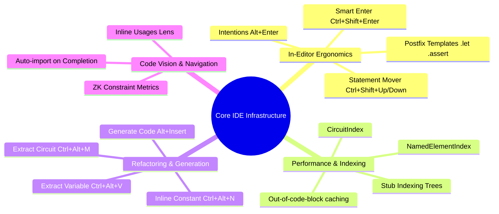
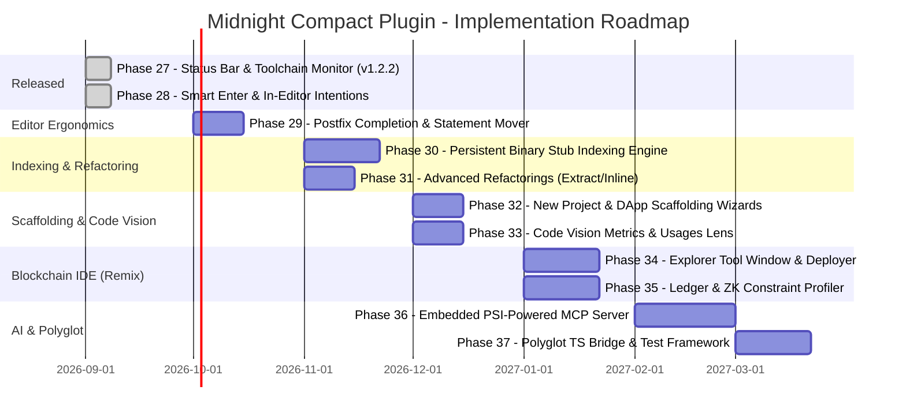

# Future Plan & Roadmap — Midnight Compact Language Plugin

> **Document Status**: Active Strategic & Technical Plan  
> **Target Platform**: JetBrains IntelliJ IDEA (Build 2026.2+ / Java 25 LTS)  
> **Plugin ID**: `dev.verloren.midnight`  
> **Last Updated**: September 2026

---

## 1. Executive Vision

The **Midnight Compact Language Plugin** delivers first-class development support for **Compact**, the smart-contract language of the **Midnight privacy-centric blockchain**. 

While the plugin has achieved production-grade language tooling—featuring a handwritten lexer, recursive-descent parser, typed PSI model, dual-namespace symbol resolver, type inference engine, 10 static inspections, formatter, multi-version compiler manager, status bar toolchain monitor, type navigation (`Ctrl+Shift+B`), and parameter info (backed by 459 passing unit tests)—the next evolution transforms the plugin from a *language editor* into a **full-lifecycle Blockchain IDE and AI-Agent Development Platform**.

This plan integrates three game-changing capability tracks:
1. **Core In-Editor Ergonomics & Invisible IDE Infrastructure**: Complete statement processor (`Ctrl+Shift+Enter`), intentions (`Alt+Enter` / `Ctrl+.`), postfix templates, code generation (`Alt+Insert`), and binary stub indexing for zero-lag symbol resolution.
2. **Blockchain IDE (Remix-Style) Features**: Visual contract deployment, dynamic circuit calling forms, private witness input builders, live ledger/UTXO inspectors, ZK constraint profiling, and 1-click local devnet management.
3. **IntelliJ PSI-Powered MCP (Model Context Protocol) Server**: Giving AI coding agents direct programmatic access to IntelliJ's live in-memory PSI, AST resolver, and atomic refactoring engine—replacing blind CLI text searching (`grep`, `cat`, `sed`) with semantic precision.

---

## 2. Comparative Analysis & Platform Gaps

### 2.1 The Declarative Surface: XML Extension Point Audit
Auditing [`plugin.xml`](file:///C:/Users/shaki/IdeaProjects/midnight-plugin/src/main/resources/META-INF/plugin.xml) against local reference plugins (`intellij-rust`, `intellij-elixir`, `intellij-scala`, `Rplugin`) establishes our declarative baseline:
- [x] **Core Parsing**: `CompactFileType`, `CompactParserDefinition`, `CompactElementTypes`.
- [x] **Syntax & Semantic Highlighting**: `CompactSyntaxHighlighterFactory`, `CompactColorSettingsPage` (42+ color keys), `CompactHighlightingAnnotator`.
- [x] **Code Insight**: `CompactCompletionContributor`, `CompactFindUsagesProvider`, `CompactStructureViewFactory`, `CompactDocumentationProvider`, `CompactTypeDeclarationProvider` (`Ctrl+Shift+B`), `CompactParameterInfoHandler` (`Ctrl+P`).
- [x] **Editor Ergonomics**: `CompactCommenter`, `CompactPairedBraceMatcher`, `CompactQuoteHandler`, `CompactFoldingBuilder`, `CompactBreadcrumbsProvider`, `CompactInlayHintsProvider`, `CompactLineMarkerProvider`, `CompactSmartEnterProcessor` (`Ctrl+Shift+Enter`), `CompactDocCommentEnterHandler`.
- [x] **In-Editor Intentions**: 6 intentions registered (`CompactTogglePureCircuitIntention`, `CompactToggleExportIntention`, `CompactSurroundWithDiscloseIntention`, `CompactInvertIfIntention`, `CompactRemoveRedundantTypeIntention`, `CompactSpecifyTypeExplicitlyIntention`).
- [x] **Formatting & Style**: `CompactFormattingModelBuilder`, `CompactLanguageCodeStyleSettingsProvider` (2-space indentation).
- [x] **Code Inspections (10 Local Inspections)**: Unresolved reference, duplicate declaration, unused local variable (with quick-fix), type mismatch, pure circuit, sealed field mutation, recursive circuit, constructor restriction, undisclosed witness, pragma version.
- [x] **Toolchain & Run Configurations**: `CompactRunConfiguration`, `CompactRunConfigurationProducer`, `CompactRunLineMarkerContributor`, `CompactExternalAnnotator`.
- [x] **Multi-Version Compiler & Status Bar Monitor**: `CompactVersionManager`, `MidnightProjectSettings`, `CompactCompilerToolWindowFactory`, `CompactCompilerPanel`, `CompactStatusBarWidgetFactory` (v1.2.2), WSL toolchain auto-association.

*(See complete extension-by-extension matrix in [`docs/XML_GAP_ANALYSIS.md`](file:///C:/Users/shaki/IdeaProjects/midnight-plugin/docs/XML_GAP_ANALYSIS.md))*

---

### 2.2 Why XML Comparison Alone Is Not Enough: The 6 Deep Architectural Dimensions

While comparing `plugin.xml` descriptors identifies **which extension points are registered**, XML is merely a declarative contract. It does not capture the algorithmic depth, execution runtime, or concurrency guarantees of an industrial IDE. 

A production-grade language plugin requires addressing **6 critical dimensions beyond XML**:

```text
┌──────────────────────────────────────────────────────────────────────────┐
│                   THE 6 ARCHITECTURAL DIMENSIONS BEYOND XML              │
├──────────────────────────────────────────────────────────────────────────┤
│ 1. Domain Type Semantics  │ Dual-namespace resolution, ZK secrecy & circuit purity│
│ 2. Process & IPC Model    │ Long-lived compile daemons vs one-off CLI execution  │
│ 3. Caching & Invalidation │ Out-of-code-block trackers & SmartPsiElementPointers   │
│ 4. Modern Concurrency     │ NonBlockingReadActions, Write-intent locks & EDT safety│
│ 5. Polyglot Interop       │ TypeScript DApp bindings <-> Compact circuit navigation │
│ 6. Testing Harness        │ In-memory headless fixture suites & PSI mutation tests │
└──────────────────────────────────────────────────────────────────────────┘
```

#### Dimension 1: Domain-Specific Type & Semantic Analysis
- In `intellij-rust`, type inference implements bidirectional Hindley-Milner with Chalk trait resolution (`RsInferenceContext`).
- In Compact, we must enforce unique Zero-Knowledge domain invariants:
  - **ZK Secrecy Tracking**: Detecting when private `witness` values inadvertently leak into public ledger state without proper cryptographic commitments or zero-knowledge proofs.
  - **Pure Circuit Enforcements**: Ensuring pure circuits never read or mutate `ledger` state.
  - **Dual Namespace Strictness**: Guaranteeing `Namespace.VALUE` and `Namespace.TYPE` never bleed together during resolution.
  - **Integer Bit-Width Range Propagation**: Validating arithmetic overflow constraints across `Uint<N>` and `Bits<N>`.

#### Dimension 2: Process & IPC Architecture (Persistent Daemons vs CLI Spawning)
- `Rplugin` uses a persistent background daemon (`RInterop`, gRPC / sockets) to stream graphics and communicate with R without process startup costs.
- `intellij-scala` maintains a background compile server (`CompileServerRunner`) over IPC sockets to eliminate JVM warmup latency.
- Repeatedly invoking `compactc` or `proof-server` via one-off CLI processes introduces noticeable latency (500ms–2s per run). For real-time Remix-style execution and in-editor constraint profiling, we need a persistent worker daemon or direct JSON-RPC/gRPC communication with the local Substrate node (`9944`) and proof server (`6300`).

#### Dimension 3: Caching, Invalidation & Memory Safety
- In large projects (100+ contracts), naive tree walking degrades editor responsiveness.
- We must utilize:
  - `PsiModificationTracker.OUT_OF_CODE_BLOCK_MODIFICATION_COUNT`: Caches resolution and types across keystrokes inside circuit bodies, invalidating only when contract signatures or top-level declarations change.
  - `SmartPsiElementPointer`: Never storing raw `PsiElement` references in tool windows, MCP session states, or long-lived services to prevent massive memory leaks during document re-parses.
  - `ResolveCache`: Caching cross-file import paths with recursion guards to prevent cyclic include deadlocks.

#### Dimension 4: Concurrency & Cancellation Model
- IntelliJ 2026.2+ enforces strict threading rules:
  - Long-running operations must run via `ReadAction.nonBlocking(...)` or background tasks with regular `ProgressManager.checkCanceled()` checks. If a user types a single character, background inspection passes must yield instantly.
  - Mutations (quick-fixes, MCP refactorings) must execute exclusively on the Event Dispatch Thread (EDT) wrapped in `WriteCommandAction`s to integrate with the platform Undo/Redo buffer (`Ctrl + Z`).

#### Dimension 5: Polyglot Language Integration (TypeScript <-> Compact)
- Midnight smart contracts are consumed by TypeScript DApps (`@midnight-ntwrk/compact-runtime`, `@midnight-ntwrk/ledger`).
- A truly great IDE provides bidirectional polyglot navigation:
  - Clicking a method call in a TypeScript frontend jumps directly to the `@export circuit` declaration in the `.compact` file.
  - Auto-generating TypeScript client wrappers (`compactc --typescript`) on save or compile.

#### Dimension 6: Headless Testing & Verification Harness
- XML declarations provide zero assurance of correctness without automated headless test fixtures.
- The project maintains 459 passing tests across 55 test classes validating lexer tokens, AST nodes, type inference, resolution namespaces, formatting idempotency, status bar lifecycle, smart enter, and intentions using `LightPlatformCodeInsightFixture4TestCase`.

---

## 3. The "Invisible" IDE Infrastructure Capabilities (Non-Visual Quality of Life)

To deliver a developer experience on par with official JetBrains language plugins, the roadmap systematically targets the invisible editor infrastructure that developers rely on subconsciously:



1. **Smart Enter (`Ctrl + Shift + Enter`)**:
   - `lang.smartEnterProcessor`: Completes incomplete circuit declarations, adds missing closing braces/semicolons, and positions caret inside the block with standard 2-space indentation.
2. **Context-Aware Intentions (`Alt + Enter` / `Ctrl + .`)**:
   - `intentionAction`: Proactive code refactorings available without errors present:
     - Convert `circuit` $\leftrightarrow$ `pure circuit`.
     - Surround expression in `disclose(...)`.
     - Invert `if` condition.
     - Add/remove `export` modifier.
     - Add explicit type annotations.
3. **Postfix Completion (`.assert`, `.let`, `.disclose`, `.return`)**:
   - `codeInsight.postfixTemplateProvider`: Typing `x > 0.assert` expands directly to `assert(x > 0, "Assertion failed");`.
4. **Binary Stub Indexing**:
   - `stubElementTypeHolder` & `stubIndex`: Serializes contract, circuit, and struct declarations into binary stubs so project-wide search (`Ctrl+Alt+Shift+N`) and cross-file resolution run in 0 milliseconds without parsing ASTs from disk.
5. **Advanced Refactoring Engine**:
   - `refactoringSupport`: Extract Circuit (`Ctrl + Alt + M`), Extract Variable (`Ctrl + Alt + V`), and Inline Constant (`Ctrl + Alt + N`).
6. **Code Vision Metrics**:
   - `codeInsight.daemonBoundCodeVisionProvider`: Inline lenses rendered directly above circuits showing caller count and estimated ZK constraint complexity.

---

## 4. Blockchain IDE (Remix-Style) Capabilities

*(See architectural specification in [`docs/REMIX_IDE_FEATURES.md`](file:///C:/Users/shaki/IdeaProjects/midnight-plugin/docs/REMIX_IDE_FEATURES.md))*

```text
┌──────────────────────────────────────────────────────────────────────────┐
│                   Midnight Blockchain Explorer Tool Window               │
├──────────────────────────────────────────────────────────────────────────┤
│ [ENVIRONMENT]  Local Devnet (http://localhost:9944)          [▼] [Reset]  │
│ [ACCOUNT]      Alice (0x4a9...f2b) - 1,500.00 tDUST          [▼] [+]      │
│                                                                          │
│ ▼ Deploy Contract: Counter.compact                                      │
│   initialSupply: [ 1000               ]                                  │
│   [ Deploy to Localnet ]                                                 │
│                                                                          │
│ ▼ Deployed Contracts                                                     │
│   ▼ Counter at 0x8f2...c01 (Block #124)                                  │
│     ► circuit increment(): Void                                          │
│     ▼ circuit transfer(recipient, amount): Void                          │
│       recipient: [ 0x3b8...91a          ]                                │
│       amount:    [ 50                   ]                                │
│       witness:   [ Provide Secret Key...] ← Opens Private Witness Drawer │
│       [ Transact (Call Circuit) ]                                        │
│                                                                          │
│ ▼ Ledger Storage Inspector (0x8f2...c01)                                 │
│   ├── [PUBLIC] state.counter: 1050                                      │
│   └── [SEALED] state.commitmentsRoot: 0x99a...44f (12 UTXO Notes)       │
└──────────────────────────────────────────────────────────────────────────┘
```

---

## 5. IntelliJ PSI-Powered MCP Server

*(See detailed protocol specification in [`docs/MCP_SERVER_SPEC.md`](file:///C:/Users/shaki/IdeaProjects/midnight-plugin/docs/MCP_SERVER_SPEC.md))*

Exposes 11 atomic AST tools (`compact_search_symbols`, `compact_get_ast`, `compact_resolve_reference`, `compact_psi_rename`, `compact_get_diagnostics`, etc.) to AI coding agents via stdio JSON-RPC and loopback HTTP/SSE.

---

## 6. Phased Implementation Roadmap



### Phase 27: Status Bar Widget & Toolchain Monitor [RELEASED - v1.2.2]
- Registered `CompactStatusBarWidgetFactory` in `plugin.xml`.
- Interactive status bar popup displaying active compiler, language version, 1-click installed version switching, auto-detect reset, background compiler downloader, and tool window shortcuts.
- Fully non-blocking $O(1)$ EDT presentation; 441 passing tests.

### Phase 28: Smart Enter & In-Editor Intentions (`Ctrl + Shift + Enter` / `Alt + Enter`) [RELEASED - v1.2.3]
- **Smart Enter (`lang.smartEnterProcessor`)**: [`CompactSmartEnterProcessor`](file:///C:/Users/shaki/IdeaProjects/midnight-plugin/src/main/java/dev/verloren/midnight/editor/smartEnter/CompactSmartEnterProcessor.java) auto-completes circuit headers (`: Void { <caret> }`), unclosed declaration bodies (`contract`, `struct`, `enum`, `module`), missing parentheses/braces on `if`/`for`, and trailing semicolons on statements, expressions, and witnesses.
- **Doc Comment Enter Handler (`enterHandlerDelegate`)**: [`CompactDocCommentEnterHandler`](file:///C:/Users/shaki/IdeaProjects/midnight-plugin/src/main/java/dev/verloren/midnight/editor/CompactDocCommentEnterHandler.java) auto-continues JSDoc/KDoc-style `/** ... */` comment blocks with ` * ` and closing ` */`.
- **In-Editor Intentions (`intentionAction`)**:
  - [`CompactTogglePureCircuitIntention`](file:///C:/Users/shaki/IdeaProjects/midnight-plugin/src/main/java/dev/verloren/midnight/intention/CompactTogglePureCircuitIntention.java): Toggles `circuit` $\leftrightarrow$ `pure circuit`.
  - [`CompactToggleExportIntention`](file:///C:/Users/shaki/IdeaProjects/midnight-plugin/src/main/java/dev/verloren/midnight/intention/CompactToggleExportIntention.java): Toggles `export` modifier.
  - [`CompactSurroundWithDiscloseIntention`](file:///C:/Users/shaki/IdeaProjects/midnight-plugin/src/main/java/dev/verloren/midnight/intention/CompactSurroundWithDiscloseIntention.java): Surrounds expressions in `disclose(...)`.
  - [`CompactInvertIfIntention`](file:///C:/Users/shaki/IdeaProjects/midnight-plugin/src/main/java/dev/verloren/midnight/intention/CompactInvertIfIntention.java): Inverts condition dualities (`==`/`!=`, etc.) and swaps `then`/`else` branches.
  - [`CompactRemoveRedundantTypeIntention`](file:///C:/Users/shaki/IdeaProjects/midnight-plugin/src/main/java/dev/verloren/midnight/intention/CompactRemoveRedundantTypeIntention.java): Removes redundant `: Type` annotations from `const` bindings while preserving proper spacing.
  - [`CompactSpecifyTypeExplicitlyIntention`](file:///C:/Users/shaki/IdeaProjects/midnight-plugin/src/main/java/dev/verloren/midnight/intention/CompactSpecifyTypeExplicitlyIntention.java): Automatically infers initializer type and inserts `: InferredType`.
- Backed by 18 dedicated unit tests across `CompactSmartEnterTest`, `CompactDocCommentEnterTest`, and `CompactPhase28IntentionsTest` (bringing suite total to 459 passing tests).

### Phase 29: Postfix Completion & Structural Statement Mover
- **Postfix Templates (`codeInsight.postfixTemplateProvider`)**: `.assert`, `.let`, `.disclose`, `.return`, `.not`.
- **Statement Mover (`lang.statementMover`)**: `Ctrl + Shift + ↑ / ↓` moves entire circuits, statements, and ledger items while respecting AST block boundaries.

### Phase 30: Persistent Binary Stub Indexing Engine
- **Stub Serialization (`stubElementTypeHolder`)**: Serialize contract, circuit, struct, and witness declarations into binary stubs.
- **Fast Stub Indexes (`stubIndex`)**:
  - `CompactNamedElementIndex`: Instant symbol search across the workspace.
  - `CompactCircuitIndex`: Instant lookup of circuits and exports without AST parsing.

### Phase 31: Advanced Refactorings (Extract Circuit, Extract Variable, Inline)
- `refactoringSupport`:
  - Extract Circuit (`Ctrl + Alt + M`): Computes parameter types, returns, and generates caller site.
  - Extract Variable (`Ctrl + Alt + V`): Computes inferred type and replaces subexpression.
  - Inline Constant (`Ctrl + Alt + N`): Inlines `const` values into usage sites.

### Phase 32: New Project & DApp Scaffolding Wizards
- Integration with IntelliJ's New Project Wizard (`newProjectWizard.language`) and `directoryProjectGenerator`.
- 4 production starter templates: Minimal Contract, Confidential Token, Bulletin Board, Counter DApp with TypeScript.

### Phase 33: Code Vision Metrics & Usages Lens
- `codeInsight.daemonBoundCodeVisionProvider`: Renders live usage counts and estimated ZK constraints directly above circuits and structs.

### Phase 34: Blockchain IDE (Remix) — Deployment & Dynamic Circuit Execution
- **Midnight Explorer** tool window: Local Devnet (Substrate 9944) connector, account selector, auto-generated deployment form, circuit execution buttons, and private witness input drawer.

### Phase 35: Ledger Storage Inspector & ZK Constraint Profiler
- TreeTable inspector for `ledger { ... }` fields with `[PUBLIC]` vs `[SEALED]` badges, state change diffs, and ZK-SNARK constraint complexity counts.

### Phase 36: Embedded PSI-Powered MCP Server
- Exposes 11 atomic AST tools (`compact_search_symbols`, `compact_get_ast`, `compact_resolve_reference`, `compact_psi_rename`, etc.) to external AI agents via stdio and SSE.

### Phase 37: Polyglot TypeScript Bridge & Contract Testing Framework
- Bidirectional navigation between TypeScript frontend calls and Compact `@export circuit` definitions.
- Gutter test runner (`runLineMarkerContributor` for contract tests).

---

## 7. Verification Strategy & Invariants

All future milestones will preserve the project's strict engineering standards:
1. **Zero Compiler Warnings**: Verified against `-Xlint:all` under Java 25.
2. **Preserve Unit Test Suite**: All existing 459 passing unit tests must continue passing without regression (`./gradlew test`).
3. **Threading Discipline**: All PSI reads guarded by `ReadAction` with cancellation checks; all PSI mutations scheduled via `WriteCommandAction` on the EDT.
4. **Strict Namespace Separation**: Never merge `Namespace.VALUE` and `Namespace.TYPE`.
5. **Cross-Platform Compatibility**: Native Windows, WSL, and Linux support verified.
