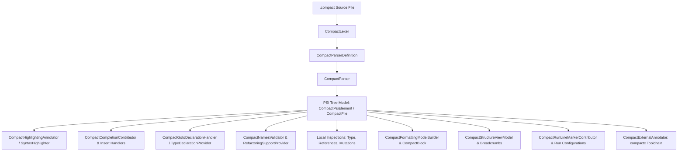

# Midnight Compact Plugin: IDE Features & IntelliJ SDK Mapping

This document provides a comprehensive technical mapping of every feature and component in the **Midnight Compact Language Plugin** (`dev.verloren.midnight`). For each feature/class, it details:

1. **IDE Feature**: The visible or functional IDE capability implemented (e.g., Gutter Run Button, External Linter, In-Place Rename, Smart Completion, Live Templates, etc.).
2. **Plugin Implementation Class & Overridden Logic**: The exact plugin class in `dev.verloren.midnight.*` and what transformations, algorithms, and logic are implemented in its overridden methods.
3. **IntelliJ SDK Class / Interface & Overridden Methods**: The exact IntelliJ Platform SDK class or interface being extended/implemented and which SDK methods are overridden.

---

## Quick Reference Matrix

| # | IDE Feature / Capability | Plugin Implementation Class | IntelliJ SDK Class / Interface |
|---|---|---|---|
| 1 | **Language Registration** | [`CompactLanguage`](file:///C:/Users/shaki/IdeaProjects/midnight-plugin/src/main/java/dev/verloren/midnight/CompactLanguage.java) | `com.intellij.lang.Language` |
| 2 | **File Type Association (`.compact`)** | [`CompactFileType`](file:///C:/Users/shaki/IdeaProjects/midnight-plugin/src/main/java/dev/verloren/midnight/CompactFileType.java) | `com.intellij.openapi.fileTypes.LanguageFileType` |
| 3 | **I18n Localization Messages** | [`CompactBundle`](file:///C:/Users/shaki/IdeaProjects/midnight-plugin/src/main/java/dev/verloren/midnight/CompactBundle.java) | `com.intellij.DynamicPluginBundle` |
| 4 | **Lexical Analysis & Tokenizer** | [`CompactLexer`](file:///C:/Users/shaki/IdeaProjects/midnight-plugin/src/main/java/dev/verloren/midnight/lexer/CompactLexer.java) | `com.intellij.lexer.LexerBase` |
| 5 | **Parser Definition & PSI Factory** | [`CompactParserDefinition`](file:///C:/Users/shaki/IdeaProjects/midnight-plugin/src/main/java/dev/verloren/midnight/parser/CompactParserDefinition.java) | `com.intellij.lang.ParserDefinition` |
| 6 | **AST Syntactic Parser** | [`CompactParser`](file:///C:/Users/shaki/IdeaProjects/midnight-plugin/src/main/java/dev/verloren/midnight/parser/CompactParser.java) | `com.intellij.lang.PsiParser` |
| 7 | **PSI Base Element Hierarchy** | [`CompactPsiElement`](file:///C:/Users/shaki/IdeaProjects/midnight-plugin/src/main/java/dev/verloren/midnight/psi/CompactPsiElement.java) | `com.intellij.extapi.psi.ASTWrapperPsiElement` |
| 8 | **PSI Named Element & Refactoring Base** | [`CompactNamedElementImpl`](file:///C:/Users/shaki/IdeaProjects/midnight-plugin/src/main/java/dev/verloren/midnight/psi/CompactNamedElementImpl.java) | `CompactPsiElement`, `PsiNameIdentifierOwner`, `CompactNamedElement` |
| 9 | **Compact PSI File Representation** | [`CompactFile`](file:///C:/Users/shaki/IdeaProjects/midnight-plugin/src/main/java/dev/verloren/midnight/psi/CompactFile.java) | `com.intellij.extapi.psi.PsiFileBase` |
| 10 | **Syntax Highlighting Engine** | [`CompactSyntaxHighlighter`](file:///C:/Users/shaki/IdeaProjects/midnight-plugin/src/main/java/dev/verloren/midnight/highlighter/CompactSyntaxHighlighter.java) | `com.intellij.openapi.fileTypes.SyntaxHighlighterBase` |
| 11 | **Syntax Highlighter Factory** | [`CompactSyntaxHighlighterFactory`](file:///C:/Users/shaki/IdeaProjects/midnight-plugin/src/main/java/dev/verloren/midnight/highlighter/CompactSyntaxHighlighterFactory.java) | `com.intellij.openapi.fileTypes.SyntaxHighlighterFactory` |
| 12 | **Semantic Token Highlighting** | [`CompactHighlightingAnnotator`](file:///C:/Users/shaki/IdeaProjects/midnight-plugin/src/main/java/dev/verloren/midnight/highlighter/CompactHighlightingAnnotator.java) | `com.intellij.lang.annotation.Annotator` |
| 13 | **Color Settings Preferences Page** | [`CompactColorSettingsPage`](file:///C:/Users/shaki/IdeaProjects/midnight-plugin/src/main/java/dev/verloren/midnight/highlighter/CompactColorSettingsPage.java) | `com.intellij.openapi.options.colors.ColorSettingsPage` |
| 14 | **Context-Aware Code Completion** | [`CompactCompletionContributor`](file:///C:/Users/shaki/IdeaProjects/midnight-plugin/src/main/java/dev/verloren/midnight/completion/CompactCompletionContributor.java) | `com.intellij.codeInsight.completion.CompletionContributor` |
| 15 | **Parameterized Type Insert Handler** | [`CompactParameterizedTypeInsertHandler`](file:///C:/Users/shaki/IdeaProjects/midnight-plugin/src/main/java/dev/verloren/midnight/completion/CompactParameterizedTypeInsertHandler.java) | `com.intellij.codeInsight.completion.InsertHandler<LookupElement>` |
| 16 | **Call Parentheses Insert Handler** | [`CompactParenthesesInsertHandler`](file:///C:/Users/shaki/IdeaProjects/midnight-plugin/src/main/java/dev/verloren/midnight/completion/CompactParenthesesInsertHandler.java) | `com.intellij.codeInsight.completion.InsertHandler<LookupElement>` |
| 17 | **Assert Insert Handler & Tab Scope** | [`CompactAssertInsertHandler`](file:///C:/Users/shaki/IdeaProjects/midnight-plugin/src/main/java/dev/verloren/midnight/completion/CompactAssertInsertHandler.java) | `com.intellij.codeInsight.completion.InsertHandler<LookupElement>` |
| 18 | **Declaration Template Insert Handler** | [`CompactDeclarationInsertHandler`](file:///C:/Users/shaki/IdeaProjects/midnight-plugin/src/main/java/dev/verloren/midnight/completion/CompactDeclarationInsertHandler.java) | `com.intellij.codeInsight.completion.InsertHandler<LookupElement>` |
| 19 | **Either Type Insert Handler** | [`CompactEitherInsertHandler`](file:///C:/Users/shaki/IdeaProjects/midnight-plugin/src/main/java/dev/verloren/midnight/completion/CompactEitherInsertHandler.java) | `com.intellij.codeInsight.completion.InsertHandler<LookupElement>` |
| 20 | **Either Helper (`left`/`right`) Insert Handler** | [`CompactEitherHelperInsertHandler`](file:///C:/Users/shaki/IdeaProjects/midnight-plugin/src/main/java/dev/verloren/midnight/completion/CompactEitherHelperInsertHandler.java) | `com.intellij.codeInsight.completion.InsertHandler<LookupElement>` |
| 21 | **Ledger Declaration Insert Handler** | [`CompactLedgerInsertHandler`](file:///C:/Users/shaki/IdeaProjects/midnight-plugin/src/main/java/dev/verloren/midnight/completion/CompactLedgerInsertHandler.java) | `com.intellij.codeInsight.completion.InsertHandler<LookupElement>` |
| 22 | **PSI Reference Contributor** | [`CompactReferenceContributor`](file:///C:/Users/shaki/IdeaProjects/midnight-plugin/src/main/java/dev/verloren/midnight/reference/CompactReferenceContributor.java) | `com.intellij.psi.PsiReferenceContributor` |
| 23 | **Identifier Reference Binding** | [`CompactIdentifierReference`](file:///C:/Users/shaki/IdeaProjects/midnight-plugin/src/main/java/dev/verloren/midnight/reference/CompactIdentifierReference.java) | `com.intellij.psi.PsiReferenceBase<CompactReferenceExprImpl>` |
| 24 | **Include File Reference Binding** | [`CompactIncludeReference`](file:///C:/Users/shaki/IdeaProjects/midnight-plugin/src/main/java/dev/verloren/midnight/reference/CompactIncludeReference.java) | `com.intellij.psi.PsiReferenceBase<CompactIncludeDeclarationImpl>`, `PsiPolyVariantReference` |
| 25 | **Member & Variant Reference Binding** | [`CompactMemberReference`](file:///C:/Users/shaki/IdeaProjects/midnight-plugin/src/main/java/dev/verloren/midnight/reference/CompactMemberReference.java) | `com.intellij.psi.PsiReferenceBase<CompactMemberExprImpl>` |
| 26 | **Go to Declaration Handler (`Ctrl+B`)** | [`CompactGotoDeclarationHandler`](file:///C:/Users/shaki/IdeaProjects/midnight-plugin/src/main/java/dev/verloren/midnight/navigation/CompactGotoDeclarationHandler.java) | `com.intellij.codeInsight.navigation.actions.GotoDeclarationHandler` |
| 27 | **Go to Class Navigation (`Ctrl+N`)** | [`CompactGotoClassContributor`](file:///C:/Users/shaki/IdeaProjects/midnight-plugin/src/main/java/dev/verloren/midnight/navigation/CompactGotoClassContributor.java) | `com.intellij.navigation.ChooseByNameContributorEx` |
| 28 | **Go to Symbol Navigation (`Ctrl+Alt+Shift+N`)** | [`CompactGotoSymbolContributor`](file:///C:/Users/shaki/IdeaProjects/midnight-plugin/src/main/java/dev/verloren/midnight/navigation/CompactGotoSymbolContributor.java) | `com.intellij.navigation.ChooseByNameContributorEx` |
| 29 | **Go to Type Declaration (`Ctrl+Shift+B`)** | [`CompactTypeDeclarationProvider`](file:///C:/Users/shaki/IdeaProjects/midnight-plugin/src/main/java/dev/verloren/midnight/navigation/CompactTypeDeclarationProvider.java) | `com.intellij.codeInsight.navigation.actions.TypeDeclarationProvider` |
| 30 | **Find Usages Provider (`Alt+F7`)** | [`CompactFindUsagesProvider`](file:///C:/Users/shaki/IdeaProjects/midnight-plugin/src/main/java/dev/verloren/midnight/findUsages/CompactFindUsagesProvider.java) | `com.intellij.lang.findUsages.FindUsagesProvider` |
| 31 | **Identifier Names Validator** | [`CompactNamesValidator`](file:///C:/Users/shaki/IdeaProjects/midnight-plugin/src/main/java/dev/verloren/midnight/refactoring/CompactNamesValidator.java) | `com.intellij.lang.refactoring.NamesValidator` |
| 32 | **Inplace Rename Refactoring Support** | [`CompactRefactoringSupportProvider`](file:///C:/Users/shaki/IdeaProjects/midnight-plugin/src/main/java/dev/verloren/midnight/refactoring/CompactRefactoringSupportProvider.java) | `com.intellij.lang.refactoring.RefactoringSupportProvider` |
| 33 | **Code Formatting Model Builder (`Ctrl+Alt+L`)** | [`CompactFormattingModelBuilder`](file:///C:/Users/shaki/IdeaProjects/midnight-plugin/src/main/java/dev/verloren/midnight/formatter/CompactFormattingModelBuilder.java) | `com.intellij.formatting.FormattingModelBuilder` |
| 34 | **Formatting AST Block & Indentation** | [`CompactBlock`](file:///C:/Users/shaki/IdeaProjects/midnight-plugin/src/main/java/dev/verloren/midnight/formatter/CompactBlock.java) | `com.intellij.formatting.ASTBlock` |
| 35 | **Code Style Settings Provider** | [`CompactLanguageCodeStyleSettingsProvider`](file:///C:/Users/shaki/IdeaProjects/midnight-plugin/src/main/java/dev/verloren/midnight/formatter/CompactLanguageCodeStyleSettingsProvider.java) | `com.intellij.psi.codeStyle.LanguageCodeStyleSettingsProvider` |
| 36 | **Structure View Factory** | [`CompactStructureViewFactory`](file:///C:/Users/shaki/IdeaProjects/midnight-plugin/src/main/java/dev/verloren/midnight/structure/CompactStructureViewFactory.java) | `com.intellij.lang.PsiStructureViewFactory` |
| 37 | **Structure View Model** | [`CompactStructureViewModel`](file:///C:/Users/shaki/IdeaProjects/midnight-plugin/src/main/java/dev/verloren/midnight/structure/CompactStructureViewModel.java) | `com.intellij.ide.structureView.StructureViewModelBase`, `StructureViewModel.ElementInfoProvider` |
| 38 | **Structure View Tree Element** | [`CompactStructureViewElement`](file:///C:/Users/shaki/IdeaProjects/midnight-plugin/src/main/java/dev/verloren/midnight/structure/CompactStructureViewElement.java) | `com.intellij.ide.structureView.StructureViewTreeElement`, `com.intellij.pom.Navigatable` |
| 39 | **Editor Breadcrumbs Provider** | [`CompactBreadcrumbsProvider`](file:///C:/Users/shaki/IdeaProjects/midnight-plugin/src/main/java/dev/verloren/midnight/editor/CompactBreadcrumbsProvider.java) | `com.intellij.ui.breadcrumbs.BreadcrumbsInfoProvider` |
| 40 | **Declarative Inlay Parameter Hints** | [`CompactInlayHintsProvider`](file:///C:/Users/shaki/IdeaProjects/midnight-plugin/src/main/java/dev/verloren/midnight/editor/CompactInlayHintsProvider.java) | `com.intellij.codeInsight.hints.declarative.InlayHintsProvider` |
| 41 | **Parameter Info Tooltip Handler (`Ctrl+P`)** | [`CompactParameterInfoHandler`](file:///C:/Users/shaki/IdeaProjects/midnight-plugin/src/main/java/dev/verloren/midnight/parameterInfo/CompactParameterInfoHandler.java) | `com.intellij.lang.parameterInfo.ParameterInfoHandler<PsiElement, CompactParametersDescription>` |
| 42 | **Quick Documentation Provider (`Ctrl+Q`)** | [`CompactDocumentationProvider`](file:///C:/Users/shaki/IdeaProjects/midnight-plugin/src/main/java/dev/verloren/midnight/documentation/CompactDocumentationProvider.java) | `com.intellij.lang.documentation.AbstractDocumentationProvider` |
| 43 | **Comment / Uncomment Actions (`Ctrl+/`, `Ctrl+Shift+/`)** | [`CompactCommenter`](file:///C:/Users/shaki/IdeaProjects/midnight-plugin/src/main/java/dev/verloren/midnight/editor/CompactCommenter.java) | `com.intellij.lang.CodeDocumentationAwareCommenter` |
| 44 | **Paired Brace Matching (`{}`, `()`, `[]`, `<>`)** | [`CompactPairedBraceMatcher`](file:///C:/Users/shaki/IdeaProjects/midnight-plugin/src/main/java/dev/verloren/midnight/editor/CompactPairedBraceMatcher.java) | `com.intellij.lang.PairedBraceMatcher` |
| 45 | **String Quote Auto-Closing** | [`CompactQuoteHandler`](file:///C:/Users/shaki/IdeaProjects/midnight-plugin/src/main/java/dev/verloren/midnight/editor/CompactQuoteHandler.java) | `com.intellij.codeInsight.editorActions.SimpleTokenSetQuoteHandler` |
| 46 | **Angle Bracket Auto-Pairing & Overtyping** | [`CompactAngleBraceTypedHandler`](file:///C:/Users/shaki/IdeaProjects/midnight-plugin/src/main/java/dev/verloren/midnight/editor/CompactAngleBraceTypedHandler.java) | `com.intellij.codeInsight.editorActions.TypedHandlerDelegate` |
| 47 | **Universal Delimiter & Punctuation Skipping** | [`CompactDelimiterTypedHandler`](file:///C:/Users/shaki/IdeaProjects/midnight-plugin/src/main/java/dev/verloren/midnight/editor/CompactDelimiterTypedHandler.java) | `com.intellij.codeInsight.editorActions.TypedHandlerDelegate` |
| 48 | **Angle Bracket Paired Backspace Handler** | [`CompactAngleBraceBackspaceHandler`](file:///C:/Users/shaki/IdeaProjects/midnight-plugin/src/main/java/dev/verloren/midnight/editor/CompactAngleBraceBackspaceHandler.java) | `com.intellij.codeInsight.editorActions.BackspaceHandlerDelegate` |
| 49 | **Doc & Block Comment Continuation on Enter** | [`CompactDocCommentEnterHandler`](file:///C:/Users/shaki/IdeaProjects/midnight-plugin/src/main/java/dev/verloren/midnight/editor/CompactDocCommentEnterHandler.java) | `com.intellij.codeInsight.editorActions.enter.EnterHandlerDelegateAdapter` |
| 50 | **Declaration Prefix Enter Expansion** | [`CompactDeclarationEnterHandler`](file:///C:/Users/shaki/IdeaProjects/midnight-plugin/src/main/java/dev/verloren/midnight/editor/CompactDeclarationEnterHandler.java) | `com.intellij.codeInsight.editorActions.enter.EnterHandlerDelegateAdapter` |
| 51 | **Smart Enter Statement Completion (`Ctrl+Shift+Enter`)** | [`CompactSmartEnterProcessor`](file:///C:/Users/shaki/IdeaProjects/midnight-plugin/src/main/java/dev/verloren/midnight/editor/smartEnter/CompactSmartEnterProcessor.java) | `com.intellij.codeInsight.editorActions.smartEnter.SmartEnterProcessor` |
| 52 | **Code Folding Builder** | [`CompactFoldingBuilder`](file:///C:/Users/shaki/IdeaProjects/midnight-plugin/src/main/java/dev/verloren/midnight/editor/CompactFoldingBuilder.java) | `com.intellij.lang.folding.CustomFoldingBuilder` |
| 53 | **Spellchecking Strategy** | [`CompactSpellcheckingStrategy`](file:///C:/Users/shaki/IdeaProjects/midnight-plugin/src/main/java/dev/verloren/midnight/editor/CompactSpellcheckingStrategy.java) | `com.intellij.spellchecker.tokenizer.SpellcheckingStrategy` |
| 54 | **Surround With Actions (`Ctrl+Alt+T`)** | [`CompactSurroundDescriptor`](file:///C:/Users/shaki/IdeaProjects/midnight-plugin/src/main/java/dev/verloren/midnight/editor/CompactSurroundDescriptor.java) | `com.intellij.lang.surroundWith.SurroundDescriptor` |
| 55 | **Block / If Surrounder Implementations** | [`CompactBlockSurrounder`](file:///C:/Users/shaki/IdeaProjects/midnight-plugin/src/main/java/dev/verloren/midnight/editor/CompactBlockSurrounder.java), [`CompactIfSurrounder`](file:///C:/Users/shaki/IdeaProjects/midnight-plugin/src/main/java/dev/verloren/midnight/editor/CompactIfSurrounder.java) | `dev.verloren.midnight.editor.CompactSurrounderBase`, `com.intellij.lang.surroundWith.Surrounder` |
| 56 | **Gutter Run / Compile Button** | [`CompactRunLineMarkerContributor`](file:///C:/Users/shaki/IdeaProjects/midnight-plugin/src/main/java/dev/verloren/midnight/run/CompactRunLineMarkerContributor.java) | `com.intellij.execution.lineMarker.RunLineMarkerContributor` |
| 57 | **Interface-Implementation Gutter Markers** | [`CompactLineMarkerProvider`](file:///C:/Users/shaki/IdeaProjects/midnight-plugin/src/main/java/dev/verloren/midnight/editor/CompactLineMarkerProvider.java) | `com.intellij.codeInsight.daemon.LineMarkerProvider` |
| 58 | **Run Configuration Type** | [`CompactConfigurationType`](file:///C:/Users/shaki/IdeaProjects/midnight-plugin/src/main/java/dev/verloren/midnight/run/CompactConfigurationType.java) | `com.intellij.execution.configurations.ConfigurationTypeBase` |
| 59 | **Run Configuration Factory** | [`CompactConfigurationFactory`](file:///C:/Users/shaki/IdeaProjects/midnight-plugin/src/main/java/dev/verloren/midnight/run/CompactConfigurationFactory.java) | `com.intellij.execution.configurations.ConfigurationFactory` |
| 60 | **Run Configuration Model** | [`CompactRunConfiguration`](file:///C:/Users/shaki/IdeaProjects/midnight-plugin/src/main/java/dev/verloren/midnight/run/CompactRunConfiguration.java) | `com.intellij.execution.configurations.LocatableConfigurationBase<CompactRunConfigurationOptions>` |
| 61 | **Run Configuration Producer** | [`CompactRunConfigurationProducer`](file:///C:/Users/shaki/IdeaProjects/midnight-plugin/src/main/java/dev/verloren/midnight/run/CompactRunConfigurationProducer.java) | `com.intellij.execution.actions.LazyRunConfigurationProducer<CompactRunConfiguration>` |
| 62 | **Compiler Process Execution State** | [`CompactRunProfileState`](file:///C:/Users/shaki/IdeaProjects/midnight-plugin/src/main/java/dev/verloren/midnight/run/CompactRunProfileState.java) | `com.intellij.execution.configurations.CommandLineState` |
| 63 | **Run Configuration Settings UI** | [`CompactRunConfigurationEditor`](file:///C:/Users/shaki/IdeaProjects/midnight-plugin/src/main/java/dev/verloren/midnight/run/CompactRunConfigurationEditor.java) | `com.intellij.openapi.options.SettingsEditor<CompactRunConfiguration>` |
| 64 | **External Compiler Linter & Annotator** | [`CompactExternalAnnotator`](file:///C:/Users/shaki/IdeaProjects/midnight-plugin/src/main/java/dev/verloren/midnight/annotator/CompactExternalAnnotator.java) | `com.intellij.lang.annotation.ExternalAnnotator<InitialInfo, AnnotationResult>` |
| 65 | **Switch Compiler Quick-Fix Action** | [`CompactSwitchCompilerQuickFix`](file:///C:/Users/shaki/IdeaProjects/midnight-plugin/src/main/java/dev/verloren/midnight/annotator/CompactSwitchCompilerQuickFix.java) | `com.intellij.codeInsight.intention.IntentionAction`, `HighPriorityAction` |
| 66 | **Update Pragma Quick-Fix Action** | [`CompactUpdatePragmaQuickFix`](file:///C:/Users/shaki/IdeaProjects/midnight-plugin/src/main/java/dev/verloren/midnight/annotator/CompactUpdatePragmaQuickFix.java) | `com.intellij.codeInsight.intention.IntentionAction`, `HighPriorityAction` |
| 67 | **Unresolved Reference Inspection** | [`CompactUnresolvedReferenceInspection`](file:///C:/Users/shaki/IdeaProjects/midnight-plugin/src/main/java/dev/verloren/midnight/inspection/CompactUnresolvedReferenceInspection.java) | `com.intellij.codeInspection.LocalInspectionTool` |
| 68 | **Duplicate Declaration Inspection** | [`CompactDuplicateDeclarationInspection`](file:///C:/Users/shaki/IdeaProjects/midnight-plugin/src/main/java/dev/verloren/midnight/inspection/CompactDuplicateDeclarationInspection.java) | `com.intellij.codeInspection.LocalInspectionTool` |
| 69 | **Unused Local Variable Inspection** | [`CompactUnusedLocalVariableInspection`](file:///C:/Users/shaki/IdeaProjects/midnight-plugin/src/main/java/dev/verloren/midnight/inspection/CompactUnusedLocalVariableInspection.java) | `com.intellij.codeInspection.LocalInspectionTool` |
| 70 | **Type Mismatch Inspection** | [`CompactTypeMismatchInspection`](file:///C:/Users/shaki/IdeaProjects/midnight-plugin/src/main/java/dev/verloren/midnight/inspection/CompactTypeMismatchInspection.java) | `com.intellij.codeInspection.LocalInspectionTool` |
| 71 | **Pure Circuit Mutation Inspection** | [`CompactPureCircuitInspection`](file:///C:/Users/shaki/IdeaProjects/midnight-plugin/src/main/java/dev/verloren/midnight/inspection/CompactPureCircuitInspection.java) | `com.intellij.codeInspection.LocalInspectionTool` |
| 72 | **Sealed Field Mutation Inspection** | [`CompactSealedFieldMutationInspection`](file:///C:/Users/shaki/IdeaProjects/midnight-plugin/src/main/java/dev/verloren/midnight/inspection/CompactSealedFieldMutationInspection.java) | `com.intellij.codeInspection.LocalInspectionTool` |
| 73 | **Recursive Circuit Inspection** | [`CompactRecursiveCircuitInspection`](file:///C:/Users/shaki/IdeaProjects/midnight-plugin/src/main/java/dev/verloren/midnight/inspection/CompactRecursiveCircuitInspection.java) | `com.intellij.codeInspection.LocalInspectionTool` |
| 74 | **Constructor Restriction Inspection** | [`CompactConstructorRestrictionInspection`](file:///C:/Users/shaki/IdeaProjects/midnight-plugin/src/main/java/dev/verloren/midnight/inspection/CompactConstructorRestrictionInspection.java) | `com.intellij.codeInspection.LocalInspectionTool` |
| 75 | **Undisclosed Witness Inspection** | [`CompactUndisclosedWitnessInspection`](file:///C:/Users/shaki/IdeaProjects/midnight-plugin/src/main/java/dev/verloren/midnight/inspection/CompactUndisclosedWitnessInspection.java) | `com.intellij.codeInspection.LocalInspectionTool` |
| 76 | **Pragma Version Compatibility Inspection** | [`CompactPragmaVersionInspection`](file:///C:/Users/shaki/IdeaProjects/midnight-plugin/src/main/java/dev/verloren/midnight/inspection/CompactPragmaVersionInspection.java) | `com.intellij.codeInspection.LocalInspectionTool` |
| 77 | **Remove Unused Variable Quick-Fix** | [`CompactRemoveUnusedVariableFix`](file:///C:/Users/shaki/IdeaProjects/midnight-plugin/src/main/java/dev/verloren/midnight/inspection/fix/CompactRemoveUnusedVariableFix.java) | `com.intellij.codeInspection.LocalQuickFix` |
| 78 | **Remove Pure Modifier Quick-Fix** | [`CompactRemovePureModifierFix`](file:///C:/Users/shaki/IdeaProjects/midnight-plugin/src/main/java/dev/verloren/midnight/inspection/fix/CompactRemovePureModifierFix.java) | `com.intellij.codeInspection.LocalQuickFix` |
| 79 | **Wrap With Disclose Quick-Fix** | [`CompactWrapWithDiscloseFix`](file:///C:/Users/shaki/IdeaProjects/midnight-plugin/src/main/java/dev/verloren/midnight/inspection/fix/CompactWrapWithDiscloseFix.java) | `com.intellij.codeInspection.LocalQuickFix` |
| 80 | **Switch Compiler Version Intention** | [`CompactSwitchCompilerVersionIntention`](file:///C:/Users/shaki/IdeaProjects/midnight-plugin/src/main/java/dev/verloren/midnight/intention/CompactSwitchCompilerVersionIntention.java) | `com.intellij.codeInsight.intention.PsiElementBaseIntentionAction` |
| 81 | **Update Pragma Version Intention** | [`CompactUpdatePragmaVersionIntention`](file:///C:/Users/shaki/IdeaProjects/midnight-plugin/src/main/java/dev/verloren/midnight/intention/CompactUpdatePragmaVersionIntention.java) | `com.intellij.codeInsight.intention.PsiElementBaseIntentionAction` |
| 82 | **Toggle Pure Circuit Intention** | [`CompactTogglePureCircuitIntention`](file:///C:/Users/shaki/IdeaProjects/midnight-plugin/src/main/java/dev/verloren/midnight/intention/CompactTogglePureCircuitIntention.java) | `com.intellij.codeInsight.intention.PsiElementBaseIntentionAction` |
| 83 | **Toggle Export Modifier Intention** | [`CompactToggleExportIntention`](file:///C:/Users/shaki/IdeaProjects/midnight-plugin/src/main/java/dev/verloren/midnight/intention/CompactToggleExportIntention.java) | `com.intellij.codeInsight.intention.PsiElementBaseIntentionAction` |
| 84 | **Surround With Disclose Intention** | [`CompactSurroundWithDiscloseIntention`](file:///C:/Users/shaki/IdeaProjects/midnight-plugin/src/main/java/dev/verloren/midnight/intention/CompactSurroundWithDiscloseIntention.java) | `com.intellij.codeInsight.intention.PsiElementBaseIntentionAction` |
| 85 | **Invert If Condition Intention** | [`CompactInvertIfIntention`](file:///C:/Users/shaki/IdeaProjects/midnight-plugin/src/main/java/dev/verloren/midnight/intention/CompactInvertIfIntention.java) | `com.intellij.codeInsight.intention.PsiElementBaseIntentionAction` |
| 86 | **Specify Type Explicitly Intention** | [`CompactSpecifyTypeExplicitlyIntention`](file:///C:/Users/shaki/IdeaProjects/midnight-plugin/src/main/java/dev/verloren/midnight/intention/CompactSpecifyTypeExplicitlyIntention.java) | `com.intellij.codeInsight.intention.PsiElementBaseIntentionAction` |
| 87 | **Remove Redundant Type Intention** | [`CompactRemoveRedundantTypeIntention`](file:///C:/Users/shaki/IdeaProjects/midnight-plugin/src/main/java/dev/verloren/midnight/intention/CompactRemoveRedundantTypeIntention.java) | `com.intellij.codeInsight.intention.PsiElementBaseIntentionAction` |
| 88 | **New Compact File Creation Action** | [`CompactCreateFileAction`](file:///C:/Users/shaki/IdeaProjects/midnight-plugin/src/main/java/dev/verloren/midnight/actions/CompactCreateFileAction.java) | `com.intellij.ide.actions.CreateFileFromTemplateAction`, `DumbAware` |
| 89 | **File Templates Descriptor Group** | [`CompactFileTemplateGroupFactory`](file:///C:/Users/shaki/IdeaProjects/midnight-plugin/src/main/java/dev/verloren/midnight/ide/fileTemplates/CompactFileTemplateGroupFactory.java) | `com.intellij.ide.fileTemplates.FileTemplateGroupDescriptorFactory` |
| 90 | **File Template Dynamic Version Properties** | [`CompactDefaultTemplatePropertiesProvider`](file:///C:/Users/shaki/IdeaProjects/midnight-plugin/src/main/java/dev/verloren/midnight/ide/fileTemplates/CompactDefaultTemplatePropertiesProvider.java) | `com.intellij.ide.fileTemplates.DefaultTemplatePropertiesProvider` |
| 91 | **Live Template Context Type** | [`CompactLiveTemplateContextType`](file:///C:/Users/shaki/IdeaProjects/midnight-plugin/src/main/java/dev/verloren/midnight/ide/templates/CompactLiveTemplateContextType.java) | `com.intellij.codeInsight.template.TemplateContextType` |
| 92 | **Live Template Name Macro** | [`CompactDeclarationNameMacro`](file:///C:/Users/shaki/IdeaProjects/midnight-plugin/src/main/java/dev/verloren/midnight/ide/templates/CompactDeclarationNameMacro.java) | `com.intellij.codeInsight.template.Macro` |
| 93 | **Live Template Circuit Name Macro** | [`CompactCircuitNameMacro`](file:///C:/Users/shaki/IdeaProjects/midnight-plugin/src/main/java/dev/verloren/midnight/ide/templates/CompactCircuitNameMacro.java) | `com.intellij.codeInsight.template.Macro` |
| 94 | **Live Template Witness Name Macro** | [`CompactWitnessNameMacro`](file:///C:/Users/shaki/IdeaProjects/midnight-plugin/src/main/java/dev/verloren/midnight/ide/templates/CompactWitnessNameMacro.java) | `com.intellij.codeInsight.template.Macro` |
| 95 | **Live Template Interactive Type Macro** | [`CompactTypeMacro`](file:///C:/Users/shaki/IdeaProjects/midnight-plugin/src/main/java/dev/verloren/midnight/ide/templates/CompactTypeMacro.java) | `com.intellij.codeInsight.template.Macro` |
| 96 | **Compact Compiler Sidebar Tool Window** | [`CompactCompilerToolWindowFactory`](file:///C:/Users/shaki/IdeaProjects/midnight-plugin/src/main/java/dev/verloren/midnight/toolwindow/CompactCompilerToolWindowFactory.java) | `com.intellij.openapi.wm.ToolWindowFactory`, `DumbAware` |
| 97 | **Status Bar Widget Factory** | [`CompactStatusBarWidgetFactory`](file:///C:/Users/shaki/IdeaProjects/midnight-plugin/src/main/java/dev/verloren/midnight/statusbar/CompactStatusBarWidgetFactory.java) | `com.intellij.openapi.wm.StatusBarWidgetFactory` |
| 98 | **Status Bar Interactive Widget** | [`CompactStatusBarWidget`](file:///C:/Users/shaki/IdeaProjects/midnight-plugin/src/main/java/dev/verloren/midnight/statusbar/CompactStatusBarWidget.java) | `com.intellij.openapi.wm.StatusBarWidget`, `StatusBarWidget.Multiframe`, `StatusBarWidget.IconAndTextPresentation` |
| 99 | **Plugin Settings Configurable UI** | [`MidnightSettingsConfigurable`](file:///C:/Users/shaki/IdeaProjects/midnight-plugin/src/main/java/dev/verloren/midnight/settings/MidnightSettingsConfigurable.java) | `com.intellij.openapi.options.SearchableConfigurable` |
| 100 | **Application Settings State Service** | [`MidnightSettingsState`](file:///C:/Users/shaki/IdeaProjects/midnight-plugin/src/main/java/dev/verloren/midnight/settings/MidnightSettingsState.java) | `com.intellij.openapi.components.PersistentStateComponent<MidnightSettingsState.State>` |

---

## Detailed Component Specifications

---

### Section 1: Core Language & Lexical Parsing

#### 1. Language Registration
- **1. IDE Feature**: Registers the Midnight Compact language runtime within IntelliJ IDEA, making language ID `"Compact"` available for all language-specific extension points and PSI operations.
- **2. Plugin Implementation & Overridden Logic**:
  - Class: [`CompactLanguage`](file:///C:/Users/shaki/IdeaProjects/midnight-plugin/src/main/java/dev/verloren/midnight/CompactLanguage.java)
  - Method: `public CompactLanguage()`
    - Logic: Calls `super("Compact")` and defines `public static final CompactLanguage INSTANCE = new CompactLanguage()`. Provides MIME type `"text/x-compact"`.
- **3. IntelliJ SDK Class / Overridden Methods**:
  - Base Class: `com.intellij.lang.Language`
  - Overridden Methods: `protected Language(@NotNull String id)` constructor.

#### 2. File Type Association
- **1. IDE Feature**: Maps `.compact` file extensions to the Midnight logo icon, language instance, and file descriptor in IntelliJ's file type system.
- **2. Plugin Implementation & Overridden Logic**:
  - Class: [`CompactFileType`](file:///C:/Users/shaki/IdeaProjects/midnight-plugin/src/main/java/dev/verloren/midnight/CompactFileType.java)
  - Overridden Methods:
    - `getName()`: Returns `"Compact"`.
    - `getDescription()`: Returns localized description `"Midnight Compact source file"`.
    - `getDefaultExtension()`: Returns `"compact"`.
    - `getIcon()`: Returns [`MidnightIcons.FILE`](file:///C:/Users/shaki/IdeaProjects/midnight-plugin/src/main/java/dev/verloren/midnight/icons/MidnightIcons.java).
- **3. IntelliJ SDK Class / Overridden Methods**:
  - Base Class: `com.intellij.openapi.fileTypes.LanguageFileType`
  - Overridden Methods:
    - `@NotNull String getName()`
    - `@NotNull String getDescription()`
    - `@NotNull String getDefaultExtension()`
    - `@Nullable Icon getIcon()`

#### 3. Lexical Analysis & Tokenizer
- **1. IDE Feature**: Low-level lexical scanner that breaks Compact character buffers into token streams (`IElementType`) for syntax highlighters, parsers, and word indexers.
- **2. Plugin Implementation & Overridden Logic**:
  - Class: [`CompactLexer`](file:///C:/Users/shaki/IdeaProjects/midnight-plugin/src/main/java/dev/verloren/midnight/lexer/CompactLexer.java)
  - Overridden Methods:
    - `start(@NotNull CharSequence buffer, int startOffset, int endOffset, int initialState)`: Initializes buffer boundaries and resets scanner state.
    - `getState()`: Returns internal scanner state index (`0`).
    - `getTokenType()`: Returns the cached `IElementType` of the current token (keyword, identifier, literal, operator, whitespace, comment, pragma token).
    - `getTokenStart()`: Returns start offset of current token.
    - `getTokenEnd()`: Returns end offset of current token.
    - `advance()`: Scans the next token character-by-character. Recognizes hexadecimal (`0x`), binary (`0b`), octal (`0o`), decimal numbers, semver version patterns in pragmas, multi-char operators (`==`, `!=`, `<=`, `>=`, `=>`, `+=`, `-=`, `&&`, `||`, `..`, `...`), comments (`//`, `/* */`), and string literals.
    - `getBufferSequence()`: Returns the underlying `CharSequence`.
    - `getBufferEnd()`: Returns end boundary offset.
- **3. IntelliJ SDK Class / Overridden Methods**:
  - Base Class: `com.intellij.lexer.LexerBase`
  - Overridden Methods:
    - `void start(@NotNull CharSequence buffer, int startOffset, int endOffset, int initialState)`
    - `int getState()`
    - `@Nullable IElementType getTokenType()`
    - `int getTokenStart()`
    - `int getTokenEnd()`
    - `void advance()`
    - `@NotNull CharSequence getBufferSequence()`
    - `int getBufferEnd()`

#### 4. Parser Definition & PSI Factory
- **1. IDE Feature**: Connects the lexer, parser, file element type, token sets (comments, strings, whitespace), and PSI element creation factory to the IntelliJ platform.
- **2. Plugin Implementation & Overridden Logic**:
  - Class: [`CompactParserDefinition`](file:///C:/Users/shaki/IdeaProjects/midnight-plugin/src/main/java/dev/verloren/midnight/parser/CompactParserDefinition.java)
  - Overridden Methods:
    - `createLexer(Project project)`: Returns a new instance of `CompactLexer`.
    - `createParser(Project project)`: Returns a new instance of `CompactParser`.
    - `getFileNodeType()`: Returns `CompactFileElementType.INSTANCE`.
    - `getCommentTokens()`: Returns `CompactTokenSets.COMMENTS` (`LINE_COMMENT`, `BLOCK_COMMENT`, `DOC_COMMENT`).
    - `getStringLiteralElements()`: Returns `CompactTokenSets.STRINGS` (`STRING_LITERAL`).
    - `getWhitespaceTokens()`: Returns `CompactTokenSets.WHITESPACES` (`WHITE_SPACE`).
    - `createElement(ASTNode node)`: Delegates to [`CompactElementFactory.createElement(node)`](file:///C:/Users/shaki/IdeaProjects/midnight-plugin/src/main/java/dev/verloren/midnight/psi/CompactElementFactory.java).
    - `createFile(FileViewProvider viewProvider)`: Instantiates a new [`CompactFile`](file:///C:/Users/shaki/IdeaProjects/midnight-plugin/src/main/java/dev/verloren/midnight/psi/CompactFile.java).
- **3. IntelliJ SDK Class / Overridden Methods**:
  - Interface: `com.intellij.lang.ParserDefinition`
  - Overridden Methods:
    - `@NotNull Lexer createLexer(Project project)`
    - `@NotNull PsiParser createParser(Project project)`
    - `@NotNull IFileElementType getFileNodeType()`
    - `@NotNull TokenSet getCommentTokens()`
    - `@NotNull TokenSet getStringLiteralElements()`
    - `@NotNull TokenSet getWhitespaceTokens()`
    - `@NotNull PsiElement createElement(ASTNode node)`
    - `@NotNull PsiFile createFile(FileViewProvider viewProvider)`

#### 5. Syntactic Parser (AST Construction)
- **1. IDE Feature**: Resilient recursive-descent parser that constructs the AST (Abstract Syntax Tree) from token streams, handling top-level declarations, statement blocks, precedence climbing expressions, and error recovery.
- **2. Plugin Implementation & Overridden Logic**:
  - Class: [`CompactParser`](file:///C:/Users/shaki/IdeaProjects/midnight-plugin/src/main/java/dev/verloren/midnight/parser/CompactParser.java)
  - Overridden Methods:
    - `parse(IElementType root, PsiBuilder builder)`: Starts the root AST marker, processes top-level declarations (`pragma`, `include`, `import`, `export`, `circuit`, `witness`, `ledger`, `struct`, `enum`, `type`, `module`, `contract`), performs recovery on syntax errors using `TOP_LEVEL_RECOVERY`, and closes the root marker.
- **3. IntelliJ SDK Class / Overridden Methods**:
  - Interface: `com.intellij.lang.PsiParser`
  - Overridden Methods:
    - `@NotNull ASTNode parse(IElementType root, PsiBuilder builder)`

---

### Section 2: Highlighting & Visual Styling

#### 6. Syntax Highlighter & Factory
- **1. IDE Feature**: Applies Lexer-level syntax token colors (keywords, types, string literals, numbers, comments, operators, delimiters) in the editor.
- **2. Plugin Implementation & Overridden Logic**:
  - Classes: [`CompactSyntaxHighlighter`](file:///C:/Users/shaki/IdeaProjects/midnight-plugin/src/main/java/dev/verloren/midnight/highlighter/CompactSyntaxHighlighter.java) & [`CompactSyntaxHighlighterFactory`](file:///C:/Users/shaki/IdeaProjects/midnight-plugin/src/main/java/dev/verloren/midnight/highlighter/CompactSyntaxHighlighterFactory.java)
  - Overridden Methods in `CompactSyntaxHighlighterFactory`:
    - `getSyntaxHighlighter(Project project, VirtualFile virtualFile)`: Returns a new `CompactSyntaxHighlighter`.
  - Overridden Methods in `CompactSyntaxHighlighter`:
    - `getHighlightingLexer()`: Returns a fresh `CompactLexer()`.
    - `getTokenHighlights(IElementType tokenType)`: Returns `TextAttributesKey[]` array corresponding to the token type (e.g. `CompactHighlighterColors.KEYWORD`, `BUILTIN_TYPE`, `NUMBER`, `STRING`, `BLOCK_COMMENT`, `DOC_COMMENT`).
- **3. IntelliJ SDK Class / Overridden Methods**:
  - Base Classes: `com.intellij.openapi.fileTypes.SyntaxHighlighterFactory`, `com.intellij.openapi.fileTypes.SyntaxHighlighterBase`
  - Overridden Methods:
    - `SyntaxHighlighterFactory`: `@NotNull SyntaxHighlighter getSyntaxHighlighter(@Nullable Project project, @Nullable VirtualFile virtualFile)`
    - `SyntaxHighlighterBase`: `@NotNull Lexer getHighlightingLexer()`, `TextAttributesKey @NotNull [] getTokenHighlights(IElementType tokenType)`

#### 7. Semantic Highlighting Annotator
- **1. IDE Feature**: Provides rich AST/PSI-aware secondary token coloring (e.g., distinguishing function calls from declarations, coloring ledger state mutations, identifying struct fields vs local variables, coloring pragma versions).
- **2. Plugin Implementation & Overridden Logic**:
  - Class: [`CompactHighlightingAnnotator`](file:///C:/Users/shaki/IdeaProjects/midnight-plugin/src/main/java/dev/verloren/midnight/highlighter/CompactHighlightingAnnotator.java)
  - Overridden Methods:
    - `annotate(@NotNull PsiElement element, @NotNull AnnotationHolder holder)`: Walks PSI elements; highlights circuit definitions, witness declarations, struct field accesses, ledger variables, and pragma versions with specific `CompactHighlighterColors` attributes using `holder.newSilentAnnotation(HighlightSeverity.INFORMATION).textAttributes(...).create()`.
- **3. IntelliJ SDK Class / Overridden Methods**:
  - Interface: `com.intellij.lang.annotation.Annotator`
  - Overridden Methods:
    - `void annotate(@NotNull PsiElement element, @NotNull AnnotationHolder holder)`

#### 8. Color Settings Page
- **1. IDE Feature**: Exposes the **File &rarr; Settings &rarr; Editor &rarr; Color Scheme &rarr; Midnight Compact** configuration page with live preview and custom attribute color customization.
- **2. Plugin Implementation & Overridden Logic**:
  - Class: [`CompactColorSettingsPage`](file:///C:/Users/shaki/IdeaProjects/midnight-plugin/src/main/java/dev/verloren/midnight/highlighter/CompactColorSettingsPage.java)
  - Overridden Methods:
    - `getIcon()`: Returns `MidnightIcons.FILE`.
    - `getHighlighter()`: Returns `new CompactSyntaxHighlighter()`.
    - `getDemoText()`: Returns a sample `.compact` file containing pragma, ledger, circuits, witnesses, structs, and enums.
    - `getAdditionalHighlightingTagToDescriptorMap()`: Maps XML-like tags (`<circuit>`, `<ledger>`, `<witness>`, `<struct>`) to `TextAttributesKey` constants for demo rendering.
    - `getAttributeDescriptors()`: Returns `AttributesDescriptor[]` array listing all configurable attributes.
    - `getColorDescriptors()`: Returns empty array (no custom raw color tags).
    - `getDisplayName()`: Returns `"Midnight Compact"`.
- **3. IntelliJ SDK Class / Overridden Methods**:
  - Interface: `com.intellij.openapi.options.colors.ColorSettingsPage`
  - Overridden Methods:
    - `@Nullable Icon getIcon()`
    - `@NotNull SyntaxHighlighter getHighlighter()`
    - `@NotNull String getDemoText()`
    - `@Nullable Map<String, TextAttributesKey> getAdditionalHighlightingTagToDescriptorMap()`
    - `AttributesDescriptor @NotNull [] getAttributeDescriptors()`
    - `ColorDescriptor @NotNull [] getColorDescriptors()`
    - `@NotNull String getDisplayName()`

---

### Section 3: Code Completion & Insert Handlers

#### 9. Context-Aware Code Completion Contributor
- **1. IDE Feature**: Autocompletion popup menu (`Ctrl+Space`) suggesting keywords, built-in types, local variables, circuit names, ledger items, witnesses, struct fields, and enum variants based on cursor context.
- **2. Plugin Implementation & Overridden Logic**:
  - Class: [`CompactCompletionContributor`](file:///C:/Users/shaki/IdeaProjects/midnight-plugin/src/main/java/dev/verloren/midnight/completion/CompactCompletionContributor.java)
  - Method: `public CompactCompletionContributor()`
    - Logic: Registers a `CompletionProvider` on `PlatformPatterns.psiElement().withLanguage(CompactLanguage.INSTANCE)`. In `addCompletions(@NotNull CompletionParameters parameters, @NotNull ProcessingContext context, @NotNull CompletionResultSet result)`:
      1. Classifies cursor position via [`CompactCompletionContext.classify(position)`](file:///C:/Users/shaki/IdeaProjects/midnight-plugin/src/main/java/dev/verloren/midnight/completion/CompactCompletionContext.java).
      2. If `KEYWORD` context: suggests top-level or statement keywords.
      3. If `TYPE` context: suggests primitives (`Field`, `Boolean`, `Uint`, `Bytes`, etc.) with `CompactParameterizedTypeInsertHandler`, struct names, and enum types.
      4. If `MEMBER` context: resolves left operand and suggests struct fields or enum variants.
      5. If `VALUE` context: suggests in-scope local variables, parameters, circuits, witnesses, and ledger variables.
- **3. IntelliJ SDK Class / Overridden Methods**:
  - Base Class: `com.intellij.codeInsight.completion.CompletionContributor`
  - Base Provider: `com.intellij.codeInsight.completion.CompletionProvider<CompletionParameters>`
  - Overridden Methods:
    - `void addCompletions(@NotNull CompletionParameters parameters, @NotNull ProcessingContext context, @NotNull CompletionResultSet result)`

#### 10. Smart Insert Handlers
- **1. IDE Feature**: Post-completion insertion hooks that format inserted items, add parentheses/angle brackets, position the caret, and set up live template tab stops.
- **2. Plugin Implementation & Overridden Logic**:
  - Classes:
    - [`CompactParameterizedTypeInsertHandler`](file:///C:/Users/shaki/IdeaProjects/midnight-plugin/src/main/java/dev/verloren/midnight/completion/CompactParameterizedTypeInsertHandler.java): Inserts `<...>` for sized types like `Bytes<32>` or `Uint<64>`, positions caret inside, and triggers popup suggestions.
    - [`CompactParenthesesInsertHandler`](file:///C:/Users/shaki/IdeaProjects/midnight-plugin/src/main/java/dev/verloren/midnight/completion/CompactParenthesesInsertHandler.java): Inserts `()` for circuit/function calls, placing the caret between parentheses.
    - [`CompactAssertInsertHandler`](file:///C:/Users/shaki/IdeaProjects/midnight-plugin/src/main/java/dev/verloren/midnight/completion/CompactAssertInsertHandler.java): Inserts `assert(condition, "message");`, positioning caret at `condition` with live template segments.
    - [`CompactDeclarationInsertHandler`](file:///C:/Users/shaki/IdeaProjects/midnight-plugin/src/main/java/dev/verloren/midnight/completion/CompactDeclarationInsertHandler.java): Expands declaration keywords (`circuit`, `witness`, `struct`, etc.) into boilerplate signatures with auto-numbered identifiers.
    - [`CompactEitherInsertHandler`](file:///C:/Users/shaki/IdeaProjects/midnight-plugin/src/main/java/dev/verloren/midnight/completion/CompactEitherInsertHandler.java): Inserts `Either<Left, Right>` with generic placeholders.
    - [`CompactEitherHelperInsertHandler`](file:///C:/Users/shaki/IdeaProjects/midnight-plugin/src/main/java/dev/verloren/midnight/completion/CompactEitherHelperInsertHandler.java): Inserts `left(...)` or `right(...)` constructors.
    - [`CompactLedgerInsertHandler`](file:///C:/Users/shaki/IdeaProjects/midnight-plugin/src/main/java/dev/verloren/midnight/completion/CompactLedgerInsertHandler.java): Expands `ledger` keyword into `ledger state: Type;`.
  - Overridden Methods in each handler:
    - `handleInsert(@NotNull InsertionContext context, @NotNull LookupElement item)`: Modifies editor `Document` at insertion offset, adjusts caret position, commits document, and initiates live templates if required.
- **3. IntelliJ SDK Class / Overridden Methods**:
  - Interface: `com.intellij.codeInsight.completion.InsertHandler<LookupElement>`
  - Overridden Methods:
    - `void handleInsert(@NotNull InsertionContext context, @NotNull T item)`

---

### Section 4: Reference Resolution, Navigation & Search

#### 11. Reference Contributor & Reference Bindings
- **1. IDE Feature**: Enables `Ctrl+Click` and `Ctrl+B` hyperlinking from identifier usages to their definitions, file paths in `include` statements, and struct/enum member accesses.
- **2. Plugin Implementation & Overridden Logic**:
  - Classes:
    - [`CompactReferenceContributor`](file:///C:/Users/shaki/IdeaProjects/midnight-plugin/src/main/java/dev/verloren/midnight/reference/CompactReferenceContributor.java): Overrides `registerReferenceProviders(@NotNull PsiReferenceRegistrar registrar)`. Registers reference providers on `CompactReferenceExprImpl`, `CompactIncludeDeclarationImpl`, and `CompactMemberExprImpl`.
    - [`CompactIdentifierReference`](file:///C:/Users/shaki/IdeaProjects/midnight-plugin/src/main/java/dev/verloren/midnight/reference/CompactIdentifierReference.java): Overrides `resolve()` by calling [`CompactResolveUtil.resolve(name, myElement, Namespace.VALUE)`](file:///C:/Users/shaki/IdeaProjects/midnight-plugin/src/main/java/dev/verloren/midnight/resolve/CompactResolveUtil.java). Overrides `getVariants()` to return lookup elements in scope.
    - [`CompactIncludeReference`](file:///C:/Users/shaki/IdeaProjects/midnight-plugin/src/main/java/dev/verloren/midnight/reference/CompactIncludeReference.java): Overrides `multiResolve(boolean incompleteCode)` to resolve relative and project-root paths to target `CompactFile` virtual files.
    - [`CompactMemberReference`](file:///C:/Users/shaki/IdeaProjects/midnight-plugin/src/main/java/dev/verloren/midnight/reference/CompactMemberReference.java): Overrides `resolve()` to locate struct fields or enum variants on the receiver type.
- **3. IntelliJ SDK Class / Overridden Methods**:
  - Base Classes: `com.intellij.psi.PsiReferenceContributor`, `com.intellij.psi.PsiReferenceBase<T>`, `com.intellij.psi.PsiPolyVariantReference`
  - Overridden Methods:
    - `PsiReferenceContributor`: `void registerReferenceProviders(@NotNull PsiReferenceRegistrar registrar)`
    - `PsiReferenceBase`: `@Nullable PsiElement resolve()`, `Object @NotNull [] getVariants()`, `@NotNull TextRange calculateDefaultRangeInElement()`
    - `PsiPolyVariantReference`: `ResolveResult @NotNull [] multiResolve(boolean incompleteCode)`

#### 12. Go to Declaration Handler
- **1. IDE Feature**: Intercepts `Ctrl+B` / `Cmd+B` / `Ctrl+Click` navigation to resolve standard library primitives, ZKIR built-ins, and complex multi-namespace symbols.
- **2. Plugin Implementation & Overridden Logic**:
  - Class: [`CompactGotoDeclarationHandler`](file:///C:/Users/shaki/IdeaProjects/midnight-plugin/src/main/java/dev/verloren/midnight/navigation/CompactGotoDeclarationHandler.java)
  - Overridden Methods:
    - `getGotoDeclarationTargets(@Nullable PsiElement sourceElement, int offset, Editor editor)`: Checks if element is in Compact language; attempts standard reference resolution, checks parent references, and if unresolved, queries [`CompactStdlibService`](file:///C:/Users/shaki/IdeaProjects/midnight-plugin/src/main/java/dev/verloren/midnight/stdlib/CompactStdlibService.java) for synthetic standard library definitions.
- **3. IntelliJ SDK Class / Overridden Methods**:
  - Interface: `com.intellij.codeInsight.navigation.actions.GotoDeclarationHandler`
  - Overridden Methods:
    - `PsiElement @Nullable [] getGotoDeclarationTargets(@Nullable PsiElement sourceElement, int offset, Editor editor)`

#### 13. Go to Class / Type Contributor (`Ctrl+N`)
- **1. IDE Feature**: Enables searching and jumping to Compact contracts, modules, structs, enums, and type aliases via the **Navigate &rarr; Class** popup dialog or Double Shift.
- **2. Plugin Implementation & Overridden Logic**:
  - Class: [`CompactGotoClassContributor`](file:///C:/Users/shaki/IdeaProjects/midnight-plugin/src/main/java/dev/verloren/midnight/navigation/CompactGotoClassContributor.java)
  - Overridden Methods:
    - `processNames(@NotNull Processor<? super String> processor, @NotNull GlobalSearchScope scope, @Nullable IdFilter filter)`: Queries `FileTypeIndex` for `.compact` files and feeds all contract, struct, enum, and type alias names into the processor.
    - `processElementsWithName(@NotNull String name, @NotNull Processor<? super NavigationItem> processor, @NotNull FindSymbolParameters parameters)`: Finds all matching `CompactNamedElement` instances across files in scope and passes them to the navigation processor.
- **3. IntelliJ SDK Class / Overridden Methods**:
  - Interface: `com.intellij.navigation.ChooseByNameContributorEx`
  - Overridden Methods:
    - `void processNames(@NotNull Processor<? super String> processor, @NotNull GlobalSearchScope scope, @Nullable IdFilter filter)`
    - `void processElementsWithName(@NotNull String name, @NotNull Processor<? super NavigationItem> processor, @NotNull FindSymbolParameters parameters)`

#### 14. Go to Symbol Contributor (`Ctrl+Alt+Shift+N`)
- **1. IDE Feature**: Enables global search and navigation to any declaration (circuits, witnesses, ledger fields, consts, struct fields, enum members) across the workspace.
- **2. Plugin Implementation & Overridden Logic**:
  - Class: [`CompactGotoSymbolContributor`](file:///C:/Users/shaki/IdeaProjects/midnight-plugin/src/main/java/dev/verloren/midnight/navigation/CompactGotoSymbolContributor.java)
  - Overridden Methods:
    - `processNames(...)`: Collects names of all declaration symbols across `.compact` files.
    - `processElementsWithName(...)`: Returns navigation items for matching circuit, witness, ledger, struct field, and const elements.
- **3. IntelliJ SDK Class / Overridden Methods**:
  - Interface: `com.intellij.navigation.ChooseByNameContributorEx`
  - Overridden Methods:
    - `void processNames(@NotNull Processor<? super String> processor, @NotNull GlobalSearchScope scope, @Nullable IdFilter filter)`
    - `void processElementsWithName(@NotNull String name, @NotNull Processor<? super NavigationItem> processor, @NotNull FindSymbolParameters parameters)`

#### 15. Go to Type Declaration (`Ctrl+Shift+B`)
- **1. IDE Feature**: Navigates from a variable, parameter, or expression directly to the struct, enum, or type alias definition that defines its type.
- **2. Plugin Implementation & Overridden Logic**:
  - Class: [`CompactTypeDeclarationProvider`](file:///C:/Users/shaki/IdeaProjects/midnight-plugin/src/main/java/dev/verloren/midnight/navigation/CompactTypeDeclarationProvider.java)
  - Overridden Methods:
    - `getSymbolTypeDeclarations(@NotNull PsiElement symbol)`: Inspects symbol; resolves its type reference or infers its expression type via [`CompactTypeInferenceUtil`](file:///C:/Users/shaki/IdeaProjects/midnight-plugin/src/main/java/dev/verloren/midnight/type/CompactTypeInferenceUtil.java), and navigates directly to the target `CompactStructDefinition`, `CompactEnumDefinition`, or `CompactTypeDefinition`.
- **3. IntelliJ SDK Class / Overridden Methods**:
  - Interface: `com.intellij.codeInsight.navigation.actions.TypeDeclarationProvider`
  - Overridden Methods:
    - `PsiElement @Nullable [] getSymbolTypeDeclarations(@NotNull PsiElement symbol)`

---

### Section 5: Find Usages, Refactoring & Code Formatting

#### 16. Find Usages Provider
- **1. IDE Feature**: Powers the **Find Usages** search tool (`Alt+F7`) for searching references across the project with words scanning and element categorization.
- **2. Plugin Implementation & Overridden Logic**:
  - Class: [`CompactFindUsagesProvider`](file:///C:/Users/shaki/IdeaProjects/midnight-plugin/src/main/java/dev/verloren/midnight/findUsages/CompactFindUsagesProvider.java)
  - Overridden Methods:
    - `getWordsScanner()`: Returns `DefaultWordsScanner` configured with `CompactLexer`, `CompactTokenSets.IDENTIFIERS`, `CompactTokenSets.COMMENTS`, `CompactTokenSets.STRINGS`.
    - `canFindUsagesFor(@NotNull PsiElement element)`: Returns `true` if element is an instance of `CompactNamedElement`.
    - `getHelpId(@NotNull PsiElement element)`: Returns `HelpID.FIND_OTHER_USAGES`.
    - `getType(@NotNull PsiElement element)`: Returns human-readable element kind (`"circuit"`, `"witness"`, `"struct"`, `"ledger variable"`, `"local variable"`).
    - `getDescriptiveName(@NotNull PsiElement element)`: Returns the element name or `"<anonymous>"`.
    - `getNodeText(@NotNull PsiElement element, boolean useFullName)`: Formats element name with its containing declaration signature.
- **3. IntelliJ SDK Class / Overridden Methods**:
  - Interface: `com.intellij.lang.findUsages.FindUsagesProvider`
  - Overridden Methods:
    - `@Nullable WordsScanner getWordsScanner()`
    - `boolean canFindUsagesFor(@NotNull PsiElement psiElement)`
    - `@Nullable String getHelpId(@NotNull PsiElement psiElement)`
    - `@NotNull String getType(@NotNull PsiElement element)`
    - `@NotNull String getDescriptiveName(@NotNull PsiElement element)`
    - `@NotNull String getNodeText(@NotNull PsiElement element, boolean useFullName)`

#### 17. Names Validator & In-Place Refactoring Support
- **1. IDE Feature**: Validates new identifier names during rename refactorings (`Shift+F6`) and enables inline rename directly in the editor buffer.
- **2. Plugin Implementation & Overridden Logic**:
  - Classes: [`CompactNamesValidator`](file:///C:/Users/shaki/IdeaProjects/midnight-plugin/src/main/java/dev/verloren/midnight/refactoring/CompactNamesValidator.java) & [`CompactRefactoringSupportProvider`](file:///C:/Users/shaki/IdeaProjects/midnight-plugin/src/main/java/dev/verloren/midnight/refactoring/CompactRefactoringSupportProvider.java)
  - Overridden Methods in `CompactNamesValidator`:
    - `isIdentifier(@NotNull String name, Project project)`: Checks regex `^[a-zA-Z_][a-zA-Z0-9_]*$` and verifies name is not in `CompactTokenSets.KEYWORDS`.
    - `isKeyword(@NotNull String name, Project project)`: Verifies if name is a reserved Compact keyword.
  - Overridden Methods in `CompactRefactoringSupportProvider`:
    - `isMemberInplaceRenameAvailable(@NotNull PsiElement element, PsiElement context)`: Returns `true` if `element instanceof CompactNamedElement`.
- **3. IntelliJ SDK Class / Overridden Methods**:
  - Base Classes: `com.intellij.lang.refactoring.NamesValidator`, `com.intellij.lang.refactoring.RefactoringSupportProvider`
  - Overridden Methods:
    - `NamesValidator`: `boolean isIdentifier(@NotNull String name, Project project)`, `boolean isKeyword(@NotNull String name, Project project)`
    - `RefactoringSupportProvider`: `boolean isMemberInplaceRenameAvailable(@NotNull PsiElement element, PsiElement context)`

#### 18. Code Formatting Model Builder & AST Block Tree
- **1. IDE Feature**: Automatically reformats Compact code (`Ctrl+Alt+L`), aligns braces, enforces canonical 2-space indentation, and standardizes spacing around binary operators, commas, and semicolons.
- **2. Plugin Implementation & Overridden Logic**:
  - Classes: [`CompactFormattingModelBuilder`](file:///C:/Users/shaki/IdeaProjects/midnight-plugin/src/main/java/dev/verloren/midnight/formatter/CompactFormattingModelBuilder.java) & [`CompactBlock`](file:///C:/Users/shaki/IdeaProjects/midnight-plugin/src/main/java/dev/verloren/midnight/formatter/CompactBlock.java)
  - Overridden Methods in `CompactFormattingModelBuilder`:
    - `createModel(@NotNull FormattingContext formattingContext)`: Instantiates root `CompactBlock` tree with `SpacingBuilder` and returns `FormattingModelProvider.createFormattingModelForPsiFile(...)`.
  - Overridden Methods in `CompactBlock`:
    - `buildChildren()`: Traverses ASTNode children, constructing child `CompactBlock` instances with appropriate `Indent` (normal indent for block bodies, struct fields, enum members).
    - `getIndent()`: Returns indent rule for the current node.
    - `getSpacing(Block child1, Block child2)`: Computes whitespace/spacing between tokens using `SpacingBuilder`.
    - `isLeaf()`: Returns `true` if AST node has no children.
- **3. IntelliJ SDK Class / Overridden Methods**:
  - Interfaces: `com.intellij.formatting.FormattingModelBuilder`, `com.intellij.formatting.ASTBlock`
  - Overridden Methods:
    - `FormattingModelBuilder`: `@NotNull FormattingModel createModel(@NotNull FormattingContext formattingContext)`
    - `ASTBlock`: `@NotNull ASTNode getNode()`, `@NotNull List<Block> buildChildren()`, `@Nullable Indent getIndent()`, `@Nullable Spacing getSpacing(@Nullable Block child1, @NotNull Block child2)`, `boolean isLeaf()`

---

### Section 6: Structure View, Breadcrumbs, Inlays & Documentation

#### 19. Structure View Factory, Model & Tree Element
- **1. IDE Feature**: Outlines the file structure in the **Structure Tool Window** (`Alt+7`) and **File Structure Popup** (`Ctrl+F12`), displaying contracts, circuits, witnesses, ledger state, structs, and enums with icons.
- **2. Plugin Implementation & Overridden Logic**:
  - Classes: [`CompactStructureViewFactory`](file:///C:/Users/shaki/IdeaProjects/midnight-plugin/src/main/java/dev/verloren/midnight/structure/CompactStructureViewFactory.java), [`CompactStructureViewModel`](file:///C:/Users/shaki/IdeaProjects/midnight-plugin/src/main/java/dev/verloren/midnight/structure/CompactStructureViewModel.java), [`CompactStructureViewElement`](file:///C:/Users/shaki/IdeaProjects/midnight-plugin/src/main/java/dev/verloren/midnight/structure/CompactStructureViewElement.java)
  - Overridden Methods:
    - `CompactStructureViewFactory.getStructureViewBuilder(PsiFile psiFile)`: Returns `TreeBasedStructureViewBuilder` creating `CompactStructureViewModel`.
    - `CompactStructureViewModel.getSuitableClasses()`: Returns array of supported declaration classes (`CompactCircuitDefinition`, `CompactStructDefinition`, etc.).
    - `CompactStructureViewElement.getChildren()`: Recursively collects child declaration elements.
    - `CompactStructureViewElement.getPresentation()`: Returns `ItemPresentation` providing icon, presentable text, and location string.
- **3. IntelliJ SDK Class / Overridden Methods**:
  - Base Classes: `com.intellij.lang.PsiStructureViewFactory`, `com.intellij.ide.structureView.StructureViewModelBase`, `com.intellij.ide.structureView.StructureViewTreeElement`
  - Overridden Methods:
    - `PsiStructureViewFactory`: `@Nullable StructureViewBuilder getStructureViewBuilder(@NotNull PsiFile psiFile)`
    - `StructureViewModelBase`: `Class<?> @NotNull [] getSuitableClasses()`, `boolean isAlwaysShowsPlus(StructureViewTreeElement element)`, `boolean isAlwaysLeaf(StructureViewTreeElement element)`
    - `StructureViewTreeElement`: `@NotNull ItemPresentation getPresentation()`, `TreeElement @NotNull [] getChildren()`, `@NotNull Object getValue()`

#### 20. Editor Breadcrumbs Provider
- **1. IDE Feature**: Renders breadcrumb navigation bars at the bottom of the editor showing the enclosing scope hierarchy (e.g. `Contract > Circuit > Block`).
- **2. Plugin Implementation & Overridden Logic**:
  - Class: [`CompactBreadcrumbsProvider`](file:///C:/Users/shaki/IdeaProjects/midnight-plugin/src/main/java/dev/verloren/midnight/editor/CompactBreadcrumbsProvider.java)
  - Overridden Methods:
    - `getLanguages()`: Returns `new Language[]{CompactLanguage.INSTANCE}`.
    - `acceptElement(@NotNull PsiElement element)`: Returns `true` for contract, module, circuit, witness, struct, enum, and statement block elements.
    - `getElementInfo(@NotNull PsiElement element)`: Returns formatted breadcrumb label (e.g. `"circuit transfer"`, `"struct State"`).
- **3. IntelliJ SDK Class / Overridden Methods**:
  - Base Class: `com.intellij.ui.breadcrumbs.BreadcrumbsInfoProvider`
  - Overridden Methods:
    - `Language @NotNull [] getLanguages()`
    - `boolean acceptElement(@NotNull PsiElement element)`
    - `@NotNull String getElementInfo(@NotNull PsiElement element)`

#### 21. Declarative Inlay Parameter Hints Provider
- **1. IDE Feature**: Renders inline gray parameter name hints (e.g. `recipient:`, `amount:`) before arguments in circuit, witness, and constructor call sites.
- **2. Plugin Implementation & Overridden Logic**:
  - Class: [`CompactInlayHintsProvider`](file:///C:/Users/shaki/IdeaProjects/midnight-plugin/src/main/java/dev/verloren/midnight/editor/CompactInlayHintsProvider.java)
  - Overridden Methods:
    - `createCollector(@NotNull PsiFile file, @NotNull Editor editor)`: Returns `CompactHintsCollector` implementing `SharedBypassCollector`. In `collectFromElement`: detects `CompactCallExprImpl`, matches arguments with callee parameter names, and adds presentation via `sink.addPresentation(new InlineInlayPosition(offset, true, 0), ...)`.
- **3. IntelliJ SDK Class / Overridden Methods**:
  - Interface: `com.intellij.codeInsight.hints.declarative.InlayHintsProvider`
  - Overridden Methods:
    - `@Nullable InlayHintsCollector createCollector(@NotNull PsiFile file, @NotNull Editor editor)`

#### 22. Parameter Info Handler (`Ctrl+P`)
- **1. IDE Feature**: Displays interactive parameter list popups when typing argument lists inside circuit calls, constructors, or struct instantiations.
- **2. Plugin Implementation & Overridden Logic**:
  - Class: [`CompactParameterInfoHandler`](file:///C:/Users/shaki/IdeaProjects/midnight-plugin/src/main/java/dev/verloren/midnight/parameterInfo/CompactParameterInfoHandler.java)
  - Overridden Methods:
    - `findElementForParameterInfo(@NotNull CreateParameterInfoContext context)`: Finds call or struct literal at caret, creates parameter descriptions, and calls `context.setItemsToShow(...)`.
    - `showParameterInfo(@NotNull PsiElement element, @NotNull CreateParameterInfoContext context)`: Shows popup UI.
    - `findElementForUpdatingParameterInfo(@NotNull UpdateParameterInfoContext context)`: Locates current argument owner during typing.
    - `updateParameterInfo(@NotNull PsiElement element, @NotNull UpdateParameterInfoContext context)`: Recomputes active parameter index based on caret offset and comma counts.
    - `updateUI(CompactParametersDescription description, @NotNull ParameterInfoUIContext context)`: Highlights active parameter in bold in the popup window.
- **3. IntelliJ SDK Class / Overridden Methods**:
  - Interface: `com.intellij.lang.parameterInfo.ParameterInfoHandler<PsiElement, CompactParametersDescription>`
  - Overridden Methods:
    - `@Nullable PsiElement findElementForParameterInfo(@NotNull CreateParameterInfoContext context)`
    - `void showParameterInfo(@NotNull PsiElement element, @NotNull CreateParameterInfoContext context)`
    - `@Nullable PsiElement findElementForUpdatingParameterInfo(@NotNull UpdateParameterInfoContext context)`
    - `void updateParameterInfo(@NotNull PsiElement element, @NotNull UpdateParameterInfoContext context)`
    - `void updateUI(CompactParametersDescription p, @NotNull ParameterInfoUIContext context)`

#### 23. Quick Documentation Provider (`Ctrl+Q`)
- **1. IDE Feature**: Generates HTML documentation popups on mouse hover or quick doc shortcut, rendering function signatures, doc comments (`///` and `/** */`), struct field listings, and enum variants.
- **2. Plugin Implementation & Overridden Logic**:
  - Class: [`CompactDocumentationProvider`](file:///C:/Users/shaki/IdeaProjects/midnight-plugin/src/main/java/dev/verloren/midnight/documentation/CompactDocumentationProvider.java)
  - Overridden Methods:
    - `generateDoc(PsiElement element, @Nullable PsiElement originalElement)`: Formats declaration signature with syntax coloring, parses doc comments via [`CompactDocComment`](file:///C:/Users/shaki/IdeaProjects/midnight-plugin/src/main/java/dev/verloren/midnight/documentation/CompactDocComment.java), and renders formatted HTML sections.
    - `getQuickNavigateInfo(PsiElement element, PsiElement originalElement)`: Returns one-line summary string for navigation tooltips.
- **3. IntelliJ SDK Class / Overridden Methods**:
  - Base Class: `com.intellij.lang.documentation.AbstractDocumentationProvider`
  - Overridden Methods:
    - `@Nullable @Nls String generateDoc(PsiElement element, @Nullable PsiElement originalElement)`
    - `@Nullable @Nls String getQuickNavigateInfo(PsiElement element, PsiElement originalElement)`

---

### Section 7: Editor Actions, Typing Handlers & Smart Enter

#### 24. Commenter & Paired Brace Matcher
- **1. IDE Feature**: Toggles line comments (`Ctrl+/`), block comments (`Ctrl+Shift+/`), and highlights matching opening/closing braces (`{}`, `()`, `[]`, `<>`).
- **2. Plugin Implementation & Overridden Logic**:
  - Classes: [`CompactCommenter`](file:///C:/Users/shaki/IdeaProjects/midnight-plugin/src/main/java/dev/verloren/midnight/editor/CompactCommenter.java) & [`CompactPairedBraceMatcher`](file:///C:/Users/shaki/IdeaProjects/midnight-plugin/src/main/java/dev/verloren/midnight/editor/CompactPairedBraceMatcher.java)
  - Overridden Methods in `CompactCommenter`:
    - `getLineCommentPrefix()`: Returns `"//"`.
    - `getBlockCommentPrefix()`: Returns `"/*"`.
    - `getBlockCommentSuffix()`: Returns `"*/"`.
    - `getDocumentationCommentPrefix()`: Returns `"/**"`.
  - Overridden Methods in `CompactPairedBraceMatcher`:
    - `getPairs()`: Returns `BracePair[]` array mapping `{}` (`LBRACE`/`RBRACE`), `()` (`LPAREN`/`RPAREN`), `[]` (`LBRACKET`/`RBRACKET`), and `<>` (`LT`/`GT`).
    - `isPairedBracesAllowedBeforeType(...)`: Returns `true` for structural tokens.
- **3. IntelliJ SDK Class / Overridden Methods**:
  - Interfaces: `com.intellij.lang.CodeDocumentationAwareCommenter`, `com.intellij.lang.PairedBraceMatcher`
  - Overridden Methods:
    - `CodeDocumentationAwareCommenter`: `getLineCommentPrefix()`, `getBlockCommentPrefix()`, `getBlockCommentSuffix()`, `getDocumentationCommentPrefix()`, `getDocumentationCommentLinePrefix()`, `getDocumentationCommentSuffix()`, `isDocumentationComment(PsiComment)`
    - `PairedBraceMatcher`: `BracePair @NotNull [] getPairs()`, `boolean isPairedBracesAllowedBeforeType(@NotNull IElementType lbraceType, @Nullable IElementType contextType)`, `int getCodeConstructStart(PsiFile file, int openingBraceOffset)`

#### 25. Angle Brace & Universal Delimiter Typed Handlers
- **1. IDE Feature**: Auto-inserts closing angle brackets (`<|>`), overtypes existing closing characters (`>`, `)`, `]`, `}`, `:`, `;`, `,`, `"`, `'`), and handles paired backspace deletion without duplicating characters.
- **2. Plugin Implementation & Overridden Logic**:
  - Classes: [`CompactAngleBraceTypedHandler`](file:///C:/Users/shaki/IdeaProjects/midnight-plugin/src/main/java/dev/verloren/midnight/editor/CompactAngleBraceTypedHandler.java), [`CompactDelimiterTypedHandler`](file:///C:/Users/shaki/IdeaProjects/midnight-plugin/src/main/java/dev/verloren/midnight/editor/CompactDelimiterTypedHandler.java), [`CompactAngleBraceBackspaceHandler`](file:///C:/Users/shaki/IdeaProjects/midnight-plugin/src/main/java/dev/verloren/midnight/editor/CompactAngleBraceBackspaceHandler.java)
  - Overridden Methods:
    - `TypedHandlerDelegate.beforeCharTyped(...)`: Intercepts closing characters; if next character in editor buffer matches typed character, advances caret forward (`Result.STOP`) preventing double-typing.
    - `TypedHandlerDelegate.charTyped(...)`: When `<` is typed after a generic type/keyword, auto-inserts `>` and positions cursor inside (`<|>`).
    - `BackspaceHandlerDelegate.beforeCharDeleted(...)` & `charDeleted(...)`: When `<` is deleted while followed by `>`, deletes the matching `>`.
- **3. IntelliJ SDK Class / Overridden Methods**:
  - Base Classes: `com.intellij.codeInsight.editorActions.TypedHandlerDelegate`, `com.intellij.codeInsight.editorActions.BackspaceHandlerDelegate`
  - Overridden Methods:
    - `TypedHandlerDelegate`: `@NotNull Result beforeCharTyped(char c, @NotNull Project project, @NotNull Editor editor, @NotNull PsiFile file, @NotNull FileType fileType)`, `@NotNull Result charTyped(char c, @NotNull Project project, @NotNull Editor editor, @NotNull PsiFile file, @NotNull FileType fileType)`
    - `BackspaceHandlerDelegate`: `void beforeCharDeleted(char c, @NotNull PsiFile file, @NotNull Editor editor)`, `boolean charDeleted(char c, @NotNull PsiFile file, @NotNull Editor editor)`

#### 26. Smart Enter Processor (`Ctrl+Shift+Enter`)
- **1. IDE Feature**: Automatically completes statements, appends missing semicolons, balances closing parentheses, and generates block bodies for circuits, contracts, and control structures.
- **2. Plugin Implementation & Overridden Logic**:
  - Class: [`CompactSmartEnterProcessor`](file:///C:/Users/shaki/IdeaProjects/midnight-plugin/src/main/java/dev/verloren/midnight/editor/smartEnter/CompactSmartEnterProcessor.java)
  - Overridden Methods:
    - `process(@NotNull Project project, @NotNull Editor editor, @NotNull PsiFile psiFile)`: Evaluates line text; if line is an incomplete circuit header or block declaration, appends ` {}` and places caret inside with correct indentation. If incomplete `const` or `return` statement, appends `;` and repositions caret.
- **3. IntelliJ SDK Class / Overridden Methods**:
  - Base Class: `com.intellij.codeInsight.editorActions.smartEnter.SmartEnterProcessor`
  - Overridden Methods:
    - `boolean process(@NotNull Project project, @NotNull Editor editor, @NotNull PsiFile psiFile)`

---

### Section 8: Gutter Markers, Run Configurations & Toolchain

#### 27. Gutter Run / Compile Button
- **1. IDE Feature**: Displays green executable **Run (▶)** icons in the editor gutter next to contract and circuit definitions to trigger compilation with one click.
- **2. Plugin Implementation & Overridden Logic**:
  - Class: [`CompactRunLineMarkerContributor`](file:///C:/Users/shaki/IdeaProjects/midnight-plugin/src/main/java/dev/verloren/midnight/run/CompactRunLineMarkerContributor.java)
  - Overridden Methods:
    - `getInfo(@NotNull PsiElement element)`: Inspects element identifier; if parent is `CompactExternalContractDeclaration` or `CompactCircuitDefinition`, returns `new Info(AllIcons.Actions.Execute, ExecutorAction.getActions(0), tooltip -> "Compile Contract/Circuit...")`.
- **3. IntelliJ SDK Class / Overridden Methods**:
  - Base Class: `com.intellij.execution.lineMarker.RunLineMarkerContributor`
  - Overridden Methods:
    - `@Nullable Info getInfo(@NotNull PsiElement element)`

#### 28. Bidirectional Interface & Implementation Line Markers
- **1. IDE Feature**: Renders gutter icons for navigating between contract interfaces and concrete implementors, jumping from abstract circuit declarations to implementations, and marking ZK privacy boundaries (`disclose`).
- **2. Plugin Implementation & Overridden Logic**:
  - Class: [`CompactLineMarkerProvider`](file:///C:/Users/shaki/IdeaProjects/midnight-plugin/src/main/java/dev/verloren/midnight/editor/CompactLineMarkerProvider.java)
  - Overridden Methods:
    - `getLineMarkerInfo(@NotNull PsiElement element)`: Checks for `disclose` keywords, `witness` declarations, and `export` circuits, returning `LineMarkerInfo` with privacy/export indicators.
    - `collectSlowLineMarkers(@NotNull List<? extends PsiElement> elements, @NotNull Collection<? super LineMarkerInfo<?>> result)`: Scans workspace for contract implementors and circuit implementations using `NavigationGutterIconBuilder`.
- **3. IntelliJ SDK Class / Overridden Methods**:
  - Interface: `com.intellij.codeInsight.daemon.LineMarkerProvider`
  - Overridden Methods:
    - `@Nullable LineMarkerInfo<?> getLineMarkerInfo(@NotNull PsiElement element)`
    - `void collectSlowLineMarkers(@NotNull List<? extends PsiElement> elements, @NotNull Collection<? super LineMarkerInfo<?>> result)`

#### 29. Run Configurations Subsystem
- **1. IDE Feature**: Manages Run/Debug Configurations for building, compiling, and verifying Compact files via the `compact` compiler toolchain.
- **2. Plugin Implementation & Overridden Logic**:
  - Classes:
    - [`CompactConfigurationType`](file:///C:/Users/shaki/IdeaProjects/midnight-plugin/src/main/java/dev/verloren/midnight/run/CompactConfigurationType.java): Extends `ConfigurationTypeBase`, registers configuration ID `"CompactRunConfiguration"`, name `"Compact"`, and icon `MidnightIcons.FILE`.
    - [`CompactConfigurationFactory`](file:///C:/Users/shaki/IdeaProjects/midnight-plugin/src/main/java/dev/verloren/midnight/run/CompactConfigurationFactory.java): Overrides `createTemplateConfiguration(Project project)`.
    - [`CompactRunConfiguration`](file:///C:/Users/shaki/IdeaProjects/midnight-plugin/src/main/java/dev/verloren/midnight/run/CompactRunConfiguration.java): Manages run options (`targetFilePath`, `outputDirectory`, `skipZk`, `compilerPath`). Overrides `getState(Executor executor, ExecutionEnvironment env)` returning `CompactRunProfileState`.
    - [`CompactRunConfigurationProducer`](file:///C:/Users/shaki/IdeaProjects/midnight-plugin/src/main/java/dev/verloren/midnight/run/CompactRunConfigurationProducer.java): Overrides `setupConfigurationFromContext(...)` to automatically create and populate a run configuration when the user right-clicks a `.compact` file or clicks the gutter run icon.
    - [`CompactRunProfileState`](file:///C:/Users/shaki/IdeaProjects/midnight-plugin/src/main/java/dev/verloren/midnight/run/CompactRunProfileState.java): Overrides `startProcess()`, constructing a `GeneralCommandLine` that executes `compact compile <file> -o <out>` with process execution listeners.
    - [`CompactRunConfigurationEditor`](file:///C:/Users/shaki/IdeaProjects/midnight-plugin/src/main/java/dev/verloren/midnight/run/CompactRunConfigurationEditor.java): Builds the Swing UI form for editing run configuration parameters.
- **3. IntelliJ SDK Class / Overridden Methods**:
  - Base Classes:
    - `com.intellij.execution.configurations.ConfigurationTypeBase`
    - `com.intellij.execution.configurations.ConfigurationFactory`
    - `com.intellij.execution.configurations.LocatableConfigurationBase<T>`
    - `com.intellij.execution.actions.LazyRunConfigurationProducer<T>`
    - `com.intellij.execution.configurations.CommandLineState`
    - `com.intellij.openapi.options.SettingsEditor<T>`

---

### Section 8: External Annotator & Compiler Diagnostics

#### 30. External Compiler Annotator & Diagnostic Parser
- **1. IDE Feature**: Runs the external `compact` compiler asynchronously in the background on file saves/edits to highlight deep type mismatches, syntax errors, and pragma incompatibility directly in the code and in the **Problems** tab.
- **2. Plugin Implementation & Overridden Logic**:
  - Class: [`CompactExternalAnnotator`](file:///C:/Users/shaki/IdeaProjects/midnight-plugin/src/main/java/dev/verloren/midnight/annotator/CompactExternalAnnotator.java)
  - Overridden Methods:
    - `collectInformation(@NotNull PsiFile file, @NotNull Editor editor, boolean hasErrors)`: Captures file path, document buffer, and compiler options into `InitialInfo`.
    - `doAnnotate(InitialInfo info)`: Executes `compact` executable in a background process, captures stdout/stderr, and parses compiler error outputs into `List<CompactCompilerDiagnostic>` via [`CompactCompilerOutputParser`](file:///C:/Users/shaki/IdeaProjects/midnight-plugin/src/main/java/dev/verloren/midnight/annotator/CompactCompilerOutputParser.java).
    - `apply(@NotNull PsiFile file, AnnotationResult result, @NotNull AnnotationHolder holder)`: Converts compiler diagnostics into IntelliJ editor annotations (`HighlightSeverity.ERROR`/`WARNING`) with attached quick-fixes (`CompactSwitchCompilerQuickFix`, `CompactUpdatePragmaQuickFix`).
- **3. IntelliJ SDK Class / Overridden Methods**:
  - Base Class: `com.intellij.lang.annotation.ExternalAnnotator<InitialInfo, AnnotationResult>`
  - Overridden Methods:
    - `@Nullable InitialInfo collectInformation(@NotNull PsiFile file, @NotNull Editor editor, boolean hasErrors)`
    - `@Nullable AnnotationResult doAnnotate(InitialInfo collectedInfo)`
    - `void apply(@NotNull PsiFile file, AnnotationResult annotationResult, @NotNull AnnotationHolder holder)`

---

### Section 9: Real-Time Static Inspections & Quick-Fixes

#### 31. Local Code Inspections (10 Semantic Inspections)
- **1. IDE Feature**: On-the-fly static code analysis flagging semantic violations in real time:
  1. `CompactUnresolvedReferenceInspection`: Flags unresolved variables, parameters, circuits, or types.
  2. `CompactDuplicateDeclarationInspection`: Flags duplicate identifier declarations in the same scope.
  3. `CompactUnusedLocalVariableInspection`: Flags unused local `const` bindings (with quick-fix to remove).
  4. `CompactTypeMismatchInspection`: Validates boolean conditional types and basic operator type compatibility.
  5. `CompactPureCircuitInspection`: Flags state mutations inside circuits declared with `pure`.
  6. `CompactSealedFieldMutationInspection`: Flags illegal assignments to `sealed` ledger state fields.
  7. `CompactRecursiveCircuitInspection`: Flags recursive circuit calls prohibited in ZK circuits.
  8. `CompactConstructorRestrictionInspection`: Validates constructor restrictions and visibility.
  9. `CompactUndisclosedWitnessInspection`: Warns when witness values are accessed across boundaries without `disclose`.
  10. `CompactPragmaVersionInspection`: Flags pragma version expressions incompatible with the configured compiler.
- **2. Plugin Implementation & Overridden Logic**:
  - Classes: All classes under [`dev.verloren.midnight.inspection.*`](file:///C:/Users/shaki/IdeaProjects/midnight-plugin/src/main/java/dev/verloren/midnight/inspection/)
  - Overridden Methods in each inspection:
    - `buildVisitor(@NotNull ProblemsHolder holder, boolean isOnTheFly)`: Returns a `PsiElementVisitor` that visits specific AST/PSI nodes (e.g. `CompactCircuitDefinition`, `CompactReferenceExpr`, `CompactLedgerDeclaration`), performs semantic checks, and reports problems via `holder.registerProblem(...)` with attached `LocalQuickFix` instances.
- **3. IntelliJ SDK Class / Overridden Methods**:
  - Base Class: `com.intellij.codeInspection.LocalInspectionTool`
  - Overridden Methods:
    - `@NotNull PsiElementVisitor buildVisitor(@NotNull ProblemsHolder holder, boolean isOnTheFly)`

#### 32. Inspection Quick-Fixes
- **1. IDE Feature**: `Alt+Enter` automated remediation actions attached to inspection warnings.
- **2. Plugin Implementation & Overridden Logic**:
  - Classes:
    - [`CompactRemoveUnusedVariableFix`](file:///C:/Users/shaki/IdeaProjects/midnight-plugin/src/main/java/dev/verloren/midnight/inspection/fix/CompactRemoveUnusedVariableFix.java): Deletes unused local `const` statements from PSI.
    - [`CompactRemovePureModifierFix`](file:///C:/Users/shaki/IdeaProjects/midnight-plugin/src/main/java/dev/verloren/midnight/inspection/fix/CompactRemovePureModifierFix.java): Removes `pure` keyword from mutating circuit definitions.
    - [`CompactWrapWithDiscloseFix`](file:///C:/Users/shaki/IdeaProjects/midnight-plugin/src/main/java/dev/verloren/midnight/inspection/fix/CompactWrapWithDiscloseFix.java): Wraps witness expressions with `disclose(...)`.
  - Overridden Methods in each fix:
    - `getName()`: Returns localized description of the fix.
    - `getFamilyName()`: Returns generic group name.
    - `applyFix(@NotNull Project project, @NotNull ProblemDescriptor descriptor)`: Modifies PSI element in a write command.
- **3. IntelliJ SDK Class / Overridden Methods**:
  - Interface: `com.intellij.codeInspection.LocalQuickFix`
  - Overridden Methods:
    - `@NotNull String getName()`
    - `@NotNull String getFamilyName()`
    - `void applyFix(@NotNull Project project, @NotNull ProblemDescriptor descriptor)`

---

### Section 10: Intention Actions (`Alt+Enter`)

#### 33. Context Intentions (8 Intention Actions)
- **1. IDE Feature**: Context-sensitive `Alt+Enter` intentions for quick code transformations:
  - `CompactSwitchCompilerVersionIntention`: Switches project compiler version to match pragma.
  - `CompactUpdatePragmaVersionIntention`: Updates file pragma version to match active compiler.
  - `CompactTogglePureCircuitIntention`: Adds/removes `pure` modifier on circuits.
  - `CompactToggleExportIntention`: Adds/removes `export` modifier on declarations.
  - `CompactSurroundWithDiscloseIntention`: Surrounds selected expression with `disclose(...)`.
  - `CompactInvertIfIntention`: Inverts `if`/`else` branches and negates condition.
  - `CompactSpecifyTypeExplicitlyIntention`: Adds inferred explicit type annotation to variables.
  - `CompactRemoveRedundantTypeIntention`: Removes redundant type annotation from initialized variables.
- **2. Plugin Implementation & Overridden Logic**:
  - Classes: All classes under [`dev.verloren.midnight.intention.*`](file:///C:/Users/shaki/IdeaProjects/midnight-plugin/src/main/java/dev/verloren/midnight/intention/)
  - Overridden Methods:
    - `getText()`: Returns action label shown in `Alt+Enter` popup.
    - `getFamilyName()`: Returns intention category name.
    - `isAvailable(@NotNull Project project, Editor editor, @NotNull PsiElement element)`: Evaluates if cursor is positioned on a compatible PSI target.
    - `invoke(@NotNull Project project, Editor editor, @NotNull PsiElement element)`: Applies AST/PSI modifications in a write action.
- **3. IntelliJ SDK Class / Overridden Methods**:
  - Base Class: `com.intellij.codeInsight.intention.PsiElementBaseIntentionAction`
  - Overridden Methods:
    - `@NotNull String getText()`
    - `@NotNull String getFamilyName()`
    - `boolean isAvailable(@NotNull Project project, Editor editor, @NotNull PsiElement element)`
    - `void invoke(@NotNull Project project, Editor editor, @NotNull PsiElement element) throws IncorrectOperationException`

---

### Section 11: File Templates, Live Templates & Template Macros

#### 34. File Templates & Create File Action
- **1. IDE Feature**: Enables **File &rarr; New &rarr; Compact File** menu with boilerplate templates for Compact Contracts, Modules, Interfaces, and bare files.
- **2. Plugin Implementation & Overridden Logic**:
  - Classes: [`CompactCreateFileAction`](file:///C:/Users/shaki/IdeaProjects/midnight-plugin/src/main/java/dev/verloren/midnight/actions/CompactCreateFileAction.java), [`CompactFileTemplateGroupFactory`](file:///C:/Users/shaki/IdeaProjects/midnight-plugin/src/main/java/dev/verloren/midnight/ide/fileTemplates/CompactFileTemplateGroupFactory.java), [`CompactDefaultTemplatePropertiesProvider`](file:///C:/Users/shaki/IdeaProjects/midnight-plugin/src/main/java/dev/verloren/midnight/ide/fileTemplates/CompactDefaultTemplatePropertiesProvider.java)
  - Overridden Methods:
    - `CompactCreateFileAction.buildDialog(...)`: Adds template options (`Compact Contract`, `Compact Module`, `Compact Interface`, `Compact File`) with input validators.
    - `CompactCreateFileAction.getActionName(...)`: Returns localized action label.
    - `CompactFileTemplateGroupFactory.getFileTemplatesDescriptor()`: Registers internal template files.
    - `CompactDefaultTemplatePropertiesProvider.fillProperties(...)`: Injects dynamic `${COMPACT_LANGUAGE_VERSION}` and `${COMPILER_VERSION}` properties based on active project toolchain.
- **3. IntelliJ SDK Class / Overridden Methods**:
  - Base Classes: `com.intellij.ide.actions.CreateFileFromTemplateAction`, `com.intellij.ide.fileTemplates.FileTemplateGroupDescriptorFactory`, `com.intellij.ide.fileTemplates.DefaultTemplatePropertiesProvider`
  - Overridden Methods:
    - `CreateFileFromTemplateAction`: `void buildDialog(@NotNull Project project, @NotNull PsiDirectory directory, @NotNull CreateFileFromTemplateDialog.Builder builder)`, `String getActionName(PsiDirectory directory, @NotNull String newName, String templateName)`
    - `FileTemplateGroupDescriptorFactory`: `FileTemplateGroupDescriptor getFileTemplatesDescriptor()`
    - `DefaultTemplatePropertiesProvider`: `void fillProperties(@NotNull PsiDirectory directory, @NotNull Properties props)`

#### 35. Live Template Context & Expression Macros
- **1. IDE Feature**: Live template shortcuts (`cir`, `wit`, `struct`, `contract`, `led`) expanding into interactive multi-variable templates with auto-numbering and type dropdowns.
- **2. Plugin Implementation & Overridden Logic**:
  - Classes:
    - [`CompactLiveTemplateContextType`](file:///C:/Users/shaki/IdeaProjects/midnight-plugin/src/main/java/dev/verloren/midnight/ide/templates/CompactLiveTemplateContextType.java): Overrides `isInContext(@NotNull TemplateActionContext context)` to enable live templates in Compact code while suppressing them inside comments.
    - [`CompactDeclarationNameMacro`](file:///C:/Users/shaki/IdeaProjects/midnight-plugin/src/main/java/dev/verloren/midnight/ide/templates/CompactDeclarationNameMacro.java): Overrides `calculateResult(...)` to generate auto-numbered unique names (e.g. `circuit1`, `circuit2`).
    - [`CompactTypeMacro`](file:///C:/Users/shaki/IdeaProjects/midnight-plugin/src/main/java/dev/verloren/midnight/ide/templates/CompactTypeMacro.java): Overrides `calculateResult(...)` and `calculateLookupItems(...)` to present a dropdown of built-in and user-defined types.
- **3. IntelliJ SDK Class / Overridden Methods**:
  - Base Classes: `com.intellij.codeInsight.template.TemplateContextType`, `com.intellij.codeInsight.template.Macro`
  - Overridden Methods:
    - `TemplateContextType`: `boolean isInContext(@NotNull TemplateActionContext templateActionContext)`
    - `Macro`: `String getName()`, `String getPresentableName()`, `@Nullable Result calculateResult(Expression @NotNull [] params, ExpressionContext context)`, `LookupElement @Nullable [] calculateLookupItems(Expression @NotNull [] params, ExpressionContext context)`

---

### Section 12: Tool Windows, Status Bar & Settings UI

#### 36. Remix-Style Compact Compiler Tool Window
- **1. IDE Feature**: Right sidebar panel ("Compact Compiler") allowing developers to switch compiler versions, auto-download releases into isolated storage (`~/.compact/versions/`), check real-time pragma compatibility, and compile with one click.
- **2. Plugin Implementation & Overridden Logic**:
  - Class: [`CompactCompilerToolWindowFactory`](file:///C:/Users/shaki/IdeaProjects/midnight-plugin/src/main/java/dev/verloren/midnight/toolwindow/CompactCompilerToolWindowFactory.java)
  - Overridden Methods:
    - `createToolWindowContent(@NotNull Project project, @NotNull ToolWindow toolWindow)`: Instantiates [`CompactCompilerPanel`](file:///C:/Users/shaki/IdeaProjects/midnight-plugin/src/main/java/dev/verloren/midnight/toolwindow/CompactCompilerPanel.java), wraps it into an IntelliJ `Content`, registers disposable lifecycle, and attaches it to the tool window.
- **3. IntelliJ SDK Class / Overridden Methods**:
  - Interfaces: `com.intellij.openapi.wm.ToolWindowFactory`, `com.intellij.openapi.project.DumbAware`
  - Overridden Methods:
    - `void createToolWindowContent(@NotNull Project project, @NotNull ToolWindow toolWindow)`

#### 37. Status Bar Widget & Factory
- **1. IDE Feature**: Displays active Compact compiler version and pragma compatibility status in the IDE bottom status bar with a clickable popup switcher.
- **2. Plugin Implementation & Overridden Logic**:
  - Classes: [`CompactStatusBarWidgetFactory`](file:///C:/Users/shaki/IdeaProjects/midnight-plugin/src/main/java/dev/verloren/midnight/statusbar/CompactStatusBarWidgetFactory.java) & [`CompactStatusBarWidget`](file:///C:/Users/shaki/IdeaProjects/midnight-plugin/src/main/java/dev/verloren/midnight/statusbar/CompactStatusBarWidget.java)
  - Overridden Methods in `CompactStatusBarWidgetFactory`:
    - `getId()`: Returns `"CompactStatusBarWidget"`.
    - `getDisplayName()`: Returns localized `"Midnight Compact Compiler"`.
    - `createWidget(@NotNull Project project, @NotNull CoroutineScope scope)`: Returns a new `CompactStatusBarWidget`.
    - `disposeWidget(@NotNull StatusBarWidget widget)`: Calls `widget.dispose()`.
  - Overridden Methods in `CompactStatusBarWidget`:
    - `ID()`: Returns widget ID.
    - `getText()`: Returns compiler version string (e.g. `compact 0.34.0`).
    - `getIcon()`: Returns status icon.
    - `getClickConsumer()`: Opens compiler switch popup on click.
- **3. IntelliJ SDK Class / Overridden Methods**:
  - Base Classes/Interfaces: `com.intellij.openapi.wm.StatusBarWidgetFactory`, `com.intellij.openapi.wm.StatusBarWidget`, `StatusBarWidget.Multiframe`, `StatusBarWidget.IconAndTextPresentation`
  - Overridden Methods:
    - `StatusBarWidgetFactory`: `@NotNull String getId()`, `@NotNull String getDisplayName()`, `@NotNull StatusBarWidget createWidget(@NotNull Project project, @NotNull CoroutineScope scope)`, `void disposeWidget(@NotNull StatusBarWidget widget)`
    - `StatusBarWidget`: `@NotNull String ID()`, `@Nullable WidgetPresentation getPresentation()`, `void install(@NotNull StatusBar statusBar)`, `void dispose()`

#### 38. Settings Configurable & State Persistence
- **1. IDE Feature**: Global settings under **Languages & Frameworks &rarr; Midnight Compact** to configure compiler executable paths, default output directory, skip-ZK default flags, and RPC endpoints.
- **2. Plugin Implementation & Overridden Logic**:
  - Classes: [`MidnightSettingsConfigurable`](file:///C:/Users/shaki/IdeaProjects/midnight-plugin/src/main/java/dev/verloren/midnight/settings/MidnightSettingsConfigurable.java) & [`MidnightSettingsState`](file:///C:/Users/shaki/IdeaProjects/midnight-plugin/src/main/java/dev/verloren/midnight/settings/MidnightSettingsState.java)
  - Overridden Methods in `MidnightSettingsConfigurable`:
    - `getId()`: Returns configurable ID.
    - `getDisplayName()`: Returns `"Midnight Compact"`.
    - `createComponent()`: Builds Swing UI form panel.
    - `isModified()`: Checks whether user modified any settings in UI.
    - `apply()`: Persists changes to `MidnightSettingsState`.
    - `reset()`: Reloads state into UI components.
  - Overridden Methods in `MidnightSettingsState`:
    - `getState()`: Returns serializable state POJO.
    - `loadState(@NotNull State state)`: Restores state from XML.
- **3. IntelliJ SDK Class / Overridden Methods**:
  - Interfaces: `com.intellij.openapi.options.SearchableConfigurable`, `com.intellij.openapi.components.PersistentStateComponent<MidnightSettingsState.State>`
  - Overridden Methods:
    - `SearchableConfigurable`: `@NotNull String getId()`, `@Nls String getDisplayName()`, `@Nullable JComponent createComponent()`, `boolean isModified()`, `void apply()`, `void reset()`
    - `PersistentStateComponent`: `@Nullable State getState()`, `void loadState(@NotNull State state)`
