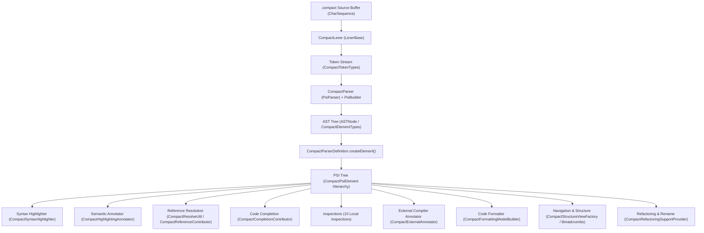
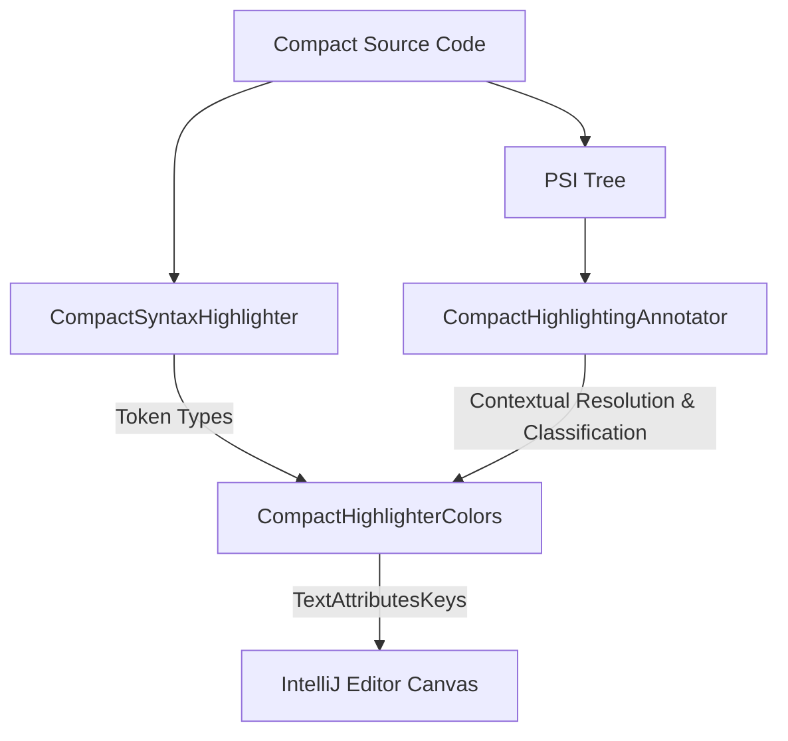
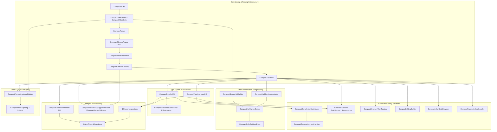

    # Midnight Compact Language Plugin: Feature Architecture & Developer Learning Guide

This document is a comprehensive, deep-dive architectural guide to the **Midnight Compact Language Plugin** for the IntelliJ Platform (`dev.verloren.midnight`). It explains how every major IDE feature is implemented directly in our codebase, tracing the exact transformation pipeline:

```text
Source Code (.compact)
        ↓
   Lexer Engine (CompactLexer)
        ↓
    Tokens (CompactTokenTypes / CompactTokenSets)
        ↓
   Parser Engine (CompactParser / PsiBuilder)
        ↓
    AST Nodes (ASTNode / CompactElementTypes)
        ↓
   PSI Elements (CompactPsiElement / CompactNamedElement)
        ↓
 IntelliJ Features (Highlighting, Completion, Navigation, Inspections, Formatting, Refactoring, Live Templates)
```

---

## Table of Contents

1. [High-Level Architecture & Component Breakdown](#1-high-level-architecture--component-breakdown)
2. [Lexer Mechanics: Handwritten Tokenization Engine](#2-lexer-mechanics-handwritten-tokenization-engine)
3. [Token Types & Token Sets Architecture](#3-token-types--token-sets-architecture)
4. [Parser Mechanics: Recursive-Descent & Precedence Climbing](#4-parser-mechanics-recursive-descent--precedence-climbing)
5. [AST Architecture: Tokens vs AST Nodes vs PSI Elements](#5-ast-architecture-tokens-vs-ast-nodes-vs-psi-elements)
6. [PSI Architecture: Type Hierarchy & Factory Binding](#6-psi-architecture-type-hierarchy--factory-binding)
7. [Syntax & Semantic Highlighting Pipeline](#7-syntax--semantic-highlighting-pipeline)
8. [Code Completion Engine & Smart Insert Handlers](#8-code-completion-engine--smart-insert-handlers)
9. [Live Templates, File Templates, and Expression Macros](#9-live-templates-file-templates-and-expression-macros)
10. [Reference Resolution, Scoping & Go To Definition](#10-reference-resolution-scoping--go-to-definition)
11. [Rename Refactoring & Identifier Manipulation](#11-rename-refactoring--identifier-manipulation)
12. [Inspections, External Annotator & Quick-Fix System](#12-inspections-external-annotator--quick-fix-system)
13. [Code Formatting, Block Hierarchy & Spacing Model](#13-code-formatting-block-hierarchy--spacing-model)
14. [Brace Matching, Quote Handlers & Auto-Insert Typing Hooks](#14-brace-matching-quote-handlers--auto-insert-typing-hooks)
15. [Comment Support, Doc Comments & Enter Handlers](#15-comment-support-doc-comments--enter-handlers)
16. [Navigation, Breadcrumbs, Structure View & Inlays](#16-navigation-breadcrumbs-structure-view--inlays)
17. [Consolidated IntelliJ Extension Points & Classes Matrix](#17-consolidated-intellij-extension-points--classes-matrix)
18. [Plugin Feature Dependency Graph](#18-plugin-feature-dependency-graph)
19. [End-to-End Lifecycle Trace: `export circuit foo(x: Field): Void {}`](#19-end-to-end-lifecycle-trace-export-circuit-foox-field-void-)
20. [Implementation Fidelity & Generated vs Handwritten Verification](#20-implementation-fidelity--generated-vs-handwritten-verification)

---

## 1. High-Level Architecture & Component Breakdown

### 1.1 Architectural Overview Diagram



### 1.2 Plugin Registration & Entry Points

The plugin is registered via `plugin.xml` ([src/main/resources/META-INF/plugin.xml](file:///C:/Users/shaki/IdeaProjects/midnight-plugin/src/main/resources/META-INF/plugin.xml)).

1. **Language Registration**:
   * Class: `dev.verloren.midnight.CompactLanguage` ([CompactLanguage.java](file:///C:/Users/shaki/IdeaProjects/midnight-plugin/src/main/java/dev/verloren/midnight/CompactLanguage.java))
   * Singleton: `CompactLanguage.INSTANCE = new CompactLanguage()`
   * Language ID: `"Compact"`
2. **File Type Registration**:
   * Extension Point: `com.intellij.fileType`
   * Class: `dev.verloren.midnight.CompactFileType` ([CompactFileType.java](file:///C:/Users/shaki/IdeaProjects/midnight-plugin/src/main/java/dev/verloren/midnight/CompactFileType.java))
   * File Extension: `compact`
   * Associated Icon: `dev.verloren.midnight.icons.MidnightIcons.FILE`
3. **Parser Definition Registration**:
   * Extension Point: `com.intellij.lang.parserDefinition`
   * Class: `dev.verloren.midnight.parser.CompactParserDefinition` ([CompactParserDefinition.java](file:///C:/Users/shaki/IdeaProjects/midnight-plugin/src/main/java/dev/verloren/midnight/parser/CompactParserDefinition.java))
   * Hooks the parser, lexer, file node type (`CompactFileElementType`), comment token sets, and PSI element factory into the IntelliJ core engine.

### 1.3 Handwritten vs Generated Engine

> [!IMPORTANT]
> **100% Handwritten Architecture**: Unlike many IntelliJ plugins that generate lexers using JFlex (`.flex`) or parsers using Grammar-Kit (`.bnf`), the Midnight Compact plugin is **entirely handwritten in Java**.
> * **No JFlex files** or Grammar-Kit specs are used in compilation.
> * `CompactLexer.java` is a handwritten, stateless character-by-character scanner extending `LexerBase`.
> * `CompactParser.java` is a handwritten recursive-descent parser with precedence climbing using IntelliJ's `PsiBuilder`.
> * The PSI classes (`CompactCircuitDefinitionImpl`, `CompactTypeDefinitionImpl`, etc.) and the factory `CompactElementFactory.java` are 100% handwritten Java classes.

---

## 2. Lexer Mechanics: Handwritten Tokenization Engine

* **File**: `dev.verloren.midnight.lexer.CompactLexer` ([CompactLexer.java](file:///C:/Users/shaki/IdeaProjects/midnight-plugin/src/main/java/dev/verloren/midnight/lexer/CompactLexer.java))
* **Base Class**: `com.intellij.lexer.LexerBase`

### 2.1 Lexer State & Buffer Model

The `CompactLexer` operates directly over a `CharSequence` buffer:
```java
public class CompactLexer extends LexerBase {
  private CharSequence buffer;
  private int startOffset;
  private int endOffset;
  private int currentOffset;
  private IElementType currentTokenType;
  private int tokenStart;
  private int tokenEnd;
  ...
}
```

* **Stateless Tokenization**: `getState()` always returns `0`. The Compact language grammar is lexically context-free, allowing the lexer to tokenize any slice of the buffer without tracking state machines or lexical modes.
* **Buffer Initialization**: `start(CharSequence buffer, int startOffset, int endOffset, int initialState)` binds the text and triggers `advance()` to locate the first token.

### 2.2 Character Scanning & Disambiguation Rules

The core scanning logic is housed in `locateToken()`:

#### A. Whitespace
* Method: `Character.isWhitespace(ch)`
* Loops until a non-whitespace character is found.
* Emits: `TokenType.WHITE_SPACE`.

#### B. Comments
* **Line Comments**: Detected when `ch == '/' && next == '/'`. Scans until `\n` or EOF. Emits `CompactTokenTypes.LINE_COMMENT`.
* **Block Comments**: Detected when `ch == '/' && next == '*'`. Scans forward for closing `*/`.
  * If EOF is reached without closing `*/` or an unclosed nested block is found, emits `CompactTokenTypes.UNTERMINATED_BLOCK_COMMENT`.
  * Otherwise emits `CompactTokenTypes.BLOCK_COMMENT`.

#### C. Identifiers vs Keywords vs Built-in Types
* Starts when `ch` satisfies `isIdentifierStart(ch)` (`Character.isLetter(ch) || ch == '_' || ch == '$'`).
* Continues while `isIdentifierPart(ch)` (`Character.isLetterOrDigit(ch) || ch == '_' || ch == '$'`).
* Once the full word string `text` is extracted:
  1. Checks `KEYWORDS.get(text)`:
     * Contains: `pragma`, `include`, `import`, `export`, `module`, `contract`, `struct`, `enum`, `type`, `witness`, `constructor`, `circuit`, `ledger`, `pure`, `sealed`, `new`, `const`, `if`, `else`, `for`, `of`, `return`, `assert`, `disclose`, `default`, `map`, `fold`, `slice`, `pad`, `emit`, `true`, `false`, `as`, `from`, `prefix`, `implements`, `let`.
  2. Checks `BUILTIN_TYPES.get(text)`:
     * Contains: `Field`, `Boolean`, `Uint`, `Bytes`, `Vector`, `Opaque`, `Cell`, `Void`, `JubjubScalar`, `Secp256k1Base`, `Secp256k1Scalar`, `Counter`, `Set`, `Map`, `List`, `HistoricMerkleTree`, `MerkleTree`, `Kernel`, `ContractAddress`, `ShieldedCoinInfo`, `QualifiedShieldedCoinInfo`, `ZswapCoinPublicKey`, `ShieldedSendResult`, `Maybe`, `Either`, `MerkleTreeDigest`, `MerkleTreePath`, `MerkleTreePathEntry`, `LeafPreimage`.
  3. Fallback: If not found in `KEYWORDS` or `BUILTIN_TYPES`, emits `CompactTokenTypes.IDENTIFIER`.

> [!NOTE]
> **Disambiguation Example**: For `circuit`: `isIdentifierStart('c')` matches, scans `"circuit"`, looks up `KEYWORDS.get("circuit")` -> returns `CompactTokenTypes.CIRCUIT`. For `foo123`: `isIdentifierStart('f')` matches, scans `"foo123"`, neither map matches -> returns `CompactTokenTypes.IDENTIFIER`.

#### D. Numbers & Version SemVer Literals
* **Hex Literals**: `0x` or `0X` followed by `[0-9a-fA-F_]+` -> `CompactTokenTypes.HEX_LITERAL`.
* **Binary Literals**: `0b` or `0B` followed by `[01_]+` -> `CompactTokenTypes.BINARY_LITERAL`.
* **Octal Literals**: `0o` or `0O` followed by `[0-7_]+` -> `CompactTokenTypes.OCTAL_LITERAL`.
* **Decimal & SemVer**:
  * Scans consecutive digits `[0-9]+`.
  * If followed by `.` and another digit (and *not* `..` range operator), scans SemVer / decimal points (`X.Y.Z`).
  * Emits `CompactTokenTypes.VERSION_LITERAL` if multiple dots or SemVer pattern matches; otherwise emits `CompactTokenTypes.DECIMAL_LITERAL`.

#### E. Operators & Delimiters
* Single and multi-character operators are disambiguated by character lookahead:
  * `==` -> `EQEQ`, `!=` -> `NEQ`, `<=` -> `LTE`, `>=` -> `GTE`, `&&` -> `ANDAND`, `||` -> `OROR`, `=>` -> `ARROW`, `..` -> `RANGE`, `...` -> `SPREAD`, `+=` -> `PLUS_ASSIGN`, `-=` -> `MINUS_ASSIGN`.
  * Single characters: `+`, `-`, `*`, `/`, `%`, `=`, `<`, `>`, `!`, `?`, `(`, `)`, `{`, `}`, `[`, `]`, `,`, `:`, `;`, `.`, `#`.

#### F. String Literals
* Starts on `"` or `'`.
* Scans until matching unescaped closing quote.
* Handles escape sequences `\n`, `\t`, `\r`, `\\`, `\"`, `\'`, `\0`, `\xHH`, `\uHHHH`.
* If EOF is reached before closing quote, emits `CompactTokenTypes.UNTERMINATED_STRING`.

---

## 3. Token Types & Token Sets Architecture

### 3.1 Token Type Hierarchy

* **Base Token Class**: `dev.verloren.midnight.lexer.CompactTokenType` ([CompactTokenType.java](file:///C:/Users/shaki/IdeaProjects/midnight-plugin/src/main/java/dev/verloren/midnight/lexer/CompactTokenType.java))
  * Extends `com.intellij.psi.tree.IElementType`.
  * Initialized with `CompactLanguage.INSTANCE`.
* **Token Dictionary**: `dev.verloren.midnight.lexer.CompactTokenTypes` ([CompactTokenTypes.java](file:///C:/Users/shaki/IdeaProjects/midnight-plugin/src/main/java/dev/verloren/midnight/lexer/CompactTokenTypes.java))
  * Declares every static token constant (e.g. `CIRCUIT`, `WITNESS`, `IDENTIFIER`, `LBRACE`, etc.).

### 3.2 Token Sets & Filtering

* **File**: `dev.verloren.midnight.lexer.CompactTokenSets` ([CompactTokenSets.java](file:///C:/Users/shaki/IdeaProjects/midnight-plugin/src/main/java/dev/verloren/midnight/lexer/CompactTokenSets.java))
* IntelliJ requires grouping tokens into `TokenSet` instances for parsing and whitespace handling:

```java
public final class CompactTokenSets {
  public static final TokenSet COMMENTS = TokenSet.create(
      CompactTokenTypes.LINE_COMMENT, 
      CompactTokenTypes.BLOCK_COMMENT, 
      CompactTokenTypes.UNTERMINATED_BLOCK_COMMENT
  );
  public static final TokenSet WHITE_SPACES = TokenSet.create(TokenType.WHITE_SPACE);
  public static final TokenSet STRINGS = TokenSet.create(
      CompactTokenTypes.STRING_LITERAL, 
      CompactTokenTypes.UNTERMINATED_STRING
  );
  public static final TokenSet KEYWORDS = TokenSet.create(
      CompactTokenTypes.PRAGMA, CompactTokenTypes.INCLUDE, CompactTokenTypes.IMPORT, 
      CompactTokenTypes.EXPORT, CompactTokenTypes.MODULE, CompactTokenTypes.CONTRACT, 
      CompactTokenTypes.STRUCT, CompactTokenTypes.ENUM, CompactTokenTypes.TYPE, 
      CompactTokenTypes.WITNESS, CompactTokenTypes.CONSTRUCTOR, CompactTokenTypes.CIRCUIT, 
      CompactTokenTypes.LEDGER, CompactTokenTypes.CONST, CompactTokenTypes.IF, 
      CompactTokenTypes.ELSE, CompactTokenTypes.FOR, CompactTokenTypes.OF, 
      CompactTokenTypes.RETURN, ...
  );
  public static final TokenSet BUILTIN_TYPES = TokenSet.create(...);
  public static final TokenSet NAT_LITERALS = TokenSet.create(
      CompactTokenTypes.DECIMAL_LITERAL, 
      CompactTokenTypes.HEX_LITERAL, 
      CompactTokenTypes.OCTAL_LITERAL, 
      CompactTokenTypes.BINARY_LITERAL
  );
}
```

### 3.3 Skipped vs Preserved Tokens

* **Ignored by Parser Stream**: In `CompactParserDefinition.java`:
  * `getWhitespaceTokens()` returns `CompactTokenSets.WHITE_SPACES`.
  * `getCommentTokens()` returns `CompactTokenSets.COMMENTS`.
  * `getStringLiteralElements()` returns `CompactTokenSets.STRINGS`.
* IntelliJ's `PsiBuilder` automatically filters out whitespace and comments from the stream passed to `CompactParser`, attaching them as leaf AST nodes to the nearest non-whitespace parent element.

---

## 4. Parser Mechanics: Recursive-Descent & Precedence Climbing

* **File**: `dev.verloren.midnight.parser.CompactParser` ([CompactParser.java](file:///C:/Users/shaki/IdeaProjects/midnight-plugin/src/main/java/dev/verloren/midnight/parser/CompactParser.java))
* **Interface**: `com.intellij.lang.PsiParser`
* **Core Helper**: `dev.verloren.midnight.parser.CompactParserUtil` ([CompactParserUtil.java](file:///C:/Users/shaki/IdeaProjects/midnight-plugin/src/main/java/dev/verloren/midnight/parser/CompactParserUtil.java))

### 4.1 Parser Execution Flow (`parse`)

```java
@Override
public @NotNull ASTNode parse(@NotNull IElementType root, @NotNull PsiBuilder builder) {
  PsiBuilder.Marker file = builder.mark();

  while (!builder.eof()) {
    int startOffset = builder.getCurrentOffset();
    if (!parseProgramElement(builder)) {
      builder.error("Expected Compact declaration");
      if (!builder.eof() && !TOP_LEVEL_RECOVERY.contains(builder.getTokenType())) {
        CompactParserUtil.sync(builder, TOP_LEVEL_RECOVERY);
      }
      if (!builder.eof() && at(builder, CompactTokenTypes.SEMICOLON)) {
        builder.advanceLexer();
      } else if (!builder.eof() && !isProgramElementStart(builder)) {
        builder.advanceLexer();
      }
    }
    if (!builder.eof() && builder.getCurrentOffset() == startOffset) {
      builder.advanceLexer(); // Infinite loop guard
    }
  }

  file.done(root);
  return builder.getTreeBuilt();
}
```

### 4.2 Marker Lifecycle: `mark()`, `done()`, `precede()`, `drop()`, `rollbackTo()`

1. **`mark()`**: Creates a checkpoint in the token stream. All tokens consumed after `mark()` belong to this node.
2. **`done(IElementType type)`**: Closes the marker and wraps the consumed tokens in an AST node of `type`.
3. **`precede()`**: Creates a parent marker enclosing an already completed or active child marker. Crucial for left-associative binary expression parsing (e.g. `a + b + c`).
4. **`drop()`**: Discards the marker without rolling back the token stream (used when speculative parsing succeeds).
5. **`rollbackTo()`**: Aborts the marker and rewinds the token stream back to where `mark()` was called (used for backtracking, e.g. in lambda speculative lookahead `tryParseLambdaExpression`).

### 4.3 Error Recovery & Synchronization

The parser defines `TOP_LEVEL_RECOVERY` to prevent cascading parse errors:
```java
private static final TokenSet TOP_LEVEL_RECOVERY = TokenSet.create(
    CompactTokenTypes.SEMICOLON,
    CompactTokenTypes.PRAGMA,
    CompactTokenTypes.IMPORT,
    CompactTokenTypes.EXPORT,
    CompactTokenTypes.INCLUDE,
    CompactTokenTypes.MODULE,
    CompactTokenTypes.CONTRACT,
    CompactTokenTypes.CIRCUIT,
    CompactTokenTypes.STRUCT,
    CompactTokenTypes.ENUM,
    CompactTokenTypes.TYPE,
    CompactTokenTypes.LEDGER,
    CompactTokenTypes.WITNESS,
    CompactTokenTypes.CONSTRUCTOR,
    CompactTokenTypes.SEALED,
    CompactTokenTypes.PURE,
    CompactTokenTypes.NEW
);
```
When syntax is invalid, `CompactParserUtil.sync(builder, TOP_LEVEL_RECOVERY)` skips erroneous tokens until a safe declaration boundary is reached.

### 4.4 Binary Expression Parsing via Precedence Climbing

Binary operators use classic Pratt/Precedence Climbing in `parseBinaryExpression(PsiBuilder builder, int minPrecedence)`:

```java
private PsiBuilder.Marker parseBinaryExpression(PsiBuilder builder, int minPrecedence) {
  PsiBuilder.Marker left = parseUnaryExpression(builder);
  while (!builder.eof()) {
    IElementType operator = builder.getTokenType();
    int precedence = CompactParserUtil.binaryPrecedence(operator);
    if (precedence < minPrecedence) {
      break;
    }

    PsiBuilder.Marker expression = left.precede();
    builder.advanceLexer();
    if (operator == CompactTokenTypes.AS) {
      parseType(builder);
      expression.done(CompactElementTypes.CAST_EXPR);
    } else {
      parseBinaryExpression(builder, precedence + 1);
      expression.done(CompactElementTypes.BINARY_EXPR);
    }
    left = expression;
  }
  return left;
}
```

Precedence levels defined in `CompactParserUtil.binaryPrecedence()`:
* Precedence 1: `||`
* Precedence 2: `&&`
* Precedence 3: `==`, `!=`
* Precedence 4: `<`, `<=`, `>`, `>=`
* Precedence 5: `+`, `-`
* Precedence 6: `*`, `/`, `%`
* Precedence 7: `as` (Type Cast)

---

## 5. AST Architecture: Tokens vs AST Nodes vs PSI Elements

### 5.1 Three-Tiered Structural Hierarchy

| Layer | Type Class | Created By | Description |
| :--- | :--- | :--- | :--- |
| **Token (Leaf)** | `CompactTokenType` / `LeafElement` | `CompactLexer` | Raw lexical unit (e.g. `CIRCUIT`, `IDENTIFIER`, `LBRACE`). Has text and offset, no semantic children. |
| **AST Node (Composite)** | `CompactElementType` / `CompositeElement` | `CompactParser` via `PsiBuilder.done()` | Intermediate tree node representing grammatical productions (e.g. `CIRCUIT_DEFINITION`, `BLOCK`, `TYPED_ID`). |
| **PSI Element (Semantic)** | `CompactPsiElement` / `CompactNamedElement` | `CompactElementFactory` via `ParserDefinition` | High-level strongly-typed Java object providing IDE APIs (e.g. `getName()`, `resolve()`, `getType()`, `getTextOffset()`). |

### 5.2 AST Element Types Dictionary

* **File**: `dev.verloren.midnight.parser.CompactElementTypes` ([CompactElementTypes.java](file:///C:/Users/shaki/IdeaProjects/midnight-plugin/src/main/java/dev/verloren/midnight/parser/CompactElementTypes.java))
* All composite element types are instances of `dev.verloren.midnight.parser.CompactElementType`:
  * Top-Level: `PRAGMA_FORM`, `INCLUDE_FORM`, `IMPORT_FORM`, `EXPORT_FORM`, `MODULE_DEFINITION`, `CONTRACT_DECLARATION`, `CIRCUIT_DEFINITION`, `WITNESS_DECLARATION`, `LEDGER_DECLARATION`, `TYPE_ALIAS_DECLARATION`, `STRUCT_DECLARATION`, `ENUM_DECLARATION`, `CONSTRUCTOR_DEFINITION`.
  * Expressions: `BINARY_EXPR`, `UNARY_EXPR`, `CAST_EXPR`, `TERNARY_EXPR`, `REFERENCE_EXPR`, `LITERAL_EXPR`, `CALL_EXPR`, `STRUCT_LITERAL_EXPR`, `MEMBER_EXPR`, `TUPLE_EXPR`, `INDEX_EXPR`, `PAD_EXPR`, `DEFAULT_EXPR`, `SLICE_EXPR`, `LAMBDA_EXPR`.
  * Statements: `IF_STATEMENT`, `FOR_STATEMENT`, `CONST_STATEMENT`, `RETURN_STATEMENT`, `EXPR_STATEMENT`, `BLOCK`.
  * Types: `BUILTIN_TYPE`, `TYPE_REFERENCE`, `TUPLE_TYPE`, `TYPE_SIZE`.

---

## 6. PSI Architecture: Type Hierarchy & Factory Binding

### 6.1 PSI Class Hierarchy

All Compact PSI elements inherit from `CompactPsiElement`:

```text
com.intellij.extapi.psi.ASTWrapperPsiElement
    └── dev.verloren.midnight.psi.CompactPsiElement
            ├── CompactBlock
            ├── CompactBinaryExprImpl
            ├── CompactCallExprImpl
            ├── CompactReferenceExprImpl
            ├── CompactTypeReferenceImpl
            ├── CompactBuiltinTypeImpl
            └── dev.verloren.midnight.psi.CompactNamedElementImpl (implements CompactNamedElement)
                    ├── CompactCircuitDefinitionImpl (implements CompactCircuitDefinition)
                    ├── CompactWitnessDeclarationImpl (implements CompactWitnessDeclaration)
                    ├── CompactConstructorDeclarationImpl (implements CompactConstructorDeclaration)
                    ├── CompactExternalContractDeclarationImpl (implements CompactExternalContractDeclaration)
                    ├── CompactModuleDefinitionImpl (implements CompactModuleDefinition)
                    ├── CompactStructDefinitionImpl (implements CompactStructDefinition)
                    ├── CompactEnumDefinitionImpl (implements CompactEnumDefinition)
                    ├── CompactEnumMemberImpl
                    ├── CompactStructFieldImpl
                    ├── CompactTypeDefinitionImpl (implements CompactTypeDefinition)
                    ├── CompactLedgerDeclarationImpl (implements CompactLedgerDeclaration)
                    ├── CompactParameterImpl (implements CompactParameter)
                    ├── CompactGenericParameterImpl
                    ├── CompactConstBindingImpl (implements CompactConstBinding)
                    └── CompactPatternImpl
```

### 6.2 PSI Factory Dispatch: `CompactElementFactory`

* **File**: `dev.verloren.midnight.psi.CompactElementFactory` ([CompactElementFactory.java](file:///C:/Users/shaki/IdeaProjects/midnight-plugin/src/main/java/dev/verloren/midnight/psi/CompactElementFactory.java))
* When IntelliJ constructs the PSI tree, `CompactParserDefinition.createElement(ASTNode node)` delegates to `CompactElementFactory.createElement(node)`:

```java
public static @NotNull PsiElement createElement(@NotNull ASTNode node) {
  IElementType elementType = node.getElementType();
  if (elementType == CompactElementTypes.CIRCUIT_DEFINITION) {
    return new CompactCircuitDefinitionImpl(node);
  }
  if (elementType == CompactElementTypes.WITNESS_DECLARATION) {
    return new CompactWitnessDeclarationImpl(node);
  }
  if (elementType == CompactElementTypes.TYPE_ALIAS_DECLARATION) {
    return new CompactTypeDefinitionImpl(node);
  }
  if (elementType == CompactElementTypes.REFERENCE_EXPR) {
    return new CompactReferenceExprImpl(node);
  }
  ...
  return new CompactPsiElement(node);
}
```

### 6.3 Named Elements Lifecycle (`CompactNamedElementImpl`)

* **File**: `dev.verloren.midnight.psi.CompactNamedElementImpl` ([CompactNamedElementImpl.java](file:///C:/Users/shaki/IdeaProjects/midnight-plugin/src/main/java/dev/verloren/midnight/psi/CompactNamedElementImpl.java))
1. **Name Extraction (`getName()`)**: Finds the leaf identifier token child node (`CompactTokenTypes.IDENTIFIER`) and returns its text.
2. **Name Identifier (`getNameIdentifier()`)**: Returns the `PsiElement` leaf representing the declaration name.
3. **Caret Offset (`getTextOffset()`)**: Directs the editor caret and navigation targets directly to the identifier token rather than the beginning of the declaration keyword.
4. **Renaming (`setName(String name)`)**: Creates a fresh identifier leaf via `CompactElementFactory.createIdentifierLeaf(getProject(), name)` and replaces the old AST node.
5. **Search Scope (`getUseScope()`)**:
   * Scopes local variables, parameters, and generic parameters to `LocalSearchScope(getContainingFile())`.
   * Scopes top-level declarations (circuits, structs, types) to `GlobalSearchScope.projectScope(getProject())`.

---

## 7. Syntax & Semantic Highlighting Pipeline

Highlighting in our plugin uses a two-tier architecture:
1. **Lexer-Level Syntax Highlighting**: Fast, token-based coloring running synchronously as tokens are scanned.
2. **Semantic Annotator Highlighting**: AST/PSI-aware coloring running asynchronously in the background.



### 7.1 Tier 1: Lexer Highlighting

* **Class**: `dev.verloren.midnight.highlighter.CompactSyntaxHighlighter` ([CompactSyntaxHighlighter.java](file:///C:/Users/shaki/IdeaProjects/midnight-plugin/src/main/java/dev/verloren/midnight/highlighter/CompactSyntaxHighlighter.java))
* **Factory**: `dev.verloren.midnight.highlighter.CompactSyntaxHighlighterFactory`
* Maps raw tokens to base `TextAttributesKey`s:
  * `EXPORT`, `PURE`, `SEALED`, `NEW`, `IMPLEMENTS` -> `CompactHighlighterColors.MODIFIER`
  * `PRAGMA` -> `CompactHighlighterColors.PRAGMA`
  * `ASSERT`, `DISCLOSE`, `FOLD`, `SLICE`, `PAD`, `EMIT` -> `CompactHighlighterColors.BUILTIN_FUNCTION`
  * `CIRCUIT`, `STRUCT`, `ENUM`, `TYPE`, `WITNESS`, `LEDGER`, etc. -> `CompactHighlighterColors.KEYWORD`
  * `BUILTIN_TYPES` -> `CompactHighlighterColors.BUILTIN_TYPE`
  * `DECIMAL_LITERAL`, `HEX_LITERAL` -> `CompactHighlighterColors.NUMBER`
  * `STRING_LITERAL` -> `CompactHighlighterColors.STRING`

### 7.2 Tier 2: Semantic Highlighting

* **Class**: `dev.verloren.midnight.highlighter.CompactHighlightingAnnotator` ([CompactHighlightingAnnotator.java](file:///C:/Users/shaki/IdeaProjects/midnight-plugin/src/main/java/dev/verloren/midnight/highlighter/CompactHighlightingAnnotator.java))
* Enriches the editor by analyzing the PSI tree:
  1. **Declaration Names**: Differentiates circuit declarations (`CIRCUIT_DECLARATION`), witness declarations (`WITNESS_DECLARATION`), struct declarations (`STRUCT_DECLARATION`), ledger state declarations (`LEDGER_DECLARATION`), and parameters (`PARAMETER_DECLARATION`).
  2. **Call Expressions**: Resolves `CompactCallExprImpl` targets; if resolving to a witness, highlights as `WITNESS_CALL`; if to a circuit, highlights as `CIRCUIT_CALL`.
  3. **Member Accesses**: Resolves `CompactMemberExprImpl` to distinguish enum members (`ENUM_MEMBER_ACCESS`) from struct fields (`FIELD_ACCESS`).
  4. **Doc Comments**: Distinguishes `///` and `/**` as `DOC_COMMENT`, parsing `@param` / `@return` tags as `DOC_COMMENT_TAG`.
  5. **String Escapes**: Scans string characters to validate and highlight valid (`\n`, `\uXXXX`) vs invalid escape sequences (`\q`).

### 7.3 Color Settings Page

* **Class**: `dev.verloren.midnight.highlighter.CompactColorSettingsPage` ([CompactColorSettingsPage.java](file:///C:/Users/shaki/IdeaProjects/midnight-plugin/src/main/java/dev/verloren/midnight/highlighter/CompactColorSettingsPage.java))
* **Extension Point**: `com.intellij.colorSettingsPage`
* Provides an interactive settings pane in **Settings -> Editor -> Color Scheme -> Compact** with 48 configurable color descriptors.

---

## 8. Code Completion Engine & Smart Insert Handlers

### 8.1 Caret Context Classification

* **Contributor**: `dev.verloren.midnight.completion.CompactCompletionContributor` ([CompactCompletionContributor.java](file:///C:/Users/shaki/IdeaProjects/midnight-plugin/src/main/java/dev/verloren/midnight/completion/CompactCompletionContributor.java))
* **Context Classifier**: `dev.verloren.midnight.completion.CompactCompletionContext` ([CompactCompletionContext.java](file:///C:/Users/shaki/IdeaProjects/midnight-plugin/src/main/java/dev/verloren/midnight/completion/CompactCompletionContext.java))

`CompactCompletionContext.classify(position)` inspects the AST context of the caret:
* `KEYWORD`: Top-level or block start -> offers declarations (`circuit`, `witness`, `struct`, `ledger`, etc.).
* `AFTER_EXPORT`: Caret follows `export` -> offers `circuit`, `struct`, `enum`, `type`, `witness`, `ledger`.
* `AFTER_PURE`: Caret follows `pure` -> offers `circuit`.
* `AFTER_SEALED`: Caret follows `sealed` -> offers `ledger`.
* `TYPE`: In type positions (after `:`, inside `<>`, after `as` or `=`) -> offers built-in primitives and user-defined types.
* `MEMBER`: After `.` -> offers struct fields or enum members.
* `STATEMENT`: Inside circuit bodies -> offers `const`, `if`, `for`, `return`, `assert`, `disclose`, and visible local/global values.
* `BYTES_SIZE` / `UINT_SIZE`: Inside `Bytes<...>` or `Uint<...>` -> offers standard sizes (`32`, `64`, `1..8`, etc.).

### 8.2 Custom Insert Handlers

When a completion item is selected, dedicated insert handlers format the code and launch interactive templates:

| Insert Handler | Triggered On | Action |
| :--- | :--- | :--- |
| `CompactDeclarationInsertHandler` | `circuit`, `witness`, `struct`, `enum`, `type`, `const`, `ledger` | Automatically inserts template structure, generates non-colliding names (`circuit1`), and places caret with tab stops. |
| `CompactAssertInsertHandler` | `assert` | Inserts `assert($COND$, "$MSG$");` and positions caret at condition. |
| `CompactDiscloseInsertHandler` | `disclose` | Inserts `disclose($EXPR$);`. |
| `CompactEitherInsertHandler` | `Either` | Inserts `Either<$LEFT$, $RIGHT$>` and opens angle brackets. |
| `CompactMaybeInsertHandler` | `Maybe` | Inserts `Maybe<$TYPE$>`. |
| `CompactVectorInsertHandler` | `Vector` | Inserts `Vector<$SIZE$, $TYPE$>`. |
| `CompactParameterizedTypeInsertHandler`| `Bytes`, `Uint`, `Map`, `Set` | Inserts angle brackets and moves caret inside `<>`. |

---

## 9. Live Templates, File Templates, and Expression Macros

### 9.1 Live Templates Configuration

* **File**: `src/main/resources/liveTemplates/Compact.xml` ([liveTemplates/Compact.xml](file:///C:/Users/shaki/IdeaProjects/midnight-plugin/src/main/resources/liveTemplates/Compact.xml))
* **Context Type**: `dev.verloren.midnight.ide.templates.CompactLiveTemplateContextType`

Registered abbreviations:
* `cir`: `export circuit $NAME$($PARAMS$): $RET$ {\n  $END$\n}`
* `wit`: `witness $NAME$($PARAMS$): $RET$;`
* `led`: `export ledger $NAME$: $TYPE$;`
* `cct`: Complete contract skeleton with constructor, ledger state, and export circuit.
* `ccti`: Contract implements template.
* `str` / `expstr`: Struct declaration template.
* `en` / `expen`: Enum declaration template.
* `ass`: `assert($COND$, "$MSG$");`
* `disc`: `disclose($EXPR$);`

### 9.2 Custom Live Template Macros

* Extension Point: `com.intellij.liveTemplateMacro`
1. `CompactDeclarationNameMacro` ([CompactDeclarationNameMacro.java](file:///C:/Users/shaki/IdeaProjects/midnight-plugin/src/main/java/dev/verloren/midnight/ide/templates/CompactDeclarationNameMacro.java)): Generates non-colliding declaration names (`compactDeclarationName("circuit")` -> `fooCircuit`).
2. `CompactCircuitNameMacro` ([CompactCircuitNameMacro.java](file:///C:/Users/shaki/IdeaProjects/midnight-plugin/src/main/java/dev/verloren/midnight/ide/templates/CompactCircuitNameMacro.java)): Evaluates context for circuit names.
3. `CompactWitnessNameMacro` ([CompactWitnessNameMacro.java](file:///C:/Users/shaki/IdeaProjects/midnight-plugin/src/main/java/dev/verloren/midnight/ide/templates/CompactWitnessNameMacro.java)): Evaluates context for witness names.
4. `CompactTypeMacro` ([CompactTypeMacro.java](file:///C:/Users/shaki/IdeaProjects/midnight-plugin/src/main/java/dev/verloren/midnight/ide/templates/CompactTypeMacro.java)): Provides smart type defaults (`compactType("Field")`).

### 9.3 File Templates

* **Factory**: `dev.verloren.midnight.ide.templates.CompactFileTemplateGroupFactory` ([CompactFileTemplateGroupFactory.java](file:///C:/Users/shaki/IdeaProjects/midnight-plugin/src/main/java/dev/verloren/midnight/ide/templates/CompactFileTemplateGroupFactory.java))
* **Template Properties Provider**: `dev.verloren.midnight.ide.templates.CompactDefaultTemplatePropertiesProvider`
* **Templates**:
  * `Compact Contract.compact.ft`: Complete smart contract template.
  * `Compact Module.compact.ft`: Module template.
  * `Compact File.compact.ft`: Empty file with pragma.

---

## 10. Reference Resolution, Scoping & Go To Definition

### 10.1 Dual-Namespace Model: VALUE vs TYPE

* **Helper**: `dev.verloren.midnight.resolve.CompactResolveUtil` ([CompactResolveUtil.java](file:///C:/Users/shaki/IdeaProjects/midnight-plugin/src/main/java/dev/verloren/midnight/resolve/CompactResolveUtil.java))
* Resolves symbols independently across two distinct namespaces:
  * `Namespace.VALUE`: Circuits, witnesses, ledger variables, local constants, parameters, pattern bindings.
  * `Namespace.TYPE`: Structs, enums, type aliases, generic parameters, contract interfaces.

### 10.2 Reference Contributor & Providers

* **Contributor**: `dev.verloren.midnight.reference.CompactReferenceContributor` ([CompactReferenceContributor.java](file:///C:/Users/shaki/IdeaProjects/midnight-plugin/src/main/java/dev/verloren/midnight/reference/CompactReferenceContributor.java))
* Binds references to identifier leaf tokens in the PSI:
  * Identifier in `CompactTypeReferenceImpl` -> `CompactTypeReference`
  * Identifier in `CompactReferenceExprImpl` or `CompactCallExprImpl` -> `CompactValueReference`
  * Identifier in `CompactMemberExprImpl` -> `CompactStructFieldReference` / `CompactEnumMemberReference`
  * Identifier in `CompactImportElementImpl` / `CompactImportDeclarationImpl` -> `CompactImportReference`

### 10.3 Resolution Algorithm (`CompactResolveUtil`)

When resolving a value reference `name` at `context`:
1. **Local Scopes**: Traverses upwards via `PsiTreeUtil.getParentOfType(current, CompactBlock.class)`.
   * Checks preceding local `CompactConstBindingImpl` definitions.
   * Checks enclosing `CompactParameterImpl` (circuit/witness parameters).
   * Checks pattern bindings in `for` loops or pattern destructuring.
2. **Top-Level File Scope**: If not found locally, scans top-level declarations in containing `CompactFile`:
   * Matches `CompactCircuitDefinition`, `CompactWitnessDeclaration`, `CompactLedgerDeclaration`, `CompactTypeDefinition`, `CompactStructDefinition`, `CompactEnumDefinition`.
3. **Included / Imported Files**: Scans `include "path.compact"` and `import { ... } from "module"`:
   * Uses `CompactResolveUtil.resolveIncludeFile(psiFile, path)` to parse and search target files.

### 10.4 Navigation Handlers

* **Go To Declaration (`Ctrl+B`)**: `dev.verloren.midnight.navigation.CompactGotoDeclarationHandler` ([CompactGotoDeclarationHandler.java](file:///C:/Users/shaki/IdeaProjects/midnight-plugin/src/main/java/dev/verloren/midnight/navigation/CompactGotoDeclarationHandler.java))
* **Go To Type Declaration (`Ctrl+Shift+B`)**: `dev.verloren.midnight.navigation.CompactTypeDeclarationProvider` ([CompactTypeDeclarationProvider.java](file:///C:/Users/shaki/IdeaProjects/midnight-plugin/src/main/java/dev/verloren/midnight/navigation/CompactTypeDeclarationProvider.java))
* **Search Everywhere / Symbols (`Ctrl+Alt+Shift+N`)**: `dev.verloren.midnight.navigation.CompactGotoSymbolContributor`
* **Search Everywhere / Classes (`Ctrl+N`)**: `dev.verloren.midnight.navigation.CompactGotoClassContributor`

---

## 11. Rename Refactoring & Identifier Manipulation

### 11.1 Refactoring Support Provider

* **Class**: `dev.verloren.midnight.refactoring.CompactRefactoringSupportProvider` ([CompactRefactoringSupportProvider.java](file:///C:/Users/shaki/IdeaProjects/midnight-plugin/src/main/java/dev/verloren/midnight/refactoring/CompactRefactoringSupportProvider.java))
* Enables in-place rename refactoring (`isMemberInplaceRenameAvailable`) for any `CompactNamedElement`.

### 11.2 Identifier Validation

* **Class**: `dev.verloren.midnight.refactoring.CompactNamesValidator` ([CompactNamesValidator.java](file:///C:/Users/shaki/IdeaProjects/midnight-plugin/src/main/java/dev/verloren/midnight/refactoring/CompactNamesValidator.java))
* Validates whether a proposed rename string is legal:
  * `isKeyword(name, project)`: Returns `true` if name is in `CompactTokenSets.KEYWORDS` or `CompactTokenSets.BUILTIN_TYPES`.
  * `isIdentifier(name, project)`: Validates that the name begins with `isIdentifierStart` and continues with `isIdentifierPart`.

### 11.3 AST Leaf Replacement Mechanism

When a rename refactoring is executed:
1. IntelliJ invokes `CompactNamedElementImpl.setName(String newName)`.
2. `CompactElementFactory.createIdentifierLeaf(project, newName)` synthesizes a dummy file (`"type " + newName + " = Field;"`) and extracts the newly generated identifier leaf `PsiElement`.
3. `oldIdentifier.replace(newIdentifierLeaf)` surgically updates the AST and updates all resolved `CompactReferenceBase` instances across the project.

---

## 12. Inspections, External Annotator & Quick-Fix System

Our validation engine features three layers:
1. **Parser Syntax Errors**: Reported during initial PSI construction.
2. **10 In-IDE Local Inspections**: Real-time static analysis and semantic linting.
3. **External Compiler Annotator**: Background execution of the official `compactc` compiler CLI with JSON diagnostic output.

### 12.1 The 10 Local Inspections

All located in `dev.verloren.midnight.inspection`:

1. **`CompactUnresolvedReferenceInspection`**: Detects references in value or type positions that cannot be resolved in any visible scope.
2. **`CompactDuplicateDeclarationInspection`**: Detects duplicate definitions of circuits, witnesses, structs, enums, or ledger fields with identical names in the same file.
3. **`CompactUnusedLocalVariableInspection`**: Flags local `const` bindings and parameters that are never referenced in their scope. Offers quick-fix to remove or prefix with `_`.
4. **`CompactTypeMismatchInspection`**: Uses `CompactTypeInferenceUtil` to verify assignment types and binary operator operands.
5. **`CompactPureCircuitInspection`**: Validates that circuits marked `pure` do not read or mutate `ledger` state. Offers `CompactTogglePureCircuitIntention` quick-fix.
6. **`CompactSealedFieldMutationInspection`**: Ensures `sealed` ledger state fields are not assigned outside the constructor.
7. **`CompactRecursiveCircuitInspection`**: Detects direct or mutual recursion in circuits (prohibited in zero-knowledge circuit constraints).
8. **`CompactConstructorRestrictionInspection`**: Enforces that only one `constructor` is declared per contract and contains no circuit modifiers.
9. **`CompactUndisclosedWitnessInspection`**: Identifies witness values used in public expressions without explicit `disclose(...)`. Offers `CompactSurroundWithDiscloseIntention` quick-fix.
10. **`CompactPragmaVersionInspection`**: Validates `pragma language_version` against compiler compatibility matrices. Offers `CompactUpdatePragmaVersionIntention` quick-fix.

### 12.2 External Annotator & Compiler CLI Integration

* **Annotator**: `dev.verloren.midnight.compiler.CompactExternalAnnotator` ([CompactExternalAnnotator.java](file:///C:/Users/shaki/IdeaProjects/midnight-plugin/src/main/java/dev/verloren/midnight/compiler/CompactExternalAnnotator.java))
* **Output Parser**: `dev.verloren.midnight.compiler.CompactCompilerOutputParser` ([CompactCompilerOutputParser.java](file:///C:/Users/shaki/IdeaProjects/midnight-plugin/src/main/java/dev/verloren/midnight/compiler/CompactCompilerOutputParser.java))
* **Quick Fixes**: `CompactSwitchCompilerQuickFix`, `CompactUpdatePragmaQuickFix`.

#### External Annotator Lifecycle:
1. `collectInformation(PsiFile file)`: Captures virtual file path and source text snapshot.
2. `doAnnotate(InitialInfo info)`: Runs in background thread; invokes configured `compactc` binary or tool wrapper:
   ```bash
   compactc --check --format=json <source-file>
   ```
3. `apply(PsiFile file, AnnotationResult result, AnnotationHolder holder)`: Runs on UI thread; maps compiler line/column spans to IntelliJ `TextRange` and creates warning/error annotations with attached QuickFixes.

---

## 13. Code Formatting, Block Hierarchy & Spacing Model

### 13.1 Formatter Model Builder

* **Class**: `dev.verloren.midnight.formatter.CompactFormattingModelBuilder` ([CompactFormattingModelBuilder.java](file:///C:/Users/shaki/IdeaProjects/midnight-plugin/src/main/java/dev/verloren/midnight/formatter/CompactFormattingModelBuilder.java))
* **Base Interface**: `com.intellij.formatting.FormattingModelBuilder`

Creates a `FormattingModel` containing a tree of `CompactBlock` instances:
```java
@Override
public @NotNull FormattingModel createModel(@NotNull FormattingContext formattingContext) {
  CodeStyleSettings settings = formattingContext.getCodeStyleSettings();
  SpacingBuilder spacingBuilder = createSpacingBuilder(settings);
  CompactBlock rootBlock = new CompactBlock(
      formattingContext.getNode(),
      Wrap.createWrap(WrapType.NONE, false),
      Alignment.createAlignment(),
      spacingBuilder,
      Indent.getNoneIndent(),
      settings
  );
  return FormattingModelProvider.createFormattingModelForPsiFile(
      formattingContext.getContainingFile(), 
      rootBlock, 
      settings
  );
}
```

### 13.2 Spacing Rules (`createSpacingBuilder`)

Configured via `com.intellij.formatting.SpacingBuilder`:
* Before/after binary operators (`+`, `-`, `*`, `/`, `==`, `!=`, `=`, `=>`): `spacing(1, 1, 0, false, 0)` (1 space).
* After commas (`,`) and colons (`:`): 1 space.
* Before opening brace (`{`): 1 space.
* Inside parentheses `(` and `)`: 0 spaces.
* Inside type angle brackets `<` and `>`: 0 spaces.
* Before semicolons (`;`): 0 spaces.
* Around statements and top-level declarations: 1 to 2 blank lines.

### 13.3 Indentation Model (`CompactBlock`)

* **Class**: `dev.verloren.midnight.formatter.CompactBlock` ([CompactBlock.java](file:///C:/Users/shaki/IdeaProjects/midnight-plugin/src/main/java/dev/verloren/midnight/formatter/CompactBlock.java))
* Children inside `CompactElementTypes.BLOCK` (circuit bodies, struct declarations, module definitions) receive `Indent.getNormalIndent()` (4 spaces / 1 tab).
* Parameter lists inside parentheses receive `Indent.getContinuationIndent()`.
* Top-level declarations receive `Indent.getNoneIndent()`.

---

## 14. Brace Matching, Quote Handlers & Auto-Insert Typing Hooks

### 14.1 Paired Brace Matcher

* **Class**: `dev.verloren.midnight.editor.CompactPairedBraceMatcher` ([CompactPairedBraceMatcher.java](file:///C:/Users/shaki/IdeaProjects/midnight-plugin/src/main/java/dev/verloren/midnight/editor/CompactPairedBraceMatcher.java))
* Registered Pairs:
  * `{` ... `}` (`CompactTokenTypes.LBRACE`, `CompactTokenTypes.RBRACE`, structural = true)
  * `(` ... `)` (`CompactTokenTypes.LPAREN`, `CompactTokenTypes.RPAREN`, structural = false)
  * `[` ... `]` (`CompactTokenTypes.LBRACKET`, `CompactTokenTypes.RBRACKET`, structural = false)
  * `<` ... `>` (`CompactTokenTypes.LT`, `CompactTokenTypes.GT`, structural = false)

### 14.2 Quote Handler

* **Class**: `dev.verloren.midnight.editor.CompactQuoteHandler` ([CompactQuoteHandler.java](file:///C:/Users/shaki/IdeaProjects/midnight-plugin/src/main/java/dev/verloren/midnight/editor/CompactQuoteHandler.java))
* Base: `com.intellij.codeInsight.editorActions.SimpleTokenSetQuoteHandler`
* Handles auto-closing and typing over `"` and `'`.

### 14.3 Angle Bracket & Delimiter Typing Handlers

* **`CompactAngleBraceTypedHandler`**: Automatically inserts closing `>` when typing `<` in type contexts (e.g. `Vector<` -> `Vector<>`), preventing insertion if already followed by `>`.
* **`CompactAngleBraceBackspaceHandler`**: Automatically deletes the matching `>` when backspacing over `<` in an empty generic list `<>`.
* **`CompactDelimiterTypedHandler`**: Handles auto-closing for braces, parentheses, and brackets with smart skip-over when the closing delimiter is typed.

---

## 15. Comment Support, Doc Comments & Enter Handlers

### 15.1 Commenter Implementation

* **Class**: `dev.verloren.midnight.editor.CompactCommenter` ([CompactCommenter.java](file:///C:/Users/shaki/IdeaProjects/midnight-plugin/src/main/java/dev/verloren/midnight/editor/CompactCommenter.java))
* Line Comment Prefix: `//`
* Block Comment Prefix: `/*`
* Block Comment Suffix: `*/`
* Documentation Comment Prefix: `/**` or `///`

### 15.2 Doc Comment & Enter Handlers

* **`CompactDocCommentEnterHandler`**: When pressing <kbd>Enter</kbd> inside a `/** ... */` block comment, automatically inserts leading `* ` on the new line.
* **`CompactDeclarationEnterHandler`**: Handles smart line indentation and automatic semicolon insertion when pressing <kbd>Enter</kbd> after declaration headers.
* **`CompactSmartEnterProcessor`**: Handles <kbd>Ctrl+Shift+Enter</kbd> (Complete Current Statement), completing missing parentheses, braces, or trailing semicolons.

---

## 16. Navigation, Breadcrumbs, Structure View & Inlays

### 16.1 Structure View & File Structure Popup (`Ctrl+F12`)

* **Factory**: `dev.verloren.midnight.structure.CompactStructureViewFactory` ([CompactStructureViewFactory.java](file:///C:/Users/shaki/IdeaProjects/midnight-plugin/src/main/java/dev/verloren/midnight/structure/CompactStructureViewFactory.java))
* **Model**: `dev.verloren.midnight.structure.CompactStructureViewModel`
* **Element**: `dev.verloren.midnight.structure.CompactStructureViewElement`
* Builds the hierarchical tree for the Structure tool window:
  * Contract -> Ledger Fields, Constructor, Circuits, Witnesses.
  * Module -> Nested Structs, Enums, Circuits.
  * Struct -> Fields.
  * Enum -> Members.

### 16.2 Editor Breadcrumbs

* **Class**: `dev.verloren.midnight.navigation.CompactBreadcrumbsProvider` ([CompactBreadcrumbsProvider.java](file:///C:/Users/shaki/IdeaProjects/midnight-plugin/src/main/java/dev/verloren/midnight/navigation/CompactBreadcrumbsProvider.java))
* Displays active breadcrumb trail at the bottom/top of the editor (e.g. `Contract` > `circuit foo()` > `if (x > 0)`).

### 16.3 Line Marker Providers (Gutter Icons)

* **Class**: `dev.verloren.midnight.navigation.CompactLineMarkerProvider` ([CompactLineMarkerProvider.java](file:///C:/Users/shaki/IdeaProjects/midnight-plugin/src/main/java/dev/verloren/midnight/navigation/CompactLineMarkerProvider.java))
  * Places gutter icons on `export circuit`, `witness`, and `ledger` declarations.
* **Class**: `dev.verloren.midnight.ide.run.CompactRunLineMarkerContributor`
  * Places green "Run/Test" play icons next to runnable contracts and test circuits.

### 16.4 Parameter Info & Inlay Hints

* **Parameter Info (`Ctrl+P`)**: `dev.verloren.midnight.editor.CompactParameterInfoHandler` ([CompactParameterInfoHandler.java](file:///C:/Users/shaki/IdeaProjects/midnight-plugin/src/main/java/dev/verloren/midnight/editor/CompactParameterInfoHandler.java))
  * Displays parameter tooltips for circuit calls, witness calls, and built-in functions.
* **Inlay Type Hints**: `dev.verloren.midnight.editor.CompactInlayHintsProvider` ([CompactInlayHintsProvider.java](file:///C:/Users/shaki/IdeaProjects/midnight-plugin/src/main/java/dev/verloren/midnight/editor/CompactInlayHintsProvider.java))
  * Displays inline inferred types for untyped `const x = 50;` bindings.

---

## 17. Consolidated IntelliJ Extension Points & Classes Matrix

| IntelliJ Feature / Extension Point | IntelliJ Platform API | Plugin Implementation Class | Source File Path |
| :--- | :--- | :--- | :--- |
| **Language Definition** | `com.intellij.lang.Language` | `CompactLanguage` | `dev/verloren/midnight/CompactLanguage.java` |
| **File Type** | `com.intellij.openapi.fileTypes.LanguageFileType` | `CompactFileType` | `dev/verloren/midnight/CompactFileType.java` |
| **Parser Definition** | `com.intellij.lang.ParserDefinition` | `CompactParserDefinition` | `dev/verloren/midnight/parser/CompactParserDefinition.java` |
| **Lexer Engine** | `com.intellij.lexer.LexerBase` | `CompactLexer` | `dev/verloren/midnight/lexer/CompactLexer.java` |
| **Parser Engine** | `com.intellij.lang.PsiParser` | `CompactParser` | `dev/verloren/midnight/parser/CompactParser.java` |
| **PSI Element Factory** | *(Custom Static Factory)* | `CompactElementFactory` | `dev/verloren/midnight/psi/CompactElementFactory.java` |
| **Syntax Highlighter** | `com.intellij.openapi.fileTypes.SyntaxHighlighterFactory` | `CompactSyntaxHighlighterFactory` | `dev/verloren/midnight/highlighter/CompactSyntaxHighlighterFactory.java` |
| **Semantic Annotator** | `com.intellij.lang.annotation.Annotator` | `CompactHighlightingAnnotator` | `dev/verloren/midnight/highlighter/CompactHighlightingAnnotator.java` |
| **Color Settings Page** | `com.intellij.openapi.options.colors.ColorSettingsPage` | `CompactColorSettingsPage` | `dev/verloren/midnight/highlighter/CompactColorSettingsPage.java` |
| **Completion Contributor** | `com.intellij.codeInsight.completion.CompletionContributor` | `CompactCompletionContributor` | `dev/verloren/midnight/completion/CompactCompletionContributor.java` |
| **Reference Contributor** | `com.intellij.psi.PsiReferenceContributor` | `CompactReferenceContributor` | `dev/verloren/midnight/reference/CompactReferenceContributor.java` |
| **Go To Declaration** | `com.intellij.codeInsight.navigation.actions.GotoDeclarationHandler` | `CompactGotoDeclarationHandler` | `dev/verloren/midnight/navigation/CompactGotoDeclarationHandler.java` |
| **Go To Type Declaration**| `com.intellij.codeInsight.navigation.actions.TypeDeclarationProvider`| `CompactTypeDeclarationProvider` | `dev/verloren/midnight/navigation/CompactTypeDeclarationProvider.java` |
| **Go To Symbol** | `com.intellij.navigation.ChooseByNameContributorEx` | `CompactGotoSymbolContributor` | `dev/verloren/midnight/navigation/CompactGotoSymbolContributor.java` |
| **Go To Class** | `com.intellij.navigation.ChooseByNameContributorEx` | `CompactGotoClassContributor` | `dev/verloren/midnight/navigation/CompactGotoClassContributor.java` |
| **Refactoring / Rename** | `com.intellij.lang.refactoring.RefactoringSupportProvider` | `CompactRefactoringSupportProvider`| `dev/verloren/midnight/refactoring/CompactRefactoringSupportProvider.java` |
| **Names Validator** | `com.intellij.lang.refactoring.NamesValidator` | `CompactNamesValidator` | `dev/verloren/midnight/refactoring/CompactNamesValidator.java` |
| **Formatting Model** | `com.intellij.formatting.FormattingModelBuilder` | `CompactFormattingModelBuilder`| `dev/verloren/midnight/formatter/CompactFormattingModelBuilder.java` |
| **Code Style Settings** | `com.intellij.psi.codeStyle.LanguageCodeStyleSettingsProvider` | `CompactLanguageCodeStyleSettingsProvider` | `dev/verloren/midnight/formatter/CompactLanguageCodeStyleSettingsProvider.java` |
| **Paired Brace Matcher** | `com.intellij.lang.PairedBraceMatcher` | `CompactPairedBraceMatcher` | `dev/verloren/midnight/editor/CompactPairedBraceMatcher.java` |
| **Quote Handler** | `com.intellij.codeInsight.editorActions.QuoteHandler` | `CompactQuoteHandler` | `dev/verloren/midnight/editor/CompactQuoteHandler.java` |
| **Angle Brace Handler** | `com.intellij.codeInsight.editorActions.TypedHandlerDelegate` | `CompactAngleBraceTypedHandler` | `dev/verloren/midnight/editor/CompactAngleBraceTypedHandler.java` |
| **Commenter** | `com.intellij.lang.Commenter` | `CompactCommenter` | `dev/verloren/midnight/editor/CompactCommenter.java` |
| **Structure View** | `com.intellij.lang.PsiStructureViewFactory` | `CompactStructureViewFactory` | `dev/verloren/midnight/structure/CompactStructureViewFactory.java` |
| **Breadcrumbs** | `com.intellij.ui.breadcrumbs.BreadcrumbsProvider` | `CompactBreadcrumbsProvider` | `dev/verloren/midnight/navigation/CompactBreadcrumbsProvider.java` |
| **Line Marker (Gutter)** | `com.intellij.codeInsight.daemon.LineMarkerProvider` | `CompactLineMarkerProvider` | `dev/verloren/midnight/navigation/CompactLineMarkerProvider.java` |
| **Inlay Hints (Types)** | `com.intellij.codeInsight.hints.InlayHintsProvider` | `CompactInlayHintsProvider` | `dev/verloren/midnight/editor/CompactInlayHintsProvider.java` |
| **Parameter Info** | `com.intellij.lang.parameterInfo.ParameterInfoHandler` | `CompactParameterInfoHandler` | `dev/verloren/midnight/editor/CompactParameterInfoHandler.java` |
| **Code Folding** | `com.intellij.lang.folding.FoldingBuilderEx` | `CompactFoldingBuilder` | `dev/verloren/midnight/editor/CompactFoldingBuilder.java` |
| **Documentation** | `com.intellij.lang.documentation.DocumentationProvider` | `CompactDocumentationProvider` | `dev/verloren/midnight/editor/CompactDocumentationProvider.java` |
| **External Annotator** | `com.intellij.lang.annotation.ExternalAnnotator` | `CompactExternalAnnotator` | `dev/verloren/midnight/compiler/CompactExternalAnnotator.java` |
| **Spellchecking** | `com.intellij.spellchecker.support.SpellcheckingStrategy` | `CompactSpellcheckingStrategy` | `dev/verloren/midnight/editor/CompactSpellcheckingStrategy.java` |
| **Surround With** | `com.intellij.lang.surroundWith.SurroundDescriptor` | `CompactSurroundDescriptor` | `dev/verloren/midnight/surround/CompactSurroundDescriptor.java` |
| **Live Template Context**| `com.intellij.codeInsight.template.TemplateContextType` | `CompactLiveTemplateContextType` | `dev/verloren/midnight/ide/templates/CompactLiveTemplateContextType.java` |
| **Live Template Macros** | `com.intellij.codeInsight.template.Macro` | `CompactDeclarationNameMacro`, `CompactCircuitNameMacro`, `CompactWitnessNameMacro`, `CompactTypeMacro` | `dev/verloren/midnight/ide/templates/*.java` |
| **File Templates** | `com.intellij.ide.fileTemplates.FileTemplateGroupFactory` | `CompactFileTemplateGroupFactory` | `dev/verloren/midnight/ide/templates/CompactFileTemplateGroupFactory.java` |

---

## 18. Plugin Feature Dependency Graph



---

## 19. End-to-End Lifecycle Trace: `export circuit foo(x: Field): Void {}`

To understand how all pieces operate in unison, let us trace what happens when the developer writes:

```text
export circuit foo(x: Field): Void {}
```

### Stage 1: Source Buffer & Lexer
1. `CompactLexer.start(...)` receives the text buffer.
2. Character scanner runs `locateToken()`:
   * `"export"` -> `CompactTokenTypes.EXPORT` (starts 0, ends 6)
   * `" "` -> `TokenType.WHITE_SPACE` (6..7)
   * `"circuit"` -> `CompactTokenTypes.CIRCUIT` (7..14)
   * `" "` -> `TokenType.WHITE_SPACE` (14..15)
   * `"foo"` -> `CompactTokenTypes.IDENTIFIER` (15..18)
   * `"("` -> `CompactTokenTypes.LPAREN` (18..19)
   * `"x"` -> `CompactTokenTypes.IDENTIFIER` (19..20)
   * `":"` -> `CompactTokenTypes.COLON` (20..21)
   * `" "` -> `TokenType.WHITE_SPACE` (21..22)
   * `"Field"` -> `CompactTokenTypes.FIELD_TYPE` (22..27)
   * `")"` -> `CompactTokenTypes.RPAREN` (27..28)
   * `":"` -> `CompactTokenTypes.COLON` (28..29)
   * `" "` -> `TokenType.WHITE_SPACE` (29..30)
   * `"Void"` -> `CompactTokenTypes.VOID_TYPE` (30..34)
   * `" "` -> `TokenType.WHITE_SPACE` (34..35)
   * `"{"` -> `CompactTokenTypes.LBRACE` (35..36)
   * `"}"` -> `CompactTokenTypes.RBRACE` (36..37)

### Stage 2: Parser Execution
1. `CompactParser.parse(...)` begins and creates root `file` marker.
2. Calls `parseProgramElement(builder)`.
3. Sees `at(builder, CompactTokenTypes.EXPORT)` with `lookAhead(1) == CompactTokenTypes.CIRCUIT`.
4. Calls `parseCircuit(builder, true)`:
   * Marks `circuit = builder.mark()`.
   * Consumes `EXPORT` and `CIRCUIT`.
   * Consumes `IDENTIFIER` (`foo`).
   * Calls `parsePatternParameterList(builder)`:
     * Marks `list = builder.mark()`.
     * Consumes `LPAREN`.
     * Calls `parseTypedPattern(builder)`:
       * Marks `typedPattern = builder.mark()`.
       * Marks `pattern = builder.mark()`, consumes `IDENTIFIER` (`x`), closes `pattern.done(PATTERN)`.
       * Consumes `COLON`.
       * Calls `parseType(builder)` -> consumes `FIELD_TYPE`, closes `BUILTIN_TYPE`.
       * Closes `typedPattern.done(TYPED_PATTERN)`.
     * Consumes `RPAREN`.
     * Closes `list.done(PATTERN_PARAMETER_LIST)`.
   * Consumes `COLON`.
   * Calls `parseType(builder)` -> consumes `VOID_TYPE`, closes `BUILTIN_TYPE`.
   * Calls `parseBlock(builder)`:
     * Marks `block = builder.mark()`.
     * Consumes `LBRACE` and `RBRACE`.
     * Closes `block.done(BLOCK)`.
   * Closes `circuit.done(CIRCUIT_DEFINITION)`.
5. Closes `file.done(root)`.

### Stage 3: AST Construction
IntelliJ builds the intermediate `ASTNode` composite tree:
```text
CompactFileElement
  └── CIRCUIT_DEFINITION (CompositeElement)
        ├── EXPORT (LeafElement)
        ├── CIRCUIT (LeafElement)
        ├── IDENTIFIER: "foo" (LeafElement)
        ├── PATTERN_PARAMETER_LIST (CompositeElement)
        │     ├── LPAREN
        │     ├── TYPED_PATTERN (CompositeElement)
        │     │     ├── PATTERN (CompositeElement) -> IDENTIFIER: "x"
        │     │     ├── COLON
        │     │     └── BUILTIN_TYPE (CompositeElement) -> FIELD_TYPE
        │     └── RPAREN
        ├── COLON
        ├── BUILTIN_TYPE (CompositeElement) -> VOID_TYPE
        └── BLOCK (CompositeElement)
              ├── LBRACE
              └── RBRACE
```

### Stage 4: PSI Instantiation
1. `CompactParserDefinition.createElement(ASTNode)` delegates to `CompactElementFactory.createElement(ASTNode)`.
2. `CIRCUIT_DEFINITION` AST node is wrapped in `CompactCircuitDefinitionImpl`.
3. `TYPED_PATTERN` is wrapped in `CompactTypedPatternImpl`.
4. `PATTERN` is wrapped in `CompactPatternImpl`.
5. `BLOCK` is wrapped in `CompactBlock`.

### Stage 5: Syntax & Semantic Highlighting
1. `CompactSyntaxHighlighter`:
   * `export` -> `MODIFIER`
   * `circuit` -> `KEYWORD`
   * `Field`, `Void` -> `BUILTIN_TYPE`
   * `(`, `)`, `{`, `}` -> `PARENTHESES` / `BRACES`
2. `CompactHighlightingAnnotator`:
   * Visits `CompactCircuitDefinitionImpl`.
   * Finds name identifier leaf (`"foo"`) -> annotates as `CompactHighlighterColors.CIRCUIT_DECLARATION` (bold function color).
   * Visits `CompactPatternImpl` (`"x"`) -> recognizes parameter context, annotates as `CompactHighlighterColors.PARAMETER_DECLARATION`.

### Stage 6: Reference & Index Registration
1. `CompactCircuitDefinitionImpl` implements `CompactNamedElement`:
   * `getName()` returns `"foo"`.
   * `getTextOffset()` points to offset 15 (`foo`).
2. Global symbol search indexes `"foo"` for `CompactGotoSymbolContributor`.

### Stage 7: Code Completion & Inlay Hooks
1. If caller types `fo...` elsewhere:
   * `CompactCompletionContributor` calls `CompactResolveUtil.collectCircuitDeclarations()`.
   * Proposes `foo(x: Field): Void` with circuit icon.
2. `CompactParameterInfoHandler` indexes `(x: Field)` for tooltip display.

### Stage 8: Code Formatting
1. When <kbd>Ctrl+Alt+L</kbd> is pressed:
   * `CompactFormattingModelBuilder` creates root `CompactBlock`.
   * `SpacingBuilder` enforces single space between `export` and `circuit`, `circuit` and `foo`, after `(`, and before `{`.
   * `CompactBlock` applies `Indent.getNormalIndent()` to any statement added inside `BLOCK`.

### Stage 9: Inspections & Compiler Verification
1. `CompactDuplicateDeclarationInspection` verifies no other `foo` circuit exists in file.
2. `CompactRecursiveCircuitInspection` verifies body has no cyclic calls to `foo()`.
3. `CompactExternalAnnotator` runs `compactc` in background to verify zero-knowledge circuit constraints.

---

## 20. Implementation Fidelity & Generated vs Handwritten Verification

| Subsystem | Standard IntelliJ Generator | Our Implementation | Source Evidence |
| :--- | :--- | :--- | :--- |
| **Lexer** | JFlex (`.flex`) | **Handwritten Java** | `dev.verloren.midnight.lexer.CompactLexer` extends `LexerBase` directly. No `.flex` file exists. |
| **Parser** | Grammar-Kit (`.bnf`) | **Handwritten Java** | `dev.verloren.midnight.parser.CompactParser` implements `PsiParser` directly with Pratt precedence climbing. |
| **AST Elements** | Grammar-Kit generated types | **Handwritten Java** | `CompactElementTypes.java` and `CompactElementType.java` statically instantiate all token and composite types. |
| **PSI Classes** | Grammar-Kit generated interfaces & impls | **Handwritten Java** | All PSI interfaces (`CompactCircuitDefinition`) and implementations (`CompactCircuitDefinitionImpl`) are written by hand. |
| **PSI Factory** | Grammar-Kit generated `Factory.java` | **Handwritten Java** | `CompactElementFactory.java` performs explicit switch-case mapping from `IElementType` to PSI constructors. |
| **Reference Engine** | Generic IntelliJ cache | **Custom Cached Architecture** | `CompactReferenceBase` integrates `PsiPolyVariantReferenceBase` directly with `ResolveCache.PolyVariantResolver`. |

---
*Document compiled and verified against the Midnight Compact IntelliJ Plugin codebase.*
