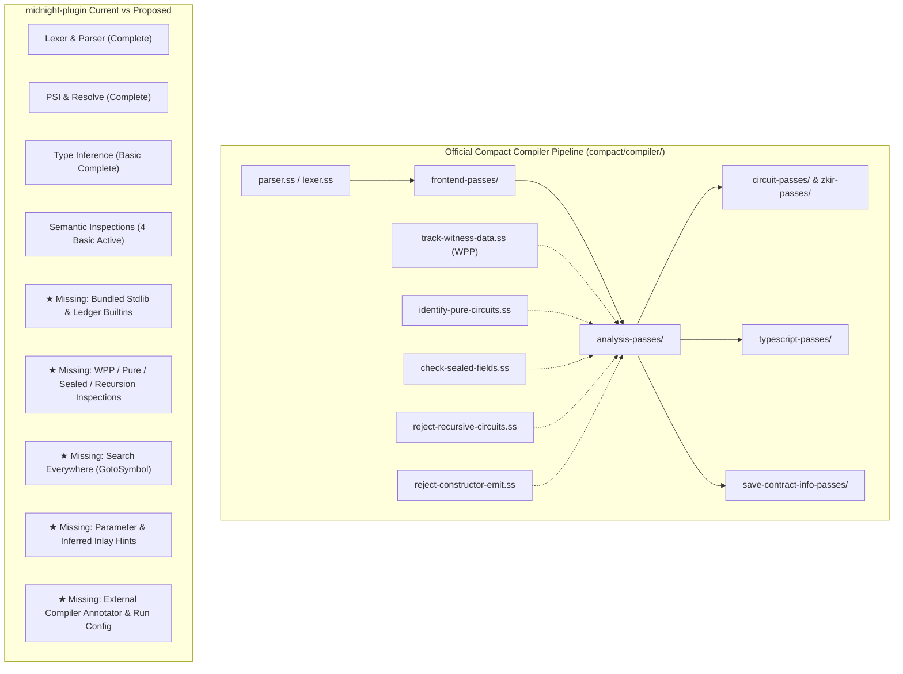
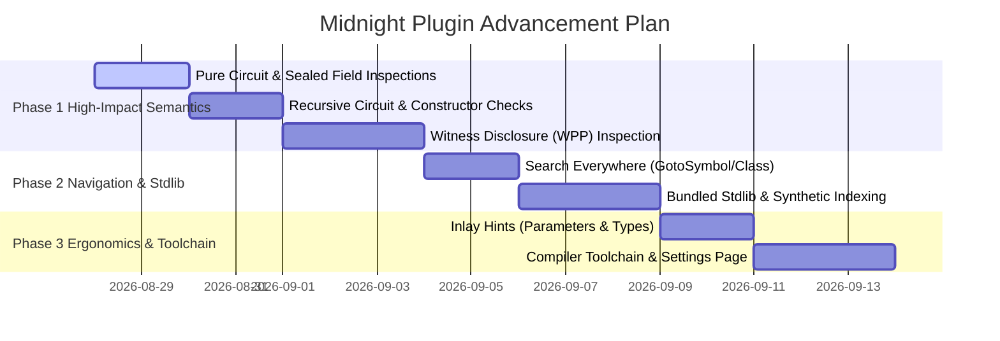

# Enhancement Plan: Elevating Midnight Compact Plugin with Official Compiler Insights

## Goal Description
Based on an in-depth review of the official Compact compiler implementation (`compact/compiler/*`), this document outlines features, domain-specific semantic validations, standard library bindings, and IDE integrations currently absent or incomplete in `midnight-plugin`. By translating compiler passes into real-time IDE capabilities, we can achieve compiler-grade fidelity and developer productivity.

---

## Architecture & Gap Analysis

---

## User Review Required

> [!IMPORTANT]
> **Priority Recommendations**:
> 1. **Bundled Standard Library & Built-ins**: Eliminates soft-unresolved warnings, enables auto-complete, parameter info, and quick documentation for `Vector`, `Map`, `Set`, `Counter`, `MerkleTree`, `persistentHash`, etc.
> 2. **Compiler-Pass-Derived Smart Contract Inspections**: Real-time IDE warnings for Compact-specific invariants (`pure circuit` violations, `disclose()` requirements for witnesses, `sealed ledger` mutation, recursion bans).
> 3. **Search Everywhere (`ChooseByNameContributor`)**: Fast `Ctrl+N` / `Double Shift` symbol searching.
> 4. **Compiler External Annotator & Toolchain Integration**: Live errors from `compact compile` / `compactc` in the editor.

---

## Key Findings: What is Missing & How to Improve

### 1. Bundled Standard Library & Built-in Type Indexing
* **Compiler Reference**: [`standard-library.compact`](file:///C:/Users/shaki/IdeaProjects/midnight-plugin/compact/compiler/standard-library.compact), [`zkir-v3-library.compact`](file:///C:/Users/shaki/IdeaProjects/midnight-plugin/compact/compiler/zkir-v3-library.compact), [`midnight-ledger.ss`](file:///C:/Users/shaki/IdeaProjects/midnight-plugin/compact/compiler/midnight-ledger.ss).
* **Current State**: Built-ins are hardcoded in `CompactHighlightingAnnotator` and skipped in `CompactUnresolvedReferenceInspection` without actual PSI definitions.
* **Proposed Enhancement**:
  - Bundle `standard-library.compact` and `zkir-v3-library.compact` into plugin resources.
  - Expose a synthetic PSI provider (`CompactStandardLibraryProvider`) to index all stdlib structs, enums, methods, and functions.
  - Enable Go-To-Definition, Quick Documentation, and signature help on standard library utilities (`MerkleTree`, `Counter`, `Map`, `Vector`, `Either`, `Maybe`).

---

### 2. High-Impact Semantic Inspections (From `analysis-passes/`)

The Compact compiler performs specific static analysis checks before code generation. Bringing these into IntelliJ provides instant feedback:

| Compiler Pass | Official Compiler Behavior | Proposed IntelliJ Inspection & Quick-Fix |
| :--- | :--- | :--- |
| [`track-witness-data.ss`](file:///C:/Users/shaki/IdeaProjects/midnight-plugin/compact/compiler/analysis-passes/track-witness-data.ss) | Witness Protection Program (WPP): Rejects direct witness assignment to ledger state or public outputs without explicit `disclose()`. | **`CompactUndisclosedWitnessInspection`**: Warns when witness calls or private variables flow into ledger assignments without `disclose(...)`. Quick-Fix: "Wrap with disclose()". |
| [`identify-pure-circuits.ss`](file:///C:/Users/shaki/IdeaProjects/midnight-plugin/compact/compiler/analysis-passes/identify-pure-circuits.ss) | `pure circuit` cannot access ledger state, emit events, call witnesses, or call impure circuits. | **`CompactPureCircuitInspection`**: Flags ledger field reads/writes, `witness` invocations, or `emit` calls inside circuits marked `pure`. Quick-Fix: "Remove 'pure' modifier". |
| [`check-sealed-fields.ss`](file:///C:/Users/shaki/IdeaProjects/midnight-plugin/compact/compiler/analysis-passes/check-sealed-fields.ss) | `sealed ledger` fields can only be initialized/modified in `constructor`. | **`CompactSealedFieldMutationInspection`**: Highlights assignments to `sealed` ledger state within standard circuits. |
| [`reject-recursive-circuits.ss`](file:///C:/Users/shaki/IdeaProjects/midnight-plugin/compact/compiler/analysis-passes/reject-recursive-circuits.ss) | ZK circuits must be statically unrollable; recursion is forbidden. | **`CompactRecursiveCircuitInspection`**: Detects direct or transitive circuit self-invocation and marks it as invalid. |
| [`reject-constructor-emit.ss`](file:///C:/Users/shaki/IdeaProjects/midnight-plugin/compact/compiler/analysis-passes/reject-constructor-emit.ss) & [`reject-constructor-cc-calls.ss`](file:///C:/Users/shaki/IdeaProjects/midnight-plugin/compact/compiler/analysis-passes/reject-constructor-cc-calls.ss) | Constructors cannot emit events or invoke cross-contract calls. | **`CompactConstructorRestrictionInspection`**: Highlights `emit` or contract calls inside `constructor`. |

---

### 3. IDE Navigation & Symbols (`Search Everywhere`)
* **Current State**: Find Usages and Rename work on local and cross-file references, but `Double Shift` / `Ctrl+N` / `Ctrl+Alt+Shift+N` (Navigate to Class/Symbol) are not registered.
* **Proposed Enhancement**:
  - Implement `ChooseByNameContributorEx` for `GotoClassContributor` (Contracts, Modules, Structs, Enums) and `GotoSymbolContributor` (Circuits, Witnesses, Ledger fields, Struct fields).

---

### 4. Inlay Hints Provider
* **Compiler Reference**: [`parser.ss`](file:///C:/Users/shaki/IdeaProjects/midnight-plugin/compact/compiler/parser.ss), [`infer-types.ss`](file:///C:/Users/shaki/IdeaProjects/midnight-plugin/compact/compiler/analysis-passes/infer-types.ss).
* **Proposed Enhancement**:
  - `CompactInlayParameterHintsProvider`: Display parameter name hints for circuit/witness calls (`publicKey(round: round, sk: sk)`).
  - `CompactInlayTypeHintsProvider`: Display inferred return types and omitted `const x = ...` types inline in light gray text.

---

### 5. Toolchain & Compiler Integration
* **Compiler Reference**: [`compactc.ss`](file:///C:/Users/shaki/IdeaProjects/midnight-plugin/compact/compiler/compactc.ss), [`compact/tools/compact/`](file:///C:/Users/shaki/IdeaProjects/midnight-plugin/compact/tools/compact).
* **Proposed Enhancement**:
  - **Compact Settings Page**: Configure `compact` CLI / `compactc` path in IDE Settings (`Languages & Frameworks > Midnight Compact`).
  - **External Annotator**: Run `compact compile --check` or `compactc` asynchronously on file save to report true compiler diagnostics directly on source lines.
  - **Run Configuration**: "Compact Build" Run/Debug configuration to compile contracts to TypeScript (`index.d.ts`) and ZKIR circuits.

---

## Phased Implementation Roadmap

---

## Verification Plan

### Automated Tests
1. **Inspection Test Suite (`CompactInspectionTest`)**:
   - `testPureCircuitCallingWitnessFails()`
   - `testPureCircuitWritingLedgerFails()`
   - `testSealedFieldMutationOutsideConstructorFails()`
   - `testDirectAndIndirectRecursiveCircuitsFail()`
   - `testConstructorEmitFails()`
   - `testUndisclosedWitnessAssignmentFails()`
2. **Navigation Test Suite (`CompactChooseByNameTest`)**:
   - Verify `GotoSymbol` and `GotoClass` across multi-file contracts.
3. **Regression Tests**:
   - Verify all existing 296 unit tests continue to pass (`./gradlew test`).
