# Architecture & Implementation Plan: Phases 15–18 (Compiler Tooling, Run Configurations, Settings & Semantic Gutter)

## 1. Executive Summary & Goals

This plan establishes end-to-end compiler execution, IDE settings management, background compiler diagnostics, and semantic gutter visualization for the Midnight Compact language plugin (`dev.verloren.midnight`).

---

## 2. Phased Architecture Breakdown

```mermaid
graph TD
    subgraph Phase 15: Run Configuration  Gutter
        RC1[CompactConfigurationType] --> RC2[CompactRunConfiguration]
        RC2 --> RC3[CompactRunProfileState]
        RC3 --> RC4[CompactConsoleFilter]
        RC5[CompactRunLineMarkerContributor] --> RC2
    end

    subgraph Phase 16: Midnight Settings
        ST1[MidnightSettingsState] --> ST2[MidnightSettingsConfigurable]
        ST2 --> ST3[MidnightSettingsComponent]
    end

    subgraph Phase 17: External Annotator
        EA1[CompactExternalAnnotator] --> EA2[CompactCompilerRunner]
        EA2 --> EA3[CompactCompilerOutputParser]
    end

    subgraph Phase 18: Semantic Gutter Markers
        LM1[CompactLineMarkerProvider] --> LM2[CompactPrivacyLineMarker]
        LM1 --> LM3[CompactCircuitLineMarker]
    end
```

---

## 3. Detailed Specifications by Phase

### Phase 15: Compact Compiler Run Configuration & Gutter "Play" Buttons
* **Purpose**: Enable 1-click execution, building, and TypeScript artifact generation for Compact smart contracts.
* **Key Components**:
  1. `dev.verloren.midnight.run.CompactConfigurationType`:
     * Extends `ConfigurationTypeBase`.
     * Provides metadata, title ("Compact Smart Contract"), description, and icon (`MidnightIcons.FILE`).
     * Defines `CompactConfigurationFactory` extending `ConfigurationFactory`.
  2. `dev.verloren.midnight.run.CompactRunConfiguration`:
     * Extends `LocatableConfigurationBase` / `RunConfigurationBase`.
     * Persists:
       * `compactFilePath`: Path to the `.compact` contract source.
       * `outputDirectory`: Target artifact directory (default: `gen/`).
       * `skipZk`: Boolean toggle (`true` by default for fast compilation).
       * `customCompilerFlags`: Additional CLI arguments.
  3. `dev.verloren.midnight.run.CompactRunConfigurationEditor`:
     * Extends `SettingsEditor<CompactRunConfiguration>`.
     * Swing UI form with file browsers for Compact file path and output directory.
  4. `dev.verloren.midnight.run.CompactRunProfileState`:
     * Extends `CommandLineState`.
     * Assembles `GeneralCommandLine` invoking `compactc` / `npx @midnight-ntwrk/compactc`.
     * Attaches `CompactConsoleFilter` to the `TextConsoleBuilder`.
  5. `dev.verloren.midnight.run.CompactConsoleFilter`:
     * Implements `com.intellij.execution.filters.Filter`.
     * Regex parses `([a-zA-Z0-9_./\\-]+):([0-9]+):([0-9]+): (.*)` and converts matching console lines into clickable hyperlinks directly to the source file, line, and column.
  6. `dev.verloren.midnight.run.CompactRunLineMarkerContributor`:
     * Extends `RunLineMarkerContributor`.
     * Renders a green **"Play" Triangle** gutter icon next to `contract` declarations and top-level entry circuits.
     * Clicking the icon generates or triggers the run configuration.
* **Testing Strategy**:
  * `CompactRunConfigurationTest`: Verifies configuration serialization, XML read/write, CLI argument generation, and console filter link parsing.

---

### Phase 16: Midnight Plugin Settings Page (`Languages & Frameworks`)
* **Purpose**: Centralized IDE settings configuration for Midnight toolchain paths, network RPC, and defaults.
* **Key Components**:
  1. `dev.verloren.midnight.settings.MidnightSettingsState`:
     * Implements `PersistentStateComponent<MidnightSettingsState>`.
     * Application-level service storing:
       * `compilerPath`: Explicit path to `compactc` binary (or empty for auto-discovery).
       * `defaultOutputDir`: Default compilation output folder (`gen/`).
       * `skipZkDefault`: Default fast-build setting (`true`).
       * `devnetRpcUrl`: RPC URL for local or remote Midnight nodes (default: `http://localhost:9944`).
  2. `dev.verloren.midnight.settings.MidnightSettingsConfigurable`:
     * Implements `SearchableConfigurable`.
     * Display name: `"Midnight Compact"` under `"Languages & Frameworks"`.
  3. `dev.verloren.midnight.settings.MidnightSettingsComponent`:
     * Swing panel using `FormBuilder` with path browsers, checkboxes, and validation alerts.
* **Testing Strategy**:
  * `MidnightSettingsTest`: Verifies default state values, state persistence, modification checks (`isModified`), and UI binding.

---

### Phase 17: External Linter / Background Compiler Diagnostics (`ExternalAnnotator`)
* **Purpose**: Background execution of `compactc --vscode --skip-zk` to mirror 100% of official compiler errors in the editor without blocking UI.
* **Key Components**:
  1. `dev.verloren.midnight.annotator.CompactExternalAnnotator`:
     * Extends `ExternalAnnotator<CompactExternalAnnotator.InitialInfo, CompactExternalAnnotator.CompilationResult>`.
     * `collectInformation(PsiFile)`: Gathers virtual file path and project settings.
     * `doAnnotate(InitialInfo)`: Executes `compactc` in background process with a timeout guard.
     * `apply(PsiFile, CompilationResult, AnnotationHolder)`: Maps errors to precise AST text ranges and highlights them as warnings or errors.
* **Testing Strategy**:
  * `CompactExternalAnnotatorTest`: Verifies parsing of structured compiler diagnostic lines into `Annotation` descriptors.

---

### Phase 18: Semantic Gutter Line Markers (Privacy & Circuit Visualizer)
* **Purpose**: Visual cues in the editor gutter distinguishing Zero-Knowledge boundaries, privacy query points, and on-chain ledger state.
* **Key Components**:
  1. `dev.verloren.midnight.editor.CompactLineMarkerProvider`:
     * Implements `LineMarkerProvider`.
     * Identifies:
       * **Witness Declarations / Private Queries**: Off-chain private data retrieval.
       * **ZK Disclosures (`disclose(...)`)**: Off-chain to in-circuit privacy boundary crossing.
       * **Exported Public Circuits**: Public on-chain transaction entry points.
       * **Ledger State Declarations**: State storage fields.
* **Testing Strategy**:
  * `CompactLineMarkerTest`: Verifies line markers attached to witness, disclose, and circuit nodes.

---

## 4. Execution Roadmap & Milestones

1. **Step 1**: Implement Phase 15 (Run Configurations, Console Filter, Gutter Run Markers) + Unit Tests + `./gradlew test`.
2. **Step 2**: Implement Phase 16 (Midnight Settings Page & Persistent State) + Unit Tests + `./gradlew test`.
3. **Step 3**: Implement Phase 17 (External Annotator & Compiler Output Parsing) + Unit Tests + `./gradlew test`.
4. **Step 4**: Implement Phase 18 (Semantic Gutter Line Markers) + Unit Tests + `./gradlew test`.
5. **Step 5**: Update all context files, QA guides, and sync documentation to `docs/` and `major-project/docs/`.
