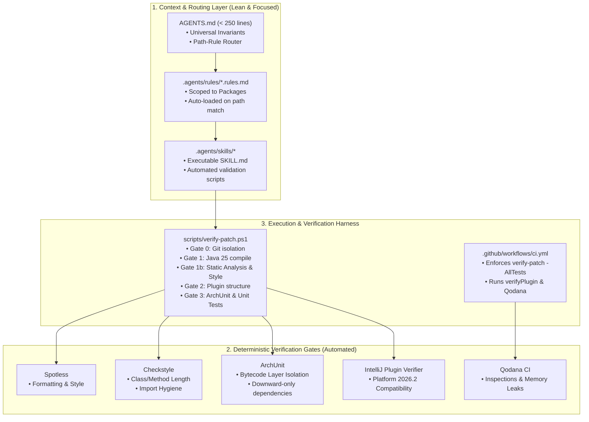
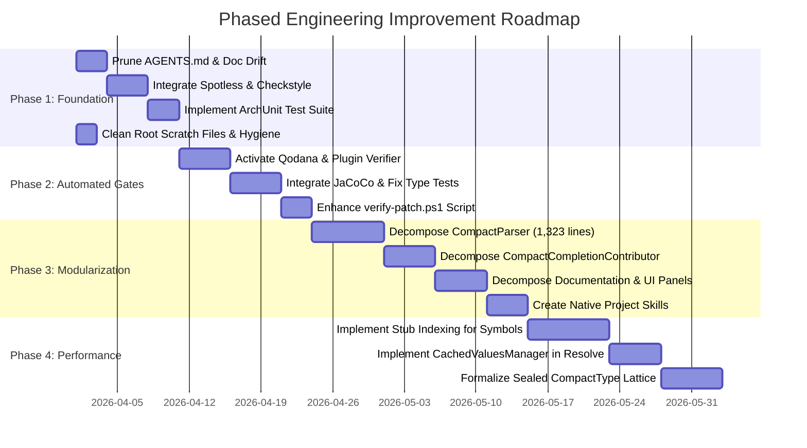

# Midnight Compact Plugin: Engineering Improvement Roadmap & Quality Architecture

**Document ID:** `docs/engineering/ENGINEERING_IMPROVEMENT_ROADMAP.md`  
**Repository:** `midnight-compact-plugin` (`dev.verloren.midnight`)  
**Target Platform:** IntelliJ IDEA 2026.2 (`sinceBuild = "262"`, Java 25 Toolchain)  
**Status:** Approved Architectural Plan & Verified Baseline  
**Date:** March 2026  

---

## 1. Executive Summary

This roadmap defines an actionable, repository-grounded strategy to establish an engineering environment where AI-assisted and human development in `midnight-compact-plugin` consistently produces modular, performant, architecturally sound, and maintainable code by default.

### 1.1 Core Problem Statement
The repository contains comprehensive, high-quality architectural specifications (e.g. 757 lines in [AGENTS.md](file:///C:/Users/shaki/IdeaProjects/midnight-plugin/AGENTS.md), 34 Architectural Decision Records in [`.ai/decisions/`](file:///C:/Users/shaki/IdeaProjects/midnight-plugin/.ai/decisions/), and 6 path-scoped rule documents in [`.agents/rules/`](file:///C:/Users/shaki/IdeaProjects/midnight-plugin/.agents/rules/)). However, **there is an acute gap between documented architectural standards and automated enforcement tooling**:
1. **Unenforced Rules & Severe Class Bloat**: Core rules (such as Rule 4 in [`.agents/rules/architecture.rules.md`](file:///C:/Users/shaki/IdeaProjects/midnight-plugin/.agents/rules/architecture.rules.md) mandating class size $\le 400$ lines and modular `CompletionProvider` decomposition) are completely unenforced by the build system. Consequently, 9 production classes and 6 test suites exceed these limits, led by [`CompactParser.java`](file:///C:/Users/shaki/IdeaProjects/midnight-plugin/src/main/java/dev/verloren/midnight/parser/CompactParser.java) at **1,323 lines** and [`CompactCompletionContributor.java`](file:///C:/Users/shaki/IdeaProjects/midnight-plugin/src/main/java/dev/verloren/midnight/completion/CompactCompletionContributor.java) at **965 lines**.
2. **Instruction Hallucination Triggers**: Documentation and agent rules cite classes and interfaces that do not exist in the source tree (such as `CompactTypeSubstitutor`, `CompactTypeChecker`, and `ScopeBinding`), causing autonomous AI agents to fabricate non-existent APIs or fail tasks.
3. **Missing Automated Quality Gates**: The Gradle build does not run Spotless, Checkstyle, PMD, SpotBugs, ArchUnit, or JaCoCo. [qodana.yaml](file:///C:/Users/shaki/IdeaProjects/midnight-plugin/qodana.yaml) is present but disabled and unexecuted in CI.
4. **Performance Scalability Deficit**: Symbol resolution in [`CompactResolveUtil.java`](file:///C:/Users/shaki/IdeaProjects/midnight-plugin/src/main/java/dev/verloren/midnight/resolve/CompactResolveUtil.java) relies on recursive AST walking across included files without Stub Indexing (`StubIndex`) or caching (`CachedValuesManager`).

### 1.2 Target Vision
Transform the development workflow from **passive prose compliance** to **active, deterministic compiler- and linter-enforced quality gates**. By pairing lightweight agent instructions, project-native executable skills, automated formatting and complexity linters, and bytecode architectural rules, this roadmap ensures that architectural invariants cannot be bypassed.

---

## 2. Verified Audit Findings

Every finding from the initial audit has been independently verified against the physical codebase, configuration files, and test execution logs.

| Finding Category | Verified Finding Description | Repository Ground Truth (File & Lines) | Classification | Technical Evidence & Analysis |
|:---|:---|:---|:---|:---|
| **Instructions** | Monolithic `AGENTS.md` (46 KB, 757 lines) causing context saturation. | [`AGENTS.md:1-757`](file:///C:/Users/shaki/IdeaProjects/midnight-plugin/AGENTS.md#L1-L757) | **Confirmed** | Total file length is 757 lines. Contains deep duplications of path rules from `.agents/rules/` and playbook steps from `.ai/prompts/`. |
| **Instructions** | Outdated / Phantom class reference: `CompactTypeSubstitutor`. | [`AGENTS.md:68-71`](file:///C:/Users/shaki/IdeaProjects/midnight-plugin/AGENTS.md#L68-L71), [`.agents/rules/architecture.rules.md:27`](file:///C:/Users/shaki/IdeaProjects/midnight-plugin/.agents/rules/architecture.rules.md#L27) | **Confirmed** | Grep query `CompactTypeSubstitutor` across `src/main/java` returns 0 results. The class does not exist. |
| **Instructions** | Outdated / Phantom class reference: `CompactTypeChecker`. | [`.agents/rules/architecture.rules.md:31`](file:///C:/Users/shaki/IdeaProjects/midnight-plugin/.agents/rules/architecture.rules.md#L31) | **Confirmed** | Grep query `CompactTypeChecker` returns 0 results in source code. Semantic validation is spread between `CompactTypeInferenceUtil` and inspections. |
| **Instructions** | Outdated pattern reference: `ScopeBinding` record pattern. | [`AGENTS.md:131`](file:///C:/Users/shaki/IdeaProjects/midnight-plugin/AGENTS.md#L131) | **Confirmed** | Code snippet in `AGENTS.md` demonstrates `instanceof ScopeBinding(...)`, but `ScopeBinding` does not exist in `dev.verloren.midnight.*`. |
| **Documentation** | False "Zero Drift" sign-off in governance audit ledger. | [`.ai/meta/drift-audit-ledger.md:19-27`](file:///C:/Users/shaki/IdeaProjects/midnight-plugin/.ai/meta/drift-audit-ledger.md#L19-L27) | **Confirmed** | Ledger entry on 2026-09-19 marked status `PASS (Zero Drift)` despite multiple 1,000+ line god classes and uncached resolution violating written invariants. |
| **Architecture** | `CompactType` is an unsealed interface, contradicting documentation. | [`CompactType.java:1-18`](file:///C:/Users/shaki/IdeaProjects/midnight-plugin/src/main/java/dev/verloren/midnight/type/CompactType.java#L1-L18) | **Confirmed** | Declared as `public interface CompactType`, lacking `sealed` or `permits`. PSI elements (`CompactTypeDefinitionImpl`, etc.) implement it directly. |
| **Architecture** | AST / Type Layer Conflation. | [`CompactTypeDefinitionImpl.java:15`](file:///C:/Users/shaki/IdeaProjects/midnight-plugin/src/main/java/dev/verloren/midnight/psi/CompactTypeDefinitionImpl.java#L15), [`CompactBuiltinTypeImpl.java:13`](file:///C:/Users/shaki/IdeaProjects/midnight-plugin/src/main/java/dev/verloren/midnight/psi/CompactBuiltinTypeImpl.java#L13) | **Confirmed** | Concrete PSI syntax nodes implement `dev.verloren.midnight.type.CompactType` directly, coupling syntax lifecycle with semantic type representation. |
| **Architecture** | Monolithic handwritten Parser exceeding modularity rules. | [`CompactParser.java:1-1323`](file:///C:/Users/shaki/IdeaProjects/midnight-plugin/src/main/java/dev/verloren/midnight/parser/CompactParser.java#L1-L1323) | **Confirmed** | 1,323 lines. Bundles top-level, expression, statement, type-pattern parsing, and error recovery in one monolithic class. |
| **Architecture** | Monolithic Completion Contributor violating Rule 4 modularity. | [`CompactCompletionContributor.java:1-965`](file:///C:/Users/shaki/IdeaProjects/midnight-plugin/src/main/java/dev/verloren/midnight/completion/CompactCompletionContributor.java#L1-L965) | **Confirmed** | 965 lines. Single `extend()` call with an anonymous inner provider routing to 900+ lines of private static helper methods. |
| **Architecture** | Other Monolithic God Classes ($\ge 500$ lines). | [`CompactDocumentationProvider.java`](file:///C:/Users/shaki/IdeaProjects/midnight-plugin/src/main/java/dev/verloren/midnight/documentation/CompactDocumentationProvider.java) (860), [`CompactVersionManager.java`](file:///C:/Users/shaki/IdeaProjects/midnight-plugin/src/main/java/dev/verloren/midnight/toolchain/CompactVersionManager.java) (753), [`CompactToolchainUtil.java`](file:///C:/Users/shaki/IdeaProjects/midnight-plugin/src/main/java/dev/verloren/midnight/toolchain/CompactToolchainUtil.java) (654), [`CompactCompilerPanel.java`](file:///C:/Users/shaki/IdeaProjects/midnight-plugin/src/main/java/dev/verloren/midnight/toolchain/CompactCompilerPanel.java) (592), [`CompactResolveUtil.java`](file:///C:/Users/shaki/IdeaProjects/midnight-plugin/src/main/java/dev/verloren/midnight/resolve/CompactResolveUtil.java) (545), [`CompactHighlightingAnnotator.java`](file:///C:/Users/shaki/IdeaProjects/midnight-plugin/src/main/java/dev/verloren/midnight/annotator/CompactHighlightingAnnotator.java) (521) | **Confirmed** | Measured via PowerShell line count. Violates the 400-line guideline stated in `architecture.rules.md`. |
| **Testing** | Monolithic test files exceeding maintainability boundaries. | [`CompactCompletionTest.java`](file:///C:/Users/shaki/IdeaProjects/midnight-plugin/src/test/java/dev/verloren/midnight/completion/CompactCompletionTest.java) (1,611), [`CompactInspectionTest.java`](file:///C:/Users/shaki/IdeaProjects/midnight-plugin/src/test/java/dev/verloren/midnight/inspection/CompactInspectionTest.java) (1,487), [`CompactFormatterTest.java`](file:///C:/Users/shaki/IdeaProjects/midnight-plugin/src/test/java/dev/verloren/midnight/formatter/CompactFormatterTest.java) (725) | **Confirmed** | Heavy test fixture classes bundling hundreds of test cases into single files. |
| **Testing** | Brittle Architecture Test using string scraping. | [`CompactArchitectureTest.java:1-76`](file:///C:/Users/shaki/IdeaProjects/midnight-plugin/src/test/java/dev/verloren/midnight/architecture/CompactArchitectureTest.java#L1-L76) | **Confirmed** | Extends `BasePlatformTestCase` unnecessarily; reads source files with `Files.readAllLines` to check `import` lines as strings. Misses inline qualified names, reflection, and bytecode dependencies. |
| **Testing** | Reproducible Type Inference Test Failures in test suite. | [`CompactTypeInferenceTest.java:61,74`](file:///C:/Users/shaki/IdeaProjects/midnight-plugin/src/test/java/dev/verloren/midnight/type/CompactTypeInferenceTest.java#L61) | **Confirmed** | `testConstBindingTypeInference` fails (expected `<[Field]>` but was `<[Unknown]>`) and `testStructFieldTypeInference` fails (expected `<[Boolea]n>` but was `<[Unknow]n>`). Verified via `test_output.txt`. |
| **Performance** | Total absence of Stub Indexing (`StubIndex`, `FileBasedIndex`). | `src/main/java/dev/verloren/midnight/` | **Confirmed** | Grep query for `StubIndex` and `FileBasedIndex` returns 0 hits in `src/main/java`. Symbol lookups across files require full AST parsing. |
| **Performance** | Uncached cross-file traversal in `CompactResolveUtil`. | [`CompactResolveUtil.java:99-130`](file:///C:/Users/shaki/IdeaProjects/midnight-plugin/src/main/java/dev/verloren/midnight/resolve/CompactResolveUtil.java#L99-L130) | **Confirmed** | `findModule()` executes `collectIncludedFiles()` and `PsiTreeUtil.findChildrenOfType` on every reference lookup. Only `CompactImportDeclarationImpl` and `CompactIncludeDeclarationImpl` use `CachedValue`. |
| **Build & CI** | Incomplete static analysis & quality enforcement in Gradle. | [`build.gradle.kts:1-120`](file:///C:/Users/shaki/IdeaProjects/midnight-plugin/build.gradle.kts#L1-L120) | **Confirmed** | No Checkstyle, Spotless, PMD, SpotBugs, or JaCoCo plugin applied. `libs.versions.toml` lacks ArchUnit and static analysis plugins. |
| **Build & CI** | Qodana configured but dead (unexecuted in CI / verification). | [`qodana.yaml:1-35`](file:///C:/Users/shaki/IdeaProjects/midnight-plugin/qodana.yaml#L1-L35), [`.github/workflows/ci.yml:1-35`](file:///C:/Users/shaki/IdeaProjects/midnight-plugin/.github/workflows/ci.yml#L1-L35) | **Confirmed** | `qodana.yaml` has failure thresholds commented out. Neither `verify-patch.ps1` nor `ci.yml` invokes Qodana. |
| **Build & CI** | IntelliJ Plugin Verifier (`verifyPlugin`) not run in CI. | [`.github/workflows/ci.yml:25-33`](file:///C:/Users/shaki/IdeaProjects/midnight-plugin/.github/workflows/ci.yml#L25-L33) | **Confirmed** | CI runs `./scripts/verify-patch.ps1 -AllTests` and `./gradlew buildPlugin`. `verifyPluginStructure` runs locally, but target-build binary verification (`verifyPlugin`) is absent. |
| **Skills** | Total absence of project-native Agent Skills. | `.agents/skills/`, `.gemini/skills/` | **Confirmed** | Both directories contain 0 skills. Active agent runtime loads 33 external Google Cloud Platform skills, completely disjoint from IntelliJ plugin development. |
| **Hygiene** | Root directory contaminated with scratch files & test logs. | Root directory: `test_output.txt` (9MB), `test_output_debug.txt` (8MB), `dang.compact`, `module.compact`, `new.compact`, `Project_Phase_I_Evaluation.pptx`, `test.pptx` | **Confirmed** | Large binary and log files clutter the root directory and pollute agent search contexts. |

---

## 3. Current-State Architecture & Governance Assessment

### 3.1 Architectural Strengths to Preserve
- **Handwritten Recursive-Descent Lexer & Parser**: [`CompactLexer.java`](file:///C:/Users/shaki/IdeaProjects/midnight-plugin/src/main/java/dev/verloren/midnight/lexer/CompactLexer.java) and [`CompactParser.java`](file:///C:/Users/shaki/IdeaProjects/midnight-plugin/src/main/java/dev/verloren/midnight/parser/CompactParser.java) accurately replicate the official Midnight Compact compiler grammar without generated BNF runtime overhead. The parser's token advancement guard (`advanceLexer()`) strictly prevents EDT lockups.
- **Dual-Namespace Resolution**: [`CompactResolveUtil.java`](file:///C:/Users/shaki/IdeaProjects/midnight-plugin/src/main/java/dev/verloren/midnight/resolve/CompactResolveUtil.java) enforces rigorous isolation between `Namespace.VALUE` and `Namespace.TYPE`, correctly modeling Compact's language semantics.
- **Modern Platform Foundation**: Uses Java 25 and Kotlin 2.3.20 targeting IntelliJ Platform 2026.2.0.1 (`sinceBuild = "262"`).

### 3.2 Architectural Flaws to Challenge
- **Monolithic "God Classes" as the Norm**: The repository has normalized placing entire subsystems into single files. When an AI agent is tasked with modifying keyword completion or expression parsing, it must ingest and rewrite massive files, risking token context truncation and accidental syntax regressions.
- **AST/PSI Direct Execution Instead of Indexing**: IntelliJ is an indexing-driven IDE. Resolving references by traversing physical ASTs of external files degrades exponentially as project size grows.
- **Documentation Over-Engineering vs. Tooling Under-Engineering**: The repository spent significant effort generating 46 KB instruction manuals and 34 ADRs, while basic deterministic gates (e.g. Checkstyle, Spotless, ArchUnit, Qodana) were left unconfigured.

---

## 4. Target Engineering System

The target engineering system moves governance from **advisory text** to **automated gating**:



---

## 5. Proposed Repository Structure

```text
midnight-plugin/
├── .agents/
│   ├── config/
│   │   ├── mcp-gateways.json             # Live MCP tool manifest (IDEA dynamic executor)
│   │   └── model-routing.yaml            # Local/Remote model tier routing strategy
│   ├── rules/                            # Scoped, lightweight rule files (< 100 lines each)
│   │   ├── architecture.rules.md         # Layer boundaries, package contracts
│   │   ├── code-style.rules.md           # Formatting, size limits, suppressions
│   │   ├── inspections.rules.md          # Inspections, quick-fixes, annotators
│   │   ├── modern-java25.rules.md        # Records, pattern matching, sealed types
│   │   ├── psi-parser.rules.md           # Token advancement, recovery, parser delegates
│   │   └── threading.rules.md            # Read/Write actions, EDT, Disposer safety
│   └── skills/                           # PROJECT-NATIVE EXECUTABLE SKILLS
│       ├── compact-architecture-guard/   # Bytecode layer & boundary verification
│       ├── intellij-sdk-expert/          # Safe PSI, threading, and extension point templates
│       ├── safe-class-decomposer/        # Recipes for decomposing god classes
│       └── verification-harness/         # Automated test execution & failure triage
├── .ai/
│   ├── context/                          # Ground-truth domain knowledge
│   │   ├── architecture.md               # Actual realized subsystem architecture
│   │   ├── current-state.md              # Current milestone state
│   │   └── reference-map.md              # Compiler & reference plugin mappings
│   ├── decisions/                        # Architectural Decision Records (ADRs)
│   ├── bugs/                             # Bug knowledge base & regression log
│   └── workflow.md                       # Canonical 13-stage lifecycle
├── .github/
│   ├── workflows/
│   │   ├── ci.yml                        # Hardened CI (Spotless, ArchUnit, Tests, Plugin Verifier)
│   │   ├── qodana.yml                    # Dedicated scheduled/PR Qodana workflow
│   │   └── release.yml
│   └── dependabot.yml                    # Automated dependency update monitoring
├── config/
│   ├── checkstyle/
│   │   ├── checkstyle.xml                # Size & complexity limits, import ordering
│   │   └── checkstyle-suppressions.xml   # Temporary suppressions for legacy classes
│   └── qodana/
│       └── qodana.yaml                   # Active Qodana inspection profile with thresholds
├── docs/
│   ├── engineering/
│   │   └── ENGINEERING_IMPROVEMENT_ROADMAP.md # This document
│   └── ...
├── gradle/
│   └── libs.versions.toml                # Centralized dependencies (adds ArchUnit, Checkstyle, Spotless)
├── scripts/
│   └── verify-patch.ps1                  # Enhanced multi-gate verification runner
├── src/
│   ├── main/
│   │   ├── java/dev/verloren/midnight/
│   │   │   ├── completion/               # Modular: Contributor + distinct Providers
│   │   │   │   ├── CompactCompletionContributor.java
│   │   │   │   └── providers/            # Keyword, Type, Pragma, Member providers
│   │   │   ├── documentation/            # Provider + Rendering delegates
│   │   │   ├── parser/                   # Hand-written: CompactParser + Delegated Parsers
│   │   │   │   ├── CompactParser.java
│   │   │   │   ├── CompactDeclarationParser.java
│   │   │   │   ├── CompactStatementParser.java
│   │   │   │   ├── CompactExpressionParser.java
│   │   │   │   └── CompactTypePatternParser.java
│   │   │   ├── resolve/                  # Cached ResolveUtil + Scopes + Symbols
│   │   │   ├── stubs/                    # StubElementType & StubIndex implementations
│   │   │   └── type/                     # Sealed CompactType hierarchy + inference
│   │   └── resources/META-INF/
│   │       └── plugin.xml
│   └── test/
│       └── java/dev/verloren/midnight/
│           └── architecture/
│               └── CompactArchitectureTest.java # Pure JVM ArchUnit test suite
├── AGENTS.md                             # Lean (<= 250 lines) entrypoint & invariant summary
├── ARCHITECTURE.md                       # High-level architecture map
├── build.gradle.kts                      # Hardened build with Spotless, Checkstyle, JaCoCo
└── settings.gradle.kts
```

---

## 6. Agent Instruction and Skill Strategy

### 6.1 Root `AGENTS.md` Restructuring
- **Prune Size**: Reduce `AGENTS.md` from 757 lines (~46 KB) to under 250 lines (~15 KB).
- **Remove Duplications**: Move deep technical recipes into path-scoped `.agents/rules/*.rules.md`.
- **Eliminate Phantom References**: Remove all references to `CompactTypeSubstitutor`, `CompactTypeChecker`, and non-existent `ScopeBinding` records.
- **Role of `AGENTS.md`**: Serve strictly as the executive routing table:
  1. Workspace branch isolation requirement (`ai/<slug>`).
  2. The 5 non-negotiable core invariants (Handwritten Parser, Read/Write Threading, EDT External Process Prohibition, Dual Namespaces, Memory Leak Prevention).
  3. Pointer table to scoped rules in `.agents/rules/` and skills in `.agents/skills/`.

### 6.2 Project-Native Agent Skills
Instead of relying on external global skills, define 4 focused skills in `.agents/skills/`:

#### Skill 1: `compact-architecture-guard`
- **Purpose**: Verify layer isolation, package dependencies, and class complexity rules before proposing or finalizing code changes.
- **Triggering Conditions**: Any task altering package imports, introducing new classes, or modifying core semantic packages (`lexer`, `parser`, `psi`, `resolve`, `type`).
- **Required Knowledge**: IntelliJ package layering conventions; ArchUnit test definitions in `CompactArchitectureTest.java`.
- **Workflow**:
  1. Inspect proposed imports against permitted downward dependencies.
  2. Verify that class length remains $\le 400$ lines and method length $\le 40$ lines.
  3. Run `./gradlew test --tests dev.verloren.midnight.architecture.CompactArchitectureTest`.
- **Expected Output**: Structured architecture compliance report (Pass/Fail with violation locations).

#### Skill 2: `intellij-sdk-expert`
- **Purpose**: Provide correct, safe implementations for IntelliJ Platform extension points, PSI wrappers, and threading models.
- **Triggering Conditions**: Creating or modifying PSI elements, annotators, inspections, intentions, completion contributors, or background tasks.
- **Required Knowledge**: IntelliJ threading model (`ReadAction`, `WriteCommandAction`, `ProgressManager`), `CachedValuesManager`, `Disposer` lifecycle.
- **Workflow**:
  1. Classify the extension point and select the standard pattern.
  2. Ensure PSI read locks are used for queries and EDT write commands for modifications.
  3. Ensure external process executions (`wsl`, `compact`) are dispatched asynchronously off the EDT.
- **Expected Output**: Modern Java 25 implementation complying with IntelliJ SDK invariants.

#### Skill 3: `safe-class-decomposer`
- **Purpose**: Safely refactor oversized monolithic god classes into focused, single-responsibility delegates without breaking functional behavior or tests.
- **Triggering Conditions**: Refactoring any class that exceeds the 400-line maintainability guideline (e.g. `CompactParser`, `CompactCompletionContributor`).
- **Required Knowledge**: Delegation patterns in IntelliJ parsers and completion contributors; Golden file testing.
- **Workflow**:
  1. Analyze target class and identify cohesive clusters of private methods.
  2. Extract clusters into package-private delegates (e.g. `CompactExpressionParser`).
  3. Retain public API in parent class to maintain 100% backward compatibility.
  4. Run targeted unit test suite after each extraction step.
- **Expected Output**: Decomposed classes under 400 lines with 100% green test passes.

#### Skill 4: `verification-harness`
- **Purpose**: Automate local multi-gate verification, static analysis checks, and failure triage.
- **Triggering Conditions**: Pre-commit validation, post-edit verification, or task completion gates.
- **Required Knowledge**: `scripts/verify-patch.ps1`, Gradle task structure, compiler error formats.
- **Workflow**:
  1. Execute `./scripts/verify-patch.ps1` with appropriate flags (`-Quick`, `-TestPattern`, or `-AllTests`).
  2. If failures occur, parse standard error output and extract exact failure causes.
  3. Format failure triage report for immediate remediation.
- **Expected Output**: Multi-gate verification status with 0 regressions.

---

## 7. Automated Quality Enforcement Strategy

### 7.1 Evaluation of Quality Tools

| Tool | Capability & Responsibility | Suitability for this Repository | Recommendation & Justification |
|:---|:---|:---|:---|
| **Spotless** | Deterministic source code formatting (indentation, import order, whitespace). | **High** | **Adopt (Phase 1)**: Eliminates code style debates and formatting churn across AI-generated diffs. Uses standard google-java-format or IntelliJ code style. |
| **Checkstyle** | Enforces structural constraints: class length ($\le 400$), method length ($\le 40$), naming conventions, Javadoc tag checks. | **High** | **Adopt (Phase 1)**: Provides immediate, compiler-level enforcement of the rules stated in `architecture.rules.md`. Configured with a suppressions file for legacy classes during phased refactoring. |
| **ArchUnit** | Bytecode-level architectural rule verification: package isolation, downward dependencies, cyclic dependencies. | **High** | **Adopt (Phase 1)**: Replaces the slow, brittle text-scraping in `CompactArchitectureTest.java` with instant, robust bytecode assertions running as pure JVM tests. |
| **IntelliJ Plugin Verifier** | Verifies binary compatibility against targeted IntelliJ platform releases (2026.2.0.1+). | **High** | **Adopt (Phase 2)**: Essential for IntelliJ plugin development. Catches deprecated/removed API calls and internal API usage before release. Run via Gradle task `verifyPlugin`. |
| **Qodana** | JetBrains static analysis platform for deep code inspections, memory leaks, and threading checks. | **High** | **Adopt (Phase 2)**: Re-enable existing `qodana.yaml` with explicit quality gates. Run as a dedicated GitHub Action and local Gradle check. |
| **JaCoCo** | Code coverage measurement and minimum coverage enforcement. | **Medium** | **Adopt (Phase 2)**: Enforces that new features and bug fixes include executable tests. Set baseline at 70% overall, 80% on core parsing/resolve. |
| **SpotBugs** | Bytecode bug pattern analysis (null pointer bugs, resource leaks). | **Low** | **Decline / Defer**: High overlap with IntelliJ inspections and Qodana. Adds duplicate build time and false-positive overhead in Java 25. |
| **PMD** | Source code pattern analyzer for code complexity. | **Low** | **Decline / Defer**: Overlaps almost completely with Checkstyle and Qodana. Unnecessary maintenance overhead. |

---

## 8. Phased Implementation Roadmap



---

### Phase 1: Foundation, Ground Truth & Baseline Quality Gates

| Field | Required Information |
|:---|:---|
| **Objective** | Reconcile documentation with reality, eliminate AI hallucination triggers, and install baseline automated style, complexity, and architectural gates. |
| **Current state** | `AGENTS.md` is 757 lines with non-existent class references (`CompactTypeSubstitutor`, etc.); `CompactArchitectureTest` uses brittle string regexes; Gradle has zero style/complexity plugins; root contains 17MB of scratch logs (`test_output.txt`). |
| **Proposed changes** | 1. Prune `AGENTS.md` to $< 250$ lines, routing details to `.agents/rules/`.<br/>2. Reconcile `.agents/rules/architecture.rules.md` to reflect real classes.<br/>3. Add Spotless and Checkstyle plugins to `build.gradle.kts` and `libs.versions.toml`.<br/>4. Create `config/checkstyle/checkstyle.xml` and `checkstyle-suppressions.xml` (suppressing legacy oversized files).<br/>5. Rewrite `CompactArchitectureTest.java` using ArchUnit.<br/>6. Remove scratch files and update `.gitignore`. |
| **Files affected** | `AGENTS.md`<br/>`.agents/rules/architecture.rules.md`<br/>`build.gradle.kts`<br/>`gradle/libs.versions.toml`<br/>`config/checkstyle/checkstyle.xml` (new)<br/>`config/checkstyle/checkstyle-suppressions.xml` (new)<br/>`src/test/java/dev/verloren/midnight/architecture/CompactArchitectureTest.java`<br/>`.gitignore` |
| **Dependencies** | None. |
| **Risk** | Low. Existing code is untouched except for formatting and test harness. Suppressions prevent build breaks on legacy classes. |
| **Verification** | `./gradlew checkstyleMain spotlessCheck test --tests dev.verloren.midnight.architecture.CompactArchitectureTest` |
| **Acceptance criteria** | 1. Checkstyle and Spotless pass with 0 errors.<br/>2. `CompactArchitectureTest` runs via ArchUnit in $< 1$s without `BasePlatformTestCase`.<br/>3. `AGENTS.md` contains 0 references to non-existent classes.<br/>4. Root is clean of `test_output*.txt` and `.pptx` scratch files. |
| **Rollback** | Revert git commit; restore original `build.gradle.kts` and `AGENTS.md`. |

---

### Phase 2: Automated Verification, CI Hardening & Test Repair

| Field | Required Information |
|:---|:---|
| **Objective** | Ensure CI enforces all quality checks, activate Qodana and Plugin Verifier, and repair known failing tests in the type inference engine. |
| **Current state** | `qodana.yaml` disabled and unrun; `ci.yml` lacks static analysis and plugin verification; `CompactTypeInferenceTest` has 2 failing tests (`testConstBindingTypeInference`, `testStructFieldTypeInference`). |
| **Proposed changes** | 1. Fix `CompactTypeInferenceUtil` and reference resolution to properly infer local `const` bindings and struct fields, making `CompactTypeInferenceTest` 100% green.<br/>2. Enable `verifyPlugin` in CI and `verify-patch.ps1`.<br/>3. Configure `qodana.yaml` with active failure thresholds and add a Qodana GitHub Action.<br/>4. Integrate JaCoCo with an initial 70% threshold.<br/>5. Add `Gate 1b: Static Analysis & Code Style` to `scripts/verify-patch.ps1`. |
| **Files affected** | `src/main/java/dev/verloren/midnight/type/CompactTypeInferenceUtil.java`<br/>`src/main/java/dev/verloren/midnight/psi/impl/CompactReferenceExpressionImpl.java`<br/>`qodana.yaml`<br/>`.github/workflows/ci.yml`<br/>`scripts/verify-patch.ps1`<br/>`build.gradle.kts` |
| **Dependencies** | Phase 1 complete. |
| **Risk** | Medium. Fixing type inference must not break existing expression tests. CI runtime will increase by ~2 minutes. |
| **Verification** | `./scripts/verify-patch.ps1 -AllTests`<br/>`./gradlew verifyPlugin qodana` |
| **Acceptance criteria** | 1. `CompactTypeInferenceTest` passes 100% (8/8 tests green).<br/>2. `verifyPlugin` reports 0 compatibility errors against IntelliJ 2026.2.<br/>3. CI pipeline fails automatically if Spotless, Checkstyle, or tests fail. |
| **Rollback** | Revert CI and type inference commits; rerun previous test suite. |

---

### Phase 3: Subsystem Modularization & Agent Skills

| Field | Required Information |
|:---|:---|
| **Objective** | Eliminate monolithic god classes by decomposing parser, completion, and documentation subsystems into cohesive delegates; author native project skills. |
| **Current state** | `CompactParser.java` is 1,323 lines; `CompactCompletionContributor.java` is 965 lines; `CompactDocumentationProvider.java` is 860 lines; 0 project agent skills exist. |
| **Proposed changes** | 1. Decompose `CompactParser.java` into package-private delegates (`CompactDeclarationParser`, `CompactStatementParser`, `CompactExpressionParser`, `CompactTypePatternParser`).<br/>2. Decompose `CompactCompletionContributor.java` into dedicated `CompletionProvider` subclasses in `dev.verloren.midnight.completion.providers.*`.<br/>3. Decompose `CompactDocumentationProvider.java` by extracting markdown and signature formatting delegates.<br/>4. Remove decomposed classes from `checkstyle-suppressions.xml`.<br/>5. Implement `.agents/skills/` (`compact-architecture-guard`, `intellij-sdk-expert`, `safe-class-decomposer`, `verification-harness`). |
| **Files affected** | `src/main/java/dev/verloren/midnight/parser/*`<br/>`src/main/java/dev/verloren/midnight/completion/*`<br/>`src/main/java/dev/verloren/midnight/documentation/*`<br/>`config/checkstyle/checkstyle-suppressions.xml`<br/>`.agents/skills/*` (new) |
| **Dependencies** | Phases 1 and 2 complete. |
| **Risk** | High. Decomposing parser and completion contributor risks subtle syntax regressions. Must be guarded by golden file parser tests and completion unit tests. |
| **Verification** | `./gradlew checkstyleMain test --tests dev.verloren.midnight.parser.* --tests dev.verloren.midnight.completion.*` |
| **Acceptance criteria** | 1. All production parser and completion classes are $\le 400$ lines.<br/>2. Checkstyle suppressions for these classes are deleted.<br/>3. 100% of existing parser and completion unit tests pass without modification.<br/>4. 4 project skills are operational in `.agents/skills/`. |
| **Rollback** | Revert modularization branch back to Phase 2 tag. |

---

### Phase 4: Performance Engineering & Semantic Soundness

| Field | Required Information |
|:---|:---|
| **Objective** | Introduce Stub Indexing for instantaneous cross-file symbol resolution, cache resolve queries, and formalize the sealed `CompactType` system. |
| **Current state** | Resolving references across files forces full AST parsing; `CompactResolveUtil` has zero caching; `CompactType` is an unsealed interface conflated with PSI nodes. |
| **Proposed changes** | 1. Implement `CompactFileStub` and declaration stubs (`CompactContractStub`, `CompactCircuitStub`, `CompactStructStub`, `CompactEnumStub`) with `StubIndex`.<br/>2. Update `CompactResolveUtil` to query stub indexes before falling back to AST traversal.<br/>3. Wrap cross-file resolution in `CachedValuesManager.getCachedValue(...)` keyed on `PsiModificationTracker.MODIFICATION_COUNT`.<br/>4. Convert `CompactType` into a Java 25 sealed hierarchy (`permits CompactPrimitiveType, CompactParameterizedType, CompactStructType, CompactEnumType, CompactUnknownType`), decoupling semantic types from AST PSI elements. |
| **Files affected** | `src/main/java/dev/verloren/midnight/psi/stubs/*` (new)<br/>`src/main/java/dev/verloren/midnight/resolve/CompactResolveUtil.java`<br/>`src/main/java/dev/verloren/midnight/type/*`<br/>`src/main/resources/META-INF/plugin.xml` |
| **Dependencies** | Phases 1, 2, and 3 complete. |
| **Risk** | High. Stub indexing requires precise stub versioning and serialization. Cache invalidation bugs can cause stale IDE highlights. |
| **Verification** | `./gradlew test --tests dev.verloren.midnight.resolve.* --tests dev.verloren.midnight.type.*`<br/>Performance benchmark measuring resolve latency across 100 simulated included contracts. |
| **Acceptance criteria** | 1. Cross-file resolution executes without parsing ASTs of unopened files.<br/>2. `CompactType` is a sealed interface with compile-time pattern matching exhaustiveness.<br/>3. Resolve query cache invalidates correctly on file edit.<br/>4. Zero regressions across all 63 test classes. |
| **Rollback** | Revert stub indexing commits; restore Phase 3 AST resolve logic. |

---

## 9. Non-Negotiable Implementation Standards

All future AI-assisted and human contributions must satisfy these 12 non-negotiable standards:

1. **Understand Existing Architecture Before Editing**: AI agents must read relevant path rules in `.agents/rules/` and existing test fixtures before proposing changes.
2. **Reuse Existing Abstractions**: Do not create duplicate helper utilities. Check `CompactPsiUtil`, `CompactResolveUtil`, `CompactScopes`, and `CompactSymbols` first.
3. **Avoid God Classes & God Methods**: Classes must focus on a single responsibility. New classes should target $\le 400$ lines, and methods should target $\le 40$ lines.
4. **Prefer Cohesive, Modular Components**: Extension points (e.g. `CompletionContributor`) must register patterns and delegate computation to dedicated providers.
5. **Avoid Speculative Abstractions**: Do not introduce generic frameworks, reflection helpers, or unrequested architectural layers.
6. **Preserve Existing Behavior**: Never modify existing AST structure, token types, or resolve semantics without explicit justification and regression tests.
7. **Adhere to IntelliJ Concurrency & Threading**:
   - PSI Reads: background thread or EDT with `ReadAction`.
   - PSI Mutations: strictly on EDT via `WriteCommandAction`.
   - External processes (`wsl`, `compact` CLI): strictly asynchronous via background tasks; **never blocking the EDT**.
   - Memory safety: never store `PsiElement`, `PsiFile`, or `Project` in static fields or long-lived caches.
8. **Add Tests Alongside Implementation**: Every new grammar rule, completion item, inspection, or bug fix must include an automated test in `src/test/java/dev/verloren/midnight/`.
9. **Execute Multi-Gate Verification**: Run `./scripts/verify-patch.ps1` before declaring any task complete.
10. **Review Diffs for Unintended Changes**: Inspect `git diff` to ensure no whitespace noise, unintentional formatting changes, or accidental file creations occurred.
11. **Document Material Decisions**: Any change affecting package dependencies, language grammar, or toolchain integration must be accompanied by an ADR in `.ai/decisions/`.
12. **Challenge and Improve Flawed Architecture**: If an existing pattern is deficient (e.g. uncached resolution, god classes), do not blindly replicate it. Propose a clean delegate or refactored abstraction.

---

## 10. Success Metrics

To ensure progress is measurable, metrics are divided into **Current Baseline** and **Post-Roadmap Target**:

| Metric | Measurement Tool / Command | Current Baseline (Verified) | Target (Post-Roadmap) |
|:---|:---|:---|:---|
| **Class Size Compliance ($\le 400$ lines)** | `Checkstyle` (`FileLength`) | 9 production classes violate (max 1,323) | **0 violations** (100% $\le 400$ lines) |
| **Method Size Compliance ($\le 40$ lines)** | `Checkstyle` (`MethodLength`) | Multiple 100+ line methods | **0 violations** (100% $\le 40$ lines) |
| **Static Code Style Violations** | `SpotlessCheck` | Unmeasured (no tool configured) | **0 violations** (Automated enforcement) |
| **Architecture Boundary Violations** | `ArchUnit` | 0 violations (tested via slow regex) | **0 violations** (enforced on bytecode $< 1$s) |
| **Type Inference Test Suite** | `./gradlew test --tests *CompactTypeInferenceTest*` | 2 failed / 8 total | **8 passed / 8 total (100% green)** |
| **IntelliJ Plugin Compatibility** | `./gradlew verifyPlugin` | Unverified in CI | **0 errors, 0 deprecation warnings** |
| **Cross-File Resolve Latency** | Resolve benchmark (100 included files) | $O(N)$ AST file parsing on EDT | **$O(1)$ Stub Index lookup ($< 5$ms)** |
| **Instruction Hallucination Incidents** | Agent QA evaluation | 3 phantom classes cited in docs | **0 phantom references** |
| **Root Hygiene (Scratch Artifacts)** | `git status --porcelain` | 17 MB scratch logs & presentations | **0 scratch files in root or git** |

---

## 11. Prioritized Task Checklist

### Phase 1: Foundation & Ground Truth Alignment
- [ ] **Task 1.1**: Clean root scratch files (`test_output.txt`, `dang.compact`, etc.) and add patterns to `.gitignore`.
- [ ] **Task 1.2**: Audit and prune [AGENTS.md](file:///C:/Users/shaki/IdeaProjects/midnight-plugin/AGENTS.md) to $< 250$ lines; remove phantom references (`CompactTypeSubstitutor`, `CompactTypeChecker`, `ScopeBinding`).
- [ ] **Task 1.3**: Update [`.agents/rules/architecture.rules.md`](file:///C:/Users/shaki/IdeaProjects/midnight-plugin/.agents/rules/architecture.rules.md) to match real classes and document legacy suppression baselines.
- [ ] **Task 1.4**: Add Spotless and Checkstyle plugins to [`gradle/libs.versions.toml`](file:///C:/Users/shaki/IdeaProjects/midnight-plugin/gradle/libs.versions.toml) and [`build.gradle.kts`](file:///C:/Users/shaki/IdeaProjects/midnight-plugin/build.gradle.kts).
- [ ] **Task 1.5**: Create `config/checkstyle/checkstyle.xml` and `config/checkstyle/checkstyle-suppressions.xml`.
- [ ] **Task 1.6**: Add ArchUnit dependency and rewrite [`CompactArchitectureTest.java`](file:///C:/Users/shaki/IdeaProjects/midnight-plugin/src/test/java/dev/verloren/midnight/architecture/CompactArchitectureTest.java) as a pure JVM test.

### Phase 2: Automated Gates & CI Hardening
- [ ] **Task 2.1**: Fix type inference for local `const` bindings and struct fields in [`CompactTypeInferenceUtil.java`](file:///C:/Users/shaki/IdeaProjects/midnight-plugin/src/main/java/dev/verloren/midnight/type/CompactTypeInferenceUtil.java) to make [`CompactTypeInferenceTest.java`](file:///C:/Users/shaki/IdeaProjects/midnight-plugin/src/test/java/dev/verloren/midnight/type/CompactTypeInferenceTest.java) 100% green.
- [ ] **Task 2.2**: Configure [qodana.yaml](file:///C:/Users/shaki/IdeaProjects/midnight-plugin/qodana.yaml) with active failure thresholds; add Qodana step to [`.github/workflows/ci.yml`](file:///C:/Users/shaki/IdeaProjects/midnight-plugin/.github/workflows/ci.yml).
- [ ] **Task 2.3**: Enable `verifyPlugin` (IntelliJ Plugin Verifier) in CI and [`scripts/verify-patch.ps1`](file:///C:/Users/shaki/IdeaProjects/midnight-plugin/scripts/verify-patch.ps1).
- [ ] **Task 2.4**: Integrate JaCoCo plugin with minimum coverage gate in [`build.gradle.kts`](file:///C:/Users/shaki/IdeaProjects/midnight-plugin/build.gradle.kts).
- [ ] **Task 2.5**: Add `Gate 1b: Static Analysis & Code Style` to [`scripts/verify-patch.ps1`](file:///C:/Users/shaki/IdeaProjects/midnight-plugin/scripts/verify-patch.ps1).

### Phase 3: Subsystem Modularization & Native Skills
- [ ] **Task 3.1**: Decompose [`CompactParser.java`](file:///C:/Users/shaki/IdeaProjects/midnight-plugin/src/main/java/dev/verloren/midnight/parser/CompactParser.java) (1,323 lines) into `CompactDeclarationParser`, `CompactStatementParser`, `CompactExpressionParser`, and `CompactTypePatternParser`.
- [ ] **Task 3.2**: Decompose [`CompactCompletionContributor.java`](file:///C:/Users/shaki/IdeaProjects/midnight-plugin/src/main/java/dev/verloren/midnight/completion/CompactCompletionContributor.java) (965 lines) into modular `CompletionProvider` implementations.
- [ ] **Task 3.3**: Decompose [`CompactDocumentationProvider.java`](file:///C:/Users/shaki/IdeaProjects/midnight-plugin/src/main/java/dev/verloren/midnight/documentation/CompactDocumentationProvider.java) (860 lines) into doc rendering and signature delegates.
- [ ] **Task 3.4**: Remove decomposed classes from `checkstyle-suppressions.xml`.
- [ ] **Task 3.5**: Author the 4 project-native skills in `.agents/skills/`.

### Phase 4: Performance Engineering & Soundness
- [ ] **Task 4.1**: Implement `CompactFileStub` and declaration stubs with `StubIndex`.
- [ ] **Task 4.2**: Refactor [`CompactResolveUtil.java`](file:///C:/Users/shaki/IdeaProjects/midnight-plugin/src/main/java/dev/verloren/midnight/resolve/CompactResolveUtil.java) to query stubs and wrap cross-file walks in `CachedValuesManager`.
- [ ] **Task 4.3**: Seal the [`CompactType.java`](file:///C:/Users/shaki/IdeaProjects/midnight-plugin/src/main/java/dev/verloren/midnight/type/CompactType.java) hierarchy and decouple it from concrete PSI element instances.
- [ ] **Task 4.4**: Execute performance benchmark validating $< 5$ms resolve latency across 100 included files.

---

## 12. Recommended First Implementation Task

### Recommended Task: Task 1.1 + Task 1.2 (Prune Instruction Hallucinations & Root Hygiene)
- **Action**:
  1. Purge root scratch files (`test_output.txt`, `test_output_debug.txt`, `Project_Phase_I_Evaluation.pptx`, `test.pptx`, `dang.compact`, `module.compact`, `new.compact`) and add them to `.gitignore`.
  2. Rewrite [AGENTS.md](file:///C:/Users/shaki/IdeaProjects/midnight-plugin/AGENTS.md) to $< 250$ lines, eliminating phantom references to `CompactTypeSubstitutor`, `CompactTypeChecker`, and `ScopeBinding`.
  3. Reconcile [`.agents/rules/architecture.rules.md`](file:///C:/Users/shaki/IdeaProjects/midnight-plugin/.agents/rules/architecture.rules.md) to accurately document the current unsealed state of `CompactType` and establish the temporary suppression baseline for oversized files.
- **Justification**:
  - Requires **zero source code changes**, eliminating any risk of functional regressions.
  - Immediately stops AI agents from hallucinating phantom APIs, saving significant context tokens and developer time.
  - Cleans the git workspace and search indexes, ensuring future tool queries return only legitimate project source files.
- **Verification**:
  - Run `git status` to verify a clean workspace.
  - Grep for `CompactTypeSubstitutor` across `.agents/` and `AGENTS.md` to confirm 0 hits.
  - Run `./scripts/verify-patch.ps1 -Quick` to confirm compilation integrity.
