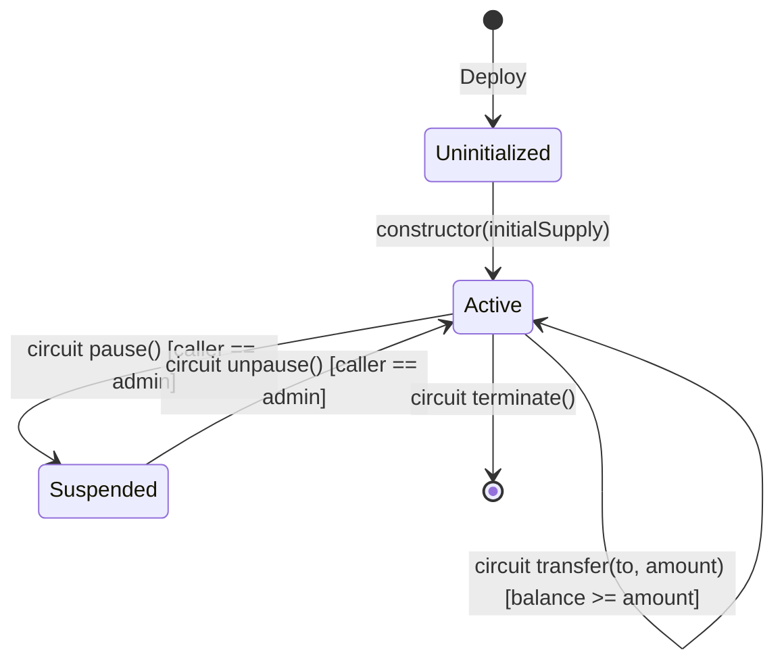
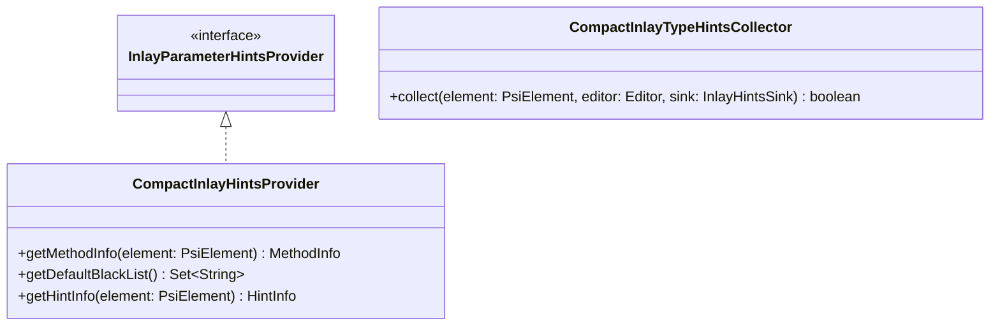
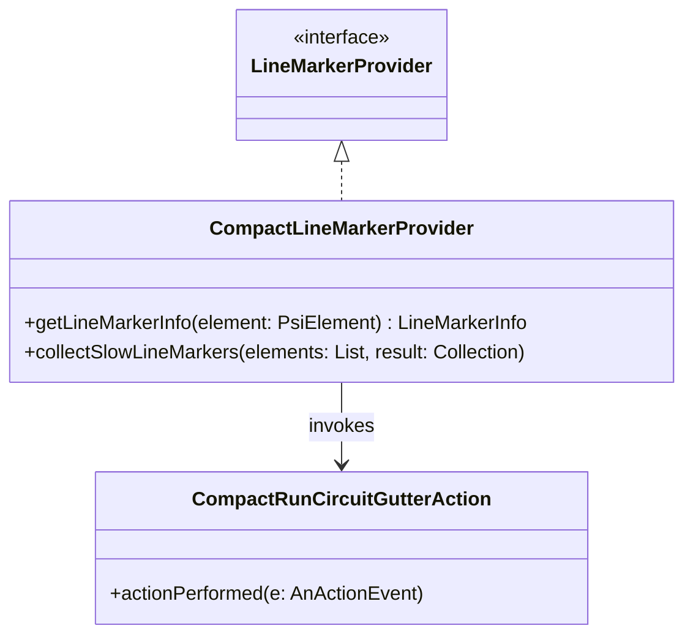
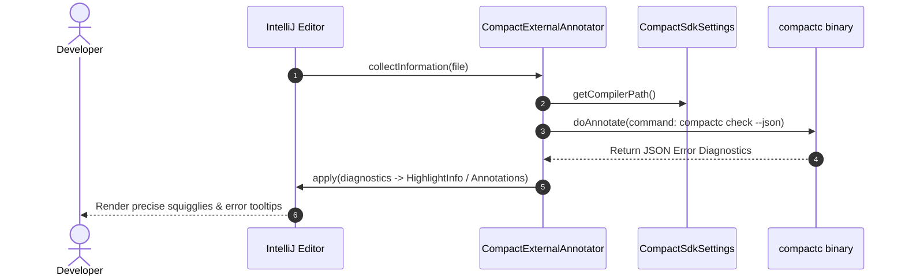
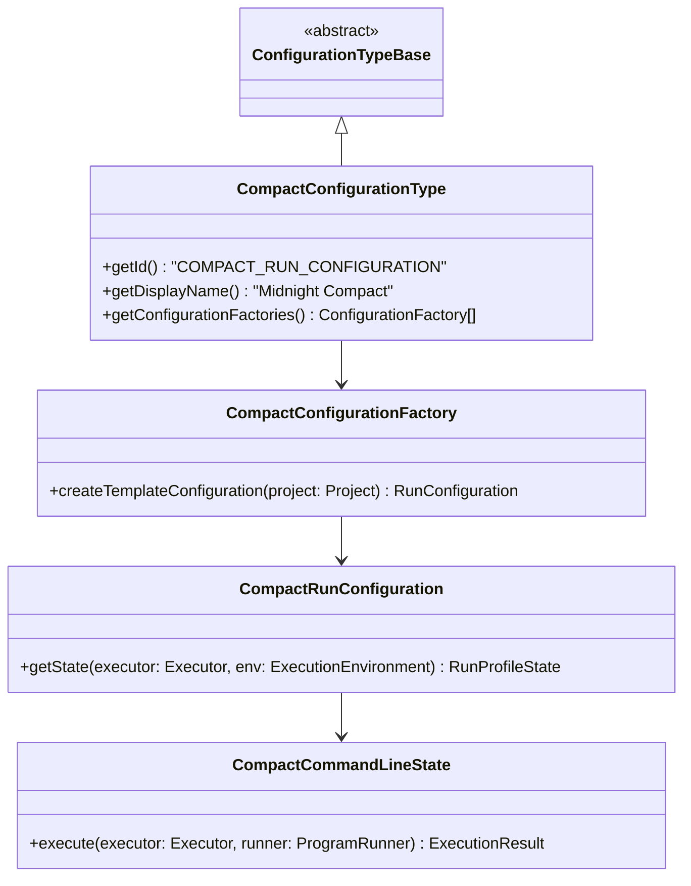

# Future Features & Blockchain IDE Roadmap: Midnight Compact Plugin

## Executive Summary & Background

With **Phase 1** of the **Midnight Compact Language Plugin** (`dev.verloren.midnight`) fully implemented, tested (296 automated unit tests passing), and verified against the manual QA checklist, the foundational language infrastructure is solid:
- Handwritten Lexer & Pratt Parser with syntax error recovery
- Strongly-typed Program Structure Interface (PSI) tree
- Syntax Highlighting with 42 customizable token/color categories
- Dual-namespace Reference Resolution (`VALUE` vs `TYPE`) & Innermost Lexical Shadowing
- Cross-file module and recursive include resolution with circular dependency guards
- Structural Type Inference Engine for primitives, bounded integers (`Uint<N>`), literals, vectors, nominal structs, and enums
- Real-time Semantic Inspections with Quick-Fixes (`Alt + Enter`)
- AST Formatting Model & Smart Indentation Engine (`Ctrl + Alt + L`)
- Structure View (`Ctrl + F12`), Code Folding, Breadcrumbs, Quick Documentation (`Ctrl + Q` / `F1`), Spellchecking, Surround With (`Ctrl + Alt + T`), File & Live Templates

This document outlines the **Next Generation Features and Architecture Roadmap**, surveying the capabilities of the **IntelliJ Platform**, analyzing state-of-the-art features across **major blockchain IDEs** (Solidity, Move, Cairo, Solana/Anchor, Clarity, Noir, Circom), and detailing the **specialized zero-knowledge (ZK) and smart contract features** uniquely required for the Midnight Compact ecosystem.

---

## Table of Contents

1. [Comparative Analysis of Blockchain IDEs & Language Tooling](#1-comparative-analysis-of-blockchain-ides--language-tooling)
   - 1.1 Ethereum & EVM (Solidity: Remix, IntelliJ Solidity, Hardhat, Foundry, Slither)
   - 1.2 Aptos / Sui (Move: Move IntelliJ Plugin, Move Analyzer, Move Prover)
   - 1.3 Starknet (Cairo: Scarb, Cairo Language Server, Sierra IR)
   - 1.4 Solana (Rust / Anchor: CLion, RustRover, Sealevel runtime)
   - 1.5 Stacks (Clarity: Clarinet REPL, Decidable state inspector)
   - 1.6 Zero-Knowledge DSLs (Noir, Circom, Leo: Constraint cost analyzers, R1CS/Plonk visualizers)
2. [IntelliJ Platform Extension Capabilities & APIs](#2-intellij-platform-extension-capabilities--apis)
   - 2.1 Inlay Hints & Parameter Name Annotations
   - 2.2 Line Markers, Gutter Actions & Navigation
   - 2.3 Intention Actions & Smart Transformations
   - 2.4 Postfix Completion Templates
   - 2.5 Code Vision & Usage Telemetry
   - 2.6 Hierarchy Providers (Call & Type Trees)
   - 2.7 Tool Windows & Interactive Panels
   - 2.8 Execution Framework & Run Configurations
   - 2.9 External Annotators & Asynchronous Toolchain Interop
   - 2.10 SDK Management & Project Configurable
3. [Blockchain & Zero-Knowledge Specific Features for Midnight Compact](#3-blockchain--zero-knowledge-specific-features-for-midnight-compact)
   - 3.1 ZK Circuit Constraint Cost Estimator & Metrics
   - 3.2 Privacy Boundary & Private Witness Taint Analysis
   - 3.3 Ledger State Machine & State Transition Diagram Generator
   - 3.4 Compact Standard Library (`compact-std`) Indexer & Bundled SDK
   - 3.5 ZKIR (Zero-Knowledge Intermediate Representation) Split Disassembler
   - 3.6 TypeScript / JavaScript Client Binding Generator (`.d.ts` / Midnight JS)
   - 3.7 Midnight DevNet Sandbox & Local Node Tool Window
   - 3.8 Transaction Simulation & Interactive Circuit Test Runner
   - 3.9 Specialized Smart Contract Security Inspections (Slither-style for Compact)
4. [Phased Implementation Roadmap](#4-phased-implementation-roadmap)
   - Phase 2A: Editor Polish & Inlay Intelligence (Sprint 1)
   - Phase 2B: Compiler & Toolchain Integration (Sprint 2)
   - Phase 2C: Transaction Execution & Test Runner (Sprint 3)
   - Phase 2D: ZK & Privacy Specialization (Sprint 4)
   - Phase 2E: Visual Tooling & Security Audit Suite (Sprint 5)
5. [Technical Architecture & Class Blueprints for Upcoming Modules](#5-technical-architecture--class-blueprints-for-upcoming-modules)
   - 5.1 Inlay Hints Provider Architecture
   - 5.2 Line Marker & Gutter Runner Architecture
   - 5.3 SDK Settings & External Annotator Pipeline
   - 5.4 Run Configuration & Test Console Flow
6. [Summary Comparison: Current State vs Future State](#6-summary-comparison-current-state-vs-future-state)
7. [Conclusion & Next Steps](#7-conclusion--next-steps)

---

## 1. Comparative Analysis of Blockchain IDEs & Language Tooling

To ensure the Midnight Compact plugin meets and exceeds industry standards, we benchmark against leading smart contract development environments:

```
+-------------------------------------------------------------------------------------------------------------------+
|                                      SMART CONTRACT IDE TOOLING LANDSCAPE                                         |
+--------------------------+------------------------------+---------------------------+-----------------------------+
|    EVM / Solidity        |       Move (Aptos/Sui)       |    Starknet (Cairo 1.0)   |    ZK-DSLs (Noir / Circom)  |
| - Remix IDE              | - Move IntelliJ Plugin       | - Scarb Toolchain         | - Noir Language Server      |
| - IntelliJ-Solidity      | - Move Analyzer (LSP)        | - Cairo LS                | - snarkjs / zkREPL          |
| - Hardhat / Foundry      | - Move Prover (Formal Verif) | - Sierra IR Disassembly   | - Circomspect Static Audit  |
| - Slither Static Audit   | - Bytecode Resource Verifier | - snforge Test Runner     | - Constraint Profiler       |
+--------------------------+------------------------------+---------------------------+-----------------------------+
```

### 1.1 Solidity (Ethereum / EVM)
*   **Key Features**:
    *   *IntelliJ Solidity Plugin*: Code completion, navigation, contract/function breadcrumbs, 18+ security inspections (reentrancy, unchecked call return, state visibility).
    *   *Hardhat / Foundry Integration*: Direct test execution from IDE gutter icons, gas consumption tables per function, trace step debugger.
    *   *Remix IDE*: In-browser transaction simulation, storage layout visualization, one-click contract deployment to testnets.
    *   *Slither*: Static analysis flagging vulnerabilities, data dependencies, and state-variable shadowing.
*   **Takeaway for Midnight**:
    *   Implement function-level gas/constraint profiling.
    *   Provide gutter run buttons for circuits.
    *   Build dedicated security inspections targeting state mutation and disclosure boundaries.

### 1.2 Move (Aptos / Sui)
*   **Key Features**:
    *   *Move IntelliJ Plugin (Pontem)* & *Move Analyzer*: First-class module resolution, struct unpacking completion, linear resource tracking.
    *   *Move Prover*: Formal verification integration running in background, providing mathematical proofs of contract correctness.
    *   *Resource Safety Visualizer*: Highlighting capabilities (`copy`, `drop`, `store`, `key`).
*   **Takeaway for Midnight**:
    *   Compact uses bounded types (`Uint<N>`, `Bytes<N>`) and sealed ledger variables (`sealed ledger`). Visual status indicators and type bounds checking should mimic Move's high assurance standards.

### 1.3 Cairo 1.0 (Starknet)
*   **Key Features**:
    *   *Scarb & Cairo Language Server*: Project-level dependency resolution, macro expansion.
    *   *Sierra IR Viewer*: Intermediate representation inspection to understand how high-level code translates to provable CASM (Cairo Assembly).
    *   *snforge*: Integrated test framework with cheatcodes for mocking blockchain state, block numbers, and caller addresses.
*   **Takeaway for Midnight**:
    *   Compact compiles to **ZKIR** (Zero-Knowledge Intermediate Representation) and proof circuits. An in-IDE ZKIR disassembler and test mock framework will give developers deep visibility into proof generation.

### 1.4 Solana (Rust / Anchor)
*   **Key Features**:
    *   *RustRover / CLion with IntelliJ Rust*: Macro expansion for Anchor `#[account]`, `#[derive(Accounts)]`, CPI (Cross-Program Invocation) reference resolution.
    *   *IDL (Interface Definition Language) Generation*: Auto-generating JSON IDL and TypeScript client SDKs on build.
*   **Takeaway for Midnight**:
    *   Auto-generate TypeScript `.d.ts` interfaces and `@midnight-ntwrk/compact-js` client bindings directly from `.compact` files with an IDE intention or build action.

### 1.5 Stacks (Clarity)
*   **Key Features**:
    *   *Clarinet REPL*: Decidable execution sandbox, static cost analysis showing runtime execution cost before sending transactions, interactive ledger state explorer.
*   **Takeaway for Midnight**:
    *   Develop a **Ledger State Inspector Tool Window** allowing developers to simulate circuit execution and view ledger updates locally.

### 1.6 Zero-Knowledge DSLs (Noir, Circom, Leo)
*   **Key Features**:
    *   *Noir*: Distinction between `pub` (public) and private inputs enforced at type-check time.
    *   *Circom*: Arithmetic circuit constraint counters ($R1CS$ gate count), signal flow graphs, static bug finders (*Circomspect*).
    *   *Leo (Aleo)*: Integrated proof runner, circuit constraint visualizer, private transaction debugger.
*   **Takeaway for Midnight**:
    *   Compact is specifically designed for dual-state execution (private `witness` vs public `circuit` and `ledger`). The IDE must provide first-class visual separation of private vs public realms and estimate circuit constraint complexity.

---

## 2. IntelliJ Platform Extension Capabilities & APIs

The IntelliJ Platform offers an extensive suite of extension points (`<extensions defaultExtensionNs="com.intellij">`) that can be integrated into the Midnight plugin:

```
+---------------------------------------------------------------------------------------------------------------+
|                                    INTELLIJ PLATFORM EXTENSION SPECTRUM                                       |
+-------------------------------+-------------------------------+-----------------------------------------------+
|       EDITOR & INLINE         |     GUTTER & NAVIGATION       |            TOOLING & EXECUTION                |
| - InlayHintsProvider          | - LineMarkerProvider          | - ConfigurationType & RunConfiguration        |
| - InlayParameterHintsProvider | - RelatedItemLineMarker       | - ToolWindowFactory (State / ZKIR / DevNet)   |
| - IntentionAction             | - CallHierarchyProvider       | - ExternalAnnotator (compactc background check)|
| - PostfixTemplateProvider     | - TypeHierarchyProvider       | - Configurable & ProjectSdksModel             |
| - CodeVisionProvider          | - GotoSymbolContributor       | - ExecutionConsole / ProcessHandler           |
+-------------------------------+-------------------------------+-----------------------------------------------+
```

### 2.1 Inlay Hints & Parameter Name Annotations
*   **Extension Point**: `com.intellij.codeInsight.inlayProvider` / `com.intellij.codeInsight.parameterNameHints`
*   **Purpose**: Display unobtrusive inline hints inside the code editor without modifying file text.
*   **Capabilities for Compact**:
    *   *Parameter Name Hints*: Shows argument names in circuit and witness calls:
        ```compact
        verifyTransfer(/* sender: */ addr, /* amount: */ 1000, /* nonce: */ 42);
        ```
    *   *Inferred Type Hints*: Shows the inferred static type for untyped `const` bindings:
        ```compact
        const balance /*: Uint<64> */ = getBalance();
        const coords /*: Coordinate */ = getPoint();
        ```
    *   *Bit-Width Hints*: Displays exact bit widths for bounded expressions (e.g. `/* 64-bit */`).

### 2.2 Line Markers & Gutter Actions
*   **Extension Point**: `com.intellij.codeInsight.lineMarkerProvider` / `RelatedItemLineMarkerProvider`
*   **Purpose**: Render interactive icons in the left editor gutter margin.
*   **Capabilities for Compact**:
    *   *Gutter Run / Simulate Icon* ($\blacktriangleright$): Next to `export circuit` and `witness` declarations to immediately trigger transaction simulation or test execution.
    *   *Privacy Realm Indicators*:
        *   🔒 **Lock Icon** on `witness` declarations and `disclose()` expressions indicating private client-side execution.
        *   🌐 **Globe Icon** on `export circuit` and `ledger` definitions indicating public validator on-chain verification.
    *   *Cross-File Navigation*: Gutter arrows linking imported modules or included `.compact` files directly to their definitions.

### 2.3 Intention Actions & Smart Transformations
*   **Extension Point**: `com.intellij.intentionAction` / `com.intellij.codeInsight.intention.PsiUpdateModCommandAction`
*   **Purpose**: Context-aware code transformations suggested when the user presses `Alt + Enter`.
*   **Capabilities for Compact**:
    *   *Wrap in `disclose(...)`*: Automatically wraps private expressions when passed into public circuit parameters.
    *   *Generate Constructor*: Auto-generates contract `constructor(...)` initializing all declared `ledger` fields.
    *   *Add `export` / `pure` Modifier*: Toggles function modifiers based on usage.
    *   *Generate Missing Witness / Circuit Stub*: Creates stub declarations when an unresolved function call is detected.
    *   *Convert Struct to Tuple / Pattern*: Converts multi-field structures to destructured bindings.

### 2.4 Postfix Completion Templates
*   **Extension Point**: `com.intellij.codeInsight.postfixTemplateProvider`
*   **Purpose**: Transform expressions into statements by typing a period followed by a template key.
*   **Capabilities for Compact**:
    *   `expr.const` $\to$ `const name = expr;`
    *   `expr.assert` $\to$ `assert(expr, "Assertion failed");`
    *   `expr.disclose` $\to$ `disclose(expr)`
    *   `expr.return` $\to$ `return expr;`
    *   `expr.if` $\to$ `if (expr) { <caret> }`
    *   `expr.not` $\to$ `!expr`

### 2.5 Code Vision & Usage Telemetry
*   **Extension Point**: `com.intellij.codeInsight.codeVisionProvider`
*   **Purpose**: Display metadata lines directly above declaration headers (e.g. "4 usages | 2 tests").
*   **Capabilities for Compact**:
    *   Displays reference counts above contracts, circuits, witnesses, structs, and enums.
    *   Clicking opens the "Find Usages" popup or navigates to call sites.

### 2.6 Hierarchy Providers (Call & Type Trees)
*   **Extension Points**: `com.intellij.callHierarchyProvider`, `com.intellij.typeHierarchyProvider`
*   **Purpose**: View incoming and outgoing call graphs and module inheritance structures in a dedicated tree window.
*   **Capabilities for Compact**:
    *   *Circuit Call Hierarchy (`Ctrl + Alt + H`)*: Displays all circuits that invoke a witness or subordinate circuit.
    *   *Module Hierarchy*: Displays module imports and contract interface implementations.

### 2.7 Tool Windows & Interactive Panels
*   **Extension Point**: `com.intellij.toolWindow`
*   **Purpose**: Create dedicated docked panels in the IDE layout.
*   **Capabilities for Compact**:
    1.  **Midnight State Inspector**: Displays real-time local ledger state, contract address storage, and transition history.
    2.  **ZKIR Disassembler / IR Explorer**: Shows compiled ZK intermediate representation side-by-side with source code.
    3.  **Midnight DevNet Manager**: Provides One-Click start/stop, log viewing, and reset for local development blockchain nodes.

### 2.8 Execution Framework & Run Configurations
*   **Extension Points**: `com.intellij.configurationType`, `com.intellij.runConfigurationProducer`
*   **Purpose**: Allow running, debugging, and simulating smart contracts from the standard IntelliJ Run toolbar.
*   **Capabilities for Compact**:
    *   "Midnight Compact Contract Test" run configuration type.
    *   "Midnight Transaction Simulator" run configuration type.
    *   Integrated test tree runner reporting pass/fail status, proof generation time, and execution traces.

### 2.9 External Annotators (Compiler Interop)
*   **Extension Point**: `com.intellij.externalAnnotator`
*   **Purpose**: Run external CLI binaries (such as `compactc`) in a background daemon thread and map compiler error JSON back to editor lines without blocking UI responsiveness.
*   **Capabilities for Compact**:
    *   Runs `compactc check <file>.compact --json` in the background.
    *   Surfaces deep zero-knowledge circuit constraint failures, recursion rejections, and compiler warnings.

### 2.10 SDK Management & Project Configurable
*   **Extension Points**: `com.intellij.projectConfigurable`, `com.intellij.sdkType`
*   **Purpose**: Native IntelliJ Settings page under `Languages & Frameworks -> Midnight Compact`.
*   **Capabilities for Compact**:
    *   Configures path to `compactc` executable and Midnight SDK home directory.
    *   Detects compiler version and automatically checks compatibility against file `pragma` directives.
    *   Provides download/update links for the Midnight toolchain.

---

## 3. Blockchain & Zero-Knowledge Specific Features for Midnight Compact

Smart contracts in Compact operate under unique constraints unlike general-purpose software. The following blockchain-specific features are designed specifically for the Midnight ecosystem:

```
+---------------------------------------------------------------------------------------------------------------+
|                                  MIDNIGHT COMPACT DOMAIN-SPECIFIC FEATURES                                    |
+-------------------------------+-------------------------------+-----------------------------------------------+
|     ZERO-KNOWLEDGE / PRIVACY  |      LEDGER & BLOCKCHAIN      |              ECOSYSTEM INTEGRATION            |
| - ZK Constraint Cost Profiler | - Ledger State Machine Graph  | - TypeScript SDK Binding Generator (.d.ts)    |
| - Privacy Boundary Taint Flow | - Unsealed Ledger Write Audit | - Midnight DevNet Docker/Process Manager      |
| - ZKIR Intermediate Disassembly| - Constructor State Validator | - Compact Standard Library (std) Indexer      |
| - Private Witness Stub Gen    | - Pure Circuit Verifier       | - Interactive Transaction Simulator Console   |
+-------------------------------+-------------------------------+-----------------------------------------------+
```

### 3.1 ZK Circuit Constraint Cost Estimator & Metrics
*   **The Problem**: In zero-knowledge proof systems, circuit execution cost is measured in **algebraic constraint counts** (R1CS gates or Plonk rows) rather than CPU clock cycles. Developers often inadvertently write non-linear operations (large dynamic loops, complex divisions, heavy hashing) that explode proof generation time.
*   **The Solution**:
    *   Static analysis inspection estimating circuit constraint weight.
    *   Editor Inlay Metric (e.g. `/* ~450 constraints */`) displayed on `circuit` headers.
    *   Warning inspection for expensive patterns (e.g. nested loops inside circuits, non-native arithmetic, or unoptimized hashing).

### 3.2 Privacy Boundary & Private Witness Taint Analysis
*   **The Problem**: Accidentally exposing secret user data in public ledger storage is the most severe vulnerability in privacy DApps.
*   **The Solution**:
    *   **Taint Analysis Engine**: Tracks data flow originating from `witness` outputs.
    *   Flags any direct assignment from private witness variables to public `ledger` fields unless explicitly wrapped in `disclose(...)` and sanitized.
    *   Provides an instant Quick-Fix (`Alt + Enter`): *"Wrap with disclose()"* or *"Isolate witness computation"*.

### 3.3 Ledger State Machine & State Transition Diagram Generator
*   **The Problem**: Understanding how multiple circuits modify shared contract state is difficult in large contracts.
*   **The Solution**:
    *   An interactive visual diagram generator (accessible via right-click $\to$ **Show Contract State Machine**).
    *   Generates a PlantUML / Mermaid state transition diagram showing:
        *   Ledger fields (`balance`, `owner`, `state`)
        *   Which circuits mutate each field (`transfer`, `mint`, `burn`)
        *   Transition conditions and assertions.



### 3.4 Compact Standard Library (`compact-std`) Indexer & Bundled SDK
*   **The Problem**: Developers use cryptographic primitives (`Poseidon`, `MerkleTree`, `EC`, `JubjubScalar`, `Secp256k1`) which must resolve without requiring manual file path configurations.
*   **The Solution**:
    *   Bundle official Compact standard library definitions directly in the plugin JAR (`/stdlib/`).
    *   Register a custom `CompactLibraryProvider` that automatically attaches the standard library to every Midnight project.
    *   Enables instant autocomplete, documentation tooltips, and Go-to-Definition into standard library cryptographic routines.

### 3.5 ZKIR (Zero-Knowledge Intermediate Representation) Split Disassembler
*   **The Problem**: Developers need to see how high-level Compact code compiles down to Midnight's low-level ZKIR instructions for optimization and proof debugging.
*   **The Solution**:
    *   A split-editor tab (similar to Android Studio's Bytecode Viewer or CLion's Disassembly View) showing high-level Compact code on the left and generated ZKIR on the right, with synchronized line highlighting.

### 3.6 TypeScript / JavaScript Client Binding Generator (`.d.ts` / Midnight JS)
*   **The Problem**: DApp frontends interact with Compact contracts via Midnight JS SDK. Manually writing TypeScript interfaces for contracts, circuits, and witness handlers is error-prone.
*   **The Solution**:
    *   An IDE Action: **Midnight $\to$ Generate TypeScript Contract Bindings**.
    *   Parses contract declarations, struct definitions, circuits, and witnesses to produce strongly typed TypeScript `.d.ts` and runtime wrapper classes with zero boilerplate.

### 3.7 Midnight DevNet Sandbox & Local Node Tool Window
*   **The Problem**: Starting, stopping, and inspecting local Midnight blockchain nodes requires switching back and forth between the IDE and terminal.
*   **The Solution**:
    *   A dedicated **Midnight DevNet** tool window:
        *   Start / Stop / Restart local DevNet Docker containers.
        *   Live block height and transaction streaming log.
        *   Faucet button to fund test accounts with local tokens.
        *   Clear ledger state / Reset network button.

### 3.8 Transaction Simulation & Interactive Circuit Test Runner
*   **The Problem**: Testing private witness generation and public circuit verification requires executing both client-side and ledger-side steps.
*   **The Solution**:
    *   Integrated Test Runner executing `.compact` test files against a local simulation engine.
    *   Visual test tree in IntelliJ Run window with green checkmarks, failure stack traces with clickable source file links, and detailed execution timings (Proof time vs Verification time).

### 3.9 Specialized Smart Contract Security Inspections (Slither-Style)
*   **The Problem**: Common smart contract vulnerabilities (reentrancy, uninitialized state, integer truncation, dead code) cause multi-million dollar exploits.
*   **The Solution**: Dedicated static inspections specifically designed for Compact:
    1.  *Unsealed Ledger Mutation*: Warns when unsealed ledger state is modified across untrusted circuit calls.
    2.  *Uninitialized Ledger Fields*: Flags ledger variables declared without initialization in the constructor.
    3.  *Unused Return Value in Circuit Call*: Warns when the return value of a pure or export circuit invocation is discarded.
    4.  *Integer Bound Truncation*: Flags implicit conversions or operations between mismatching `Uint<N>` widths (e.g. `Uint<64>` into `Uint<32>`) without explicit bounds checks.
    5.  *Pure Circuit Ledger Access*: Enforces that circuits declared with the `pure` modifier do not read or write ledger variables.
    6.  *Dead / Unreachable Circuit*: Flags private circuits that are never invoked by any exported entry point.

---

## 4. Phased Implementation Roadmap

```
+---------------------------------------------------------------------------------------------------------------+
|                                    FIVE-PHASE IMPLEMENTATION ROADMAP                                          |
+------------------+------------------+------------------+--------------------+---------------------------------+
|     PHASE 2A     |     PHASE 2B     |     PHASE 2C     |      PHASE 2D      |            PHASE 2E             |
| Editor Polish &  | Compiler & SDK   | Transaction Run  | ZK & Privacy       | Visual Tooling &                |
| Inlay Hints      | Toolchain        | & Test Runner    | Specialization     | Security Suite                  |
| (Sprint 1)       | (Sprint 2)       | (Sprint 3)       | (Sprint 4)         | (Sprint 5)                      |
+------------------+------------------+------------------+--------------------+---------------------------------+
| - Parameter Hints| - SDK Settings   | - Run Configs    | - ZK Cost Metrics  | - Ledger State Diagram          |
| - Inferred Types | - compactc Annot | - Gutter Runner  | - Privacy Taint    | - DevNet Tool Window            |
| - Postfix Compl. | - Pragma Matcher | - Test Console   | - ZKIR Disassembler| - Slither Security Inspections  |
| - Intentions     | - stdlib Bundler | - Navigation Link| - TS Binding Gen   | - Formal Verification Export    |
+------------------+------------------+------------------+--------------------+---------------------------------+
```

### Phase 2A: Editor Polish & Inlay Intelligence (Sprint 1)
*   **Goal**: Maximize daily editing productivity with inline feedback and rapid code generation.
*   **Deliverables**:
    1.  `CompactInlayParameterHintsProvider`: Parameter name hints for circuit/witness calls.
    2.  `CompactInlayTypeHintsProvider`: Inferred type hints for `const` declarations.
    3.  `CompactPostfixTemplateProvider`: `.const`, `.assert`, `.disclose`, `.return`, `.if` postfix templates.
    4.  `CompactIntentions`: Quick intentions for `disclose()`, generating constructors, and adding `export` modifiers.
    5.  `CompactCodeVisionProvider`: Reference counts and usage telemetry above symbols.

### Phase 2B: Compiler & Toolchain Integration (Sprint 2)
*   **Goal**: Connect the IDE to the official `compactc` compiler binary and bundled standard library.
*   **Deliverables**:
    1.  `CompactSdkConfigurable`: Settings page for configuring the `compactc` toolchain path and network targets.
    2.  `CompactExternalAnnotator`: Background asynchronous compiler checker reporting compiler errors/warnings.
    3.  `CompactPragmaVersionChecker`: Real-time inspection comparing contract `pragma` with configured SDK version.
    4.  `CompactStandardLibraryProvider`: Bundled `compact-std` libraries for instant cryptographic resolution.

### Phase 2C: Transaction Execution & Test Runner (Sprint 3)
*   **Goal**: Execute and test Compact smart contracts directly from the IDE.
*   **Deliverables**:
    1.  `CompactRunConfigurationType` & `CompactRunConfigurationFactory`: Run configurations for contracts and tests.
    2.  `CompactLineMarkerProvider`: Green gutter run icons next to circuits and witnesses.
    3.  `CompactExecutionConsole`: Interactive test execution console with ANSI colors and clickable source links.
    4.  `CompactTransactionSimulator`: Local transaction runner simulating ledger state updates.

### Phase 2D: ZK & Privacy Specialization (Sprint 4)
*   **Goal**: Deliver specialized intelligence for zero-knowledge proofs and privacy preservation.
*   **Deliverables**:
    1.  `CompactCircuitComplexityInspection`: Algebraic constraint cost estimator.
    2.  `CompactPrivacyTaintInspection`: Data flow analyzer preventing unintended witness exposure.
    3.  `CompactZkirDisassemblerViewer`: Side-by-side ZKIR disassembly tool window.
    4.  `CompactTypeScriptBindingGenerator`: Auto-generation of TypeScript interfaces and `@midnight-ntwrk/compact-js` bindings.

### Phase 2E: Visual Tooling & Security Audit Suite (Sprint 5)
*   **Goal**: Enterprise-grade smart contract visualization, devnet management, and security auditing.
*   **Deliverables**:
    1.  `CompactLedgerStateDiagram`: Mermaid/PlantUML contract state machine visualizer.
    2.  `MidnightDevNetToolWindow`: Docker/process controller for local Midnight devnet nodes.
    3.  `CompactSecurityInspectionSuite`: Advanced Slither-style security rules (unsealed writes, uninitialized state, integer truncation, pure circuit violations).

---

## 5. Technical Architecture & Class Blueprints for Upcoming Modules

Below are the architectural designs and IntelliJ Platform class structures for the upcoming modules:

### 5.1 Inlay Hints Provider Architecture



*   **Registration in `plugin.xml`**:
    ```xml
    <codeInsight.parameterNameHints
            language="Compact"
            implementationClass="dev.verloren.midnight.editor.inlay.CompactInlayParameterHintsProvider"/>
    <codeInsight.declarativeInlayProvider
            language="Compact"
            implementationClass="dev.verloren.midnight.editor.inlay.CompactInlayTypeHintsProvider"
            isEnabledByDefault="true"
            group="TYPES_GROUP"
            name="Inferred types"/>
    ```

### 5.2 Line Marker & Gutter Runner Architecture



*   **Implementation Strategy**:
    *   Target `CompactCircuitDecl` and `CompactWitnessDecl` identifier tokens.
    *   Create a `LineMarkerInfo` with `AllIcons.Actions.Execute` icon and tooltip *"Run / Simulate Circuit"*.
    *   Clicking triggers the `CompactRunCircuitGutterAction` to execute the transaction simulation.

### 5.3 SDK Settings & External Annotator Pipeline



*   **Registration in `plugin.xml`**:
    ```xml
    <externalAnnotator
            language="Compact"
            implementationClass="dev.verloren.midnight.compiler.CompactExternalAnnotator"/>
    <projectConfigurable
            parentId="language"
            instance="dev.verloren.midnight.settings.CompactSdkConfigurable"
            id="dev.verloren.midnight.settings.CompactSdkConfigurable"
            displayName="Midnight Compact"/>
    ```

### 5.4 Run Configuration & Test Console Flow



---

## 6. Summary Comparison: Current State vs Future State

| IDE Subsystem | Phase 1 (Completed & QA Verified) | Phases 2A–2E (Roadmap) |
| :--- | :--- | :--- |
| **Lexer & Parser** | Full Compact grammar, Pratt expressions, error recovery. | Incremental re-parsing, performance optimizations for huge monorepos. |
| **Inlay Hints** | Not implemented. | Inline parameter names, inferred variable types, bit-width annotations. |
| **Gutter Actions** | Not implemented. | Run/test gutter buttons ($\blacktriangleright$), privacy indicators (🔒/🌐), import navigation. |
| **Intentions & Postfix** | Surround-with (`Ctrl+Alt+T`), Unused variable fix. | Postfix templates (`.const`, `.assert`, `.disclose`, `.if`), Auto-constructor, Stub generators. |
| **Compiler Interop** | Internal AST checks & type inference. | Background `compactc` External Annotator, pragma SDK version validator. |
| **Execution & Testing** | Manual test files in test suite. | IntelliJ Run Configurations, interactive execution console, transaction simulator. |
| **ZK & Privacy Intelligence**| Lexer/Parser support for `witness` and `disclose`. | ZK constraint cost estimation, privacy taint analysis, ZKIR disassembler. |
| **Ecosystem & Bindings** | Single and multi-file Compact resolution. | TypeScript `.d.ts` generator, bundled `compact-std` library indexer, DevNet tool window. |
| **Security Auditing** | Unresolved refs, duplicate decls, unused vars, type mismatches. | 6+ specialized ZK/Smart Contract security inspections (unsealed writes, uninit state, truncation). |

---

## 7. Conclusion & Next Steps

The Midnight Compact Language Plugin has achieved complete **Phase 1 core language support** with 296 passing tests and flawless QA validation. 

By executing the **Phased Implementation Roadmap (Phases 2A–2E)** detailed above, the plugin will evolve from a syntax and navigation language tool into a **world-class, full-featured Smart Contract and Zero-Knowledge IDE**—standing alongside the best development environments in the blockchain industry (Solidity, Move, Cairo, and Rust/Anchor).
