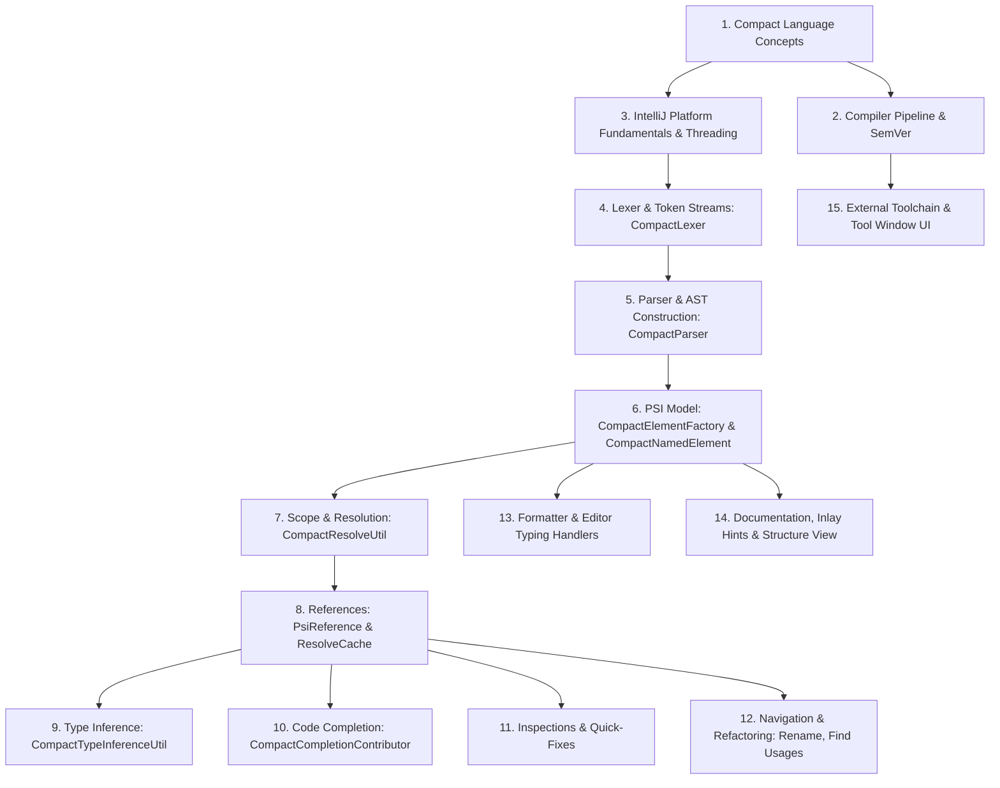

# Developer Knowledge Map & First-Principles Guide
## Midnight Compact IntelliJ Language Plugin (`dev.verloren.midnight`)

This document is the foundational technical orientation manual for engineers developing, extending, and maintaining the **Midnight Compact Language Plugin** for JetBrains IntelliJ IDEA. 

It breaks down the system from first principles, connecting the domain concepts of the **Compact smart contract language** with the internal architecture of the **IntelliJ Platform SDK**, grounded in the exact codebase structure and implementation patterns of this project.

---

## Table of Contents

1. [Executive Summary & Knowledge Classification](#1-executive-summary--knowledge-classification)
2. [Recommended Learning Dependency Order](#2-recommended-learning-dependency-order)
3. [Domain Foundation: The Compact Language & Compiler Architecture](#3-domain-foundation-the-compact-language--compiler-architecture)
   - 3.1 [The Compact Language Paradigm](#31-the-compact-language-paradigm)
   - 3.2 [Compact Compiler (`compactc`) & Toolchain Architecture](#32-compact-compiler-compactc--toolchain-architecture)
4. [IntelliJ Platform Plugin Architecture Foundation](#4-intellij-platform-plugin-architecture-foundation)
   - 4.1 [Plugin Lifecycle & Extension Points](#41-plugin-lifecycle--extension-points)
   - 4.2 [Threading Model, Read/Write Actions & Cancellation](#42-threading-model-readwrite-actions--cancellation)
   - 4.3 [Gradle Build System & Platform Tooling](#43-gradle-build-system--platform-tooling)
5. [Subsystem Deep Dives: Architecture, Implementation & Modification Knowledge](#5-subsystem-deep-dives-architecture-implementation--modification-knowledge)
   - 5.1 [Lexical Analysis (Lexer & Token Sets)](#51-lexical-analysis-lexer--token-sets)
   - 5.2 [Syntactic Parsing & AST Construction](#52-syntactic-parsing--ast-construction)
   - 5.3 [PSI (Program Structure Interface) Model & Element Factory](#53-psi-program-structure-interface-model--element-factory)
   - 5.4 [Scoping, Symbol Resolution & Namespaces](#54-scoping-symbol-resolution--namespaces)
   - 5.5 [References & Navigation (`PsiReference`, Go-To, Line Markers)](#55-references--navigation-psireference-go-to-line-markers)
   - 5.6 [Type System & Static Type Inference](#56-type-system--static-type-inference)
   - 5.7 [Code Completion & Insert Handlers](#57-code-completion--insert-handlers)
   - 5.8 [Syntax Highlighting, Colors & Semantic Annotations](#58-syntax-highlighting-colors--semantic-annotations)
   - 5.9 [Static Inspections, Verifications & Quick-Fixes](#59-static-inspections-verifications--quick-fixes)
   - 5.10 [External Toolchain Diagnostics & Compiler Annotator](#510-external-toolchain-diagnostics--compiler-annotator)
   - 5.11 [Intentions & Context Actions](#511-intentions--context-actions)
   - 5.12 [Code Formatting, Block Indentation & Smart Enter](#512-code-formatting-block-indentation--smart-enter)
   - 5.13 [Editor Typing Handlers, Delimiters & Quote/Brace Pairing](#513-editor-typing-handlers-delimiters--quotebrace-pairing)
   - 5.14 [File Templates, Live Templates & Dynamic Macros](#514-file-templates-live-templates--dynamic-macros)
   - 5.15 [Refactoring & Search (Inplace Rename, WordsScanner, Find Usages)](#515-refactoring--search-inplace-rename-wordsscanner-find-usages)
   - 5.16 [Structure View, Breadcrumbs, Inlay Hints & Quick Documentation](#516-structure-view-breadcrumbs-inlay-hints--quick-documentation)
   - 5.17 [Indexing, Stubs, Caching & Performance](#517-indexing-stubs-caching--performance)
   - 5.18 [Toolchain Management, Tool Window & Settings](#518-toolchain-management-tool-window--settings)
6. [Search Terms & Official Reference Index](#6-search-terms--official-reference-index)
7. [Before I Touch the Code: Pre-Flight Checklist](#7-before-i-touch-the-code-pre-flight-checklist)
8. [Project-Specific Hotspots & Fragile Invariants](#8-project-specific-hotspots--fragile-invariants)
9. [Recommended First 10 Things to Study](#9-recommended-first-10-things-to-study)

---

## 1. Executive Summary & Knowledge Classification

Developing a custom language plugin in IntelliJ IDEA requires mastering two intersecting domains:
1. **The target language domain:** Compact's lexical syntax, privacy/zero-knowledge invariants, circuit/witness mechanics, sum types, and compiler artifact pipeline.
2. **The IDE framework domain:** IntelliJ's Virtual File System (VFS), Abstract Syntax Tree (AST), Program Structure Interface (PSI), lexical scoping traversals, reference caches, threading constraints, and editor extension points.

To manage learning cognitive load, required knowledge is categorized into three tiers:

```text
┌─────────────────────────────────────────────────────────────────────────────┐
│ TIER 1: Core Foundation (Learn First)                                       │
│ - Compact syntax & smart contract structure (circuits, witnesses, ledger)   │
│ - IntelliJ AST vs PSI architecture                                          │
│ - Token definition (IElementType) & Handwritten Lexer (LexerBase)          │
│ - PsiBuilder & Recursive-Descent Parsing with Error Recovery                 │
│ - PSI element instantiation via CompactElementFactory                       │
│ - Read/Write Action threading model & EDT safety                            │
├─────────────────────────────────────────────────────────────────────────────┤
│ TIER 2: Semantic & Insight Architecture (Learn Next)                         │
│ - PSI References (PsiReference, ResolveCache, PolyVariantResolver)          │
│ - Dual-Namespace Scope Resolution (Namespace.VALUE vs Namespace.TYPE)      │
│ - Cross-file inclusions (`include`) and cycle detection                      │
│ - Type inference engine (CompactType, CompactTypeInferenceUtil)             │
│ - Local inspections (LocalInspectionTool) & Quick-Fix WriteCommandActions   │
│ - Code completion classification & custom InsertHandlers                    │
├─────────────────────────────────────────────────────────────────────────────┤
│ TIER 3: Specialized Subsystems (Learn When Working on Specific Features)    │
│ - Formatting blocks, SpacingBuilder, and Indent calculations                │
│ - Typing handlers (TypedHandlerDelegate, BackspaceHandlerDelegate)          │
│ - Live template macros & FileTemplateGroupFactory                           │
│ - External annotator background process orchestration & CLI parsing         │
│ - Swing UI, Tool Windows, and SemVer version management                     │
│ - Declarative Inlay Hints & Structure View presentation                      │
└─────────────────────────────────────────────────────────────────────────────┘
```

---

## 2. Recommended Learning Dependency Order

Modifying higher-level features without understanding the layers below them inevitably causes subtle bugs (such as EDT freezes, PSI invalidation exceptions, memory leaks, or broken rename refactorings). 

Follow this strict conceptual sequence:



---

## 3. Domain Foundation: The Compact Language & Compiler Architecture

### 3.1 The Compact Language Paradigm

Compact is the domain-specific smart contract language developed for the **Midnight Network**, a privacy-focused blockchain powered by zero-knowledge cryptography.

#### Key Language Invariants to Understand:
1. **Public vs. Private State Separation:**
   - **`ledger`**: Represents public on-chain state stored in the blockchain's ledger (e.g., `ledger balances: Map<Address, Uint<64>>;`). Ledger state can be declared `sealed` (read-only after deployment) or mutable.
   - **`witness`**: Represents private off-chain secret inputs provided by the user's wallet during proof generation (e.g., `witness getPrivateKey(): Bytes<32>;`). Witnesses never touch the public ledger directly unless explicitly revealed via `disclose(...)`.
2. **Circuit Model (`circuit`):**
   - Compact does not compile to traditional EVM/Wasm bytecode; circuits compile to zero-knowledge constraint systems (**ZKIR** — Zero-Knowledge Intermediate Representation).
   - Circuits are functional routines that execute over public ledger data and private witnesses to prove validity without revealing secrets.
   - **`pure circuit`**: Cannot read from or mutate `ledger` state.
   - **Non-pure circuit**: Can perform atomic state transitions on `ledger` variables.
   - **`export circuit`**: The public entry point for contract transactions.
3. **Type System & Generics:**
   - **Primitives:** `Boolean`, `Field` (elliptic curve scalar field element), `Uint<N>` (bounded unsigned integer of size $N$ bits, e.g. `Uint<8>`, `Uint<64>`), `Bytes<N>` (fixed byte arrays), `String`, `Address`.
   - **Composite Types:** `struct Name { ... }`, `enum Name { ... }`, `type Alias = ...;`, `Vector<N, T>`, `Map<K, V>`, `Set<T>`, `List<T>`, `Opaque<"name">`.
   - **Sum Types:** `Either<L, R>` with variant helpers `left(v)` and `right(v)` matching on `is_left()` / `is_right()`.
   - **Generics Distinction:** Compact supports two distinct generic parameter categories:
     - Type variables: `<T>` (arbitrary type).
     - Natural number / Bit-width constants: `<#N>` (used for fixed-size types like `Uint<#N>` or `Bytes<#N>`).
4. **Modularity & File Inclusions:**
   - `pragma language_version >= 0.26.0;`: Declares compiler version constraints.
   - `include "file.compact";`: Direct file inclusion that merges declarations into the current file's scope.
   - `import { Symbol } from Module;` / `import Module prefix my_;`: Modular encapsulation with namespace prefixing.
   - `export { ... }`: Explicit symbol visibility control.

### 3.2 Compact Compiler (`compactc`) & Toolchain Architecture

The Compact compiler toolchain operates via command-line binaries (`compact` or `compactc`) or Docker containers.

#### Compiler Outputs:
- **`contract-info.json` & `contract-manifest.json`**: Metadata describing contract interface, ledger schemas, exported circuits, and constructor arguments.
- **`.zkir` files**: Binary zero-knowledge intermediate representations for each compiled circuit.
- **TypeScript / JavaScript runtime bindings (`index.d.ts`, `index.js`)**: Client-side SDK stubs used by DApps to interact with the contract.

#### Versioning & Semantic Constraints:
- Compact evolves rapidly across versions (e.g. `0.20.x`, `0.25.x`, `0.26.x`, `0.27.x`).
- Pragmas enforce version constraints (`>= 0.26.0`, `^0.26.0`, `0.26.0 .. 0.28.0`).
- The IDE plugin manages multiple compiler installations side-by-side in `~/.compact/versions/<version>/` and resolves active project versions via `.idea/midnight.xml`.

---

## 4. IntelliJ Platform Plugin Architecture Foundation

### 4.1 Plugin Lifecycle & Extension Points

IntelliJ IDEA is built around a declarative, micro-kernel architecture:
- **`plugin.xml` ([src/main/resources/META-INF/plugin.xml](file:///C:/Users/shaki/IdeaProjects/midnight-plugin/src/main/resources/META-INF/plugin.xml))**: The single source of truth for plugin registration. It registers language implementations into IntelliJ's extension points (`com.intellij.*`).
- **Language Registration**: `CompactLanguage.INSTANCE` (MIME/ID: `"Compact"`) and `CompactFileType.INSTANCE` (`.compact` extension) tie the virtual file system to the Compact plugin pipeline.
- **Extension Categories in Midnight Plugin:**
  - `lang.parserDefinition`: Bridges lexer, parser, AST, and PSI.
  - `lang.syntaxHighlighterFactory` & `annotator`: Syntax and semantic highlighting.
  - `completion.contributor`: Code completion.
  - `localInspection`: Background static analysis rules.
  - `lang.formatter`: Code style and auto-indentation.
  - `psi.referenceContributor`: Reference resolution injection.
  - `externalAnnotator`: Asynchronous CLI compiler linter.
  - `toolWindow`: GUI panel for compiler version management.

### 4.2 Threading Model, Read/Write Actions & Cancellation

IntelliJ uses a strict multi-threaded architecture:
1. **Event Dispatch Thread (EDT):**
   - The UI thread. All GUI rendering, typing events, and action invocations run on the EDT.
   - **Golden Rule:** Never perform slow I/O, heavy resolution loops, process execution, or file parsing directly on the EDT.
2. **Read Actions (`Application.runReadAction()`):**
   - Required whenever accessing or traversing the PSI tree, AST, or ResolveCache.
   - Multiple threads can hold concurrent Read Actions.
   - Read Actions are cancelled immediately when a Write Action needs to execute (via `ProgressIndicator.checkCanceled()` or `ProgressManager.checkCanceled()`).
3. **Write Actions (`WriteCommandAction.runWriteCommandAction()`):**
   - Required for mutating the PSI tree, Document text, or Virtual File System (e.g., in Quick-Fixes, Rename Refactoring, Code Formatter).
   - Write Actions require exclusive access on the EDT and block all Read Actions.
4. **Process Execution & External Annotators:**
   - Compiler CLI invocations (`compactc build`) must run on background pooled threads (`CompactExternalAnnotator.doAnnotate(...)`).

### 4.3 Gradle Build System & Platform Tooling

The project uses the **IntelliJ Platform Gradle Plugin 2.x** (`org.jetbrains.intellij.platform`) targeting **Java 25** (`jvmToolchain(25)`).

- **`build.gradle.kts` ([build.gradle.kts](file:///C:/Users/shaki/IdeaProjects/midnight-plugin/build.gradle.kts))**:
  - Target IDE: `intellijIdea("2026.2.0.1")`.
  - Target JVM: Java 25.
  - Test framework: `testFramework(TestFrameworkType.Platform)`.
  - Sandboxed plugins: `compatiblePlugin("com.chrisrm.idea.MaterialThemeUI")` for development preview.
- **Modern Java 25 Language Features Used in Codebase:**
  - Records (`record`) for immutable data structures and cache tokens.
  - Sequenced Collections (`list.getFirst()`, `list.getLast()`, `list.reversed()`).
  - Pattern Matching for `switch` and `instanceof`.
  - Unnamed variables and patterns (`_`).
  - Sealed classes and interfaces.

---

## 5. Subsystem Deep Dives: Architecture, Implementation & Modification Knowledge

Each subsystem in the plugin is detailed below using the required 5-step breakdown:
```text
What it is
↓
Why it exists
↓
What IntelliJ/Compact concept it depends on
↓
Where it exists in THIS project
↓
What I should understand before modifying it
```

---

### 5.1 Lexical Analysis (Lexer & Token Sets)

#### 1. What it is
A handwritten, high-performance lexical scanner that transforms raw source text into a sequential stream of typed tokens (`IElementType`).

#### 2. Why it exists
IntelliJ needs a fast, non-allocating, character-by-character scanner for incremental editor syntax highlighting, bracket matching, indentation calculations, and input feeding into the parser.

#### 3. What IntelliJ/Compact concept it depends on
- `com.intellij.lexer.LexerBase` / `com.intellij.lexer.FlexAdapter`.
- `com.intellij.psi.tree.IElementType` and `com.intellij.psi.tree.TokenSet`.
- Compact lexical specifications: Hex/Oct/Bin numeric literals, semver literals (`1.0.0`), keywords, nested comment rules, multi-character operators (`==`, `!=`, `<=`, `>=`, `=>`, `+=`, `-=`, `..`, `...`).

#### 4. Where it exists in THIS project
- [`dev.verloren.midnight.lexer.CompactLexer`](file:///C:/Users/shaki/IdeaProjects/midnight-plugin/src/main/java/dev/verloren/midnight/lexer/CompactLexer.java): The stateless, handwritten scanner.
- [`dev.verloren.midnight.lexer.CompactTokenType`](file:///C:/Users/shaki/IdeaProjects/midnight-plugin/src/main/java/dev/verloren/midnight/lexer/CompactTokenType.java): Custom token type representation.
- [`dev.verloren.midnight.lexer.CompactTokenTypes`](file:///C:/Users/shaki/IdeaProjects/midnight-plugin/src/main/java/dev/verloren/midnight/lexer/CompactTokenTypes.java): Complete static registry of token constants.
- [`dev.verloren.midnight.lexer.CompactTokenSets`](file:///C:/Users/shaki/IdeaProjects/midnight-plugin/src/main/java/dev/verloren/midnight/lexer/CompactTokenSets.java): Grouped token sets (e.g. `KEYWORDS`, `LITERALS`, `COMMENTS`, `OPERATORS`, `BRACES`).

#### 5. What I should understand before modifying it
- **Stateless scanning:** `CompactLexer.getState()` returns `0`. The lexer relies only on buffer lookahead.
- **Version vs Range Disambiguation:** In `pragma language_version >= 0.26.0;`, dots form semver strings, whereas in expressions `0..10`, `..` is the range operator. The lexer must not eagerly consume multiple numbers with dots into a single invalid token in expression contexts.
- **Nested Comments:** Compact treats nested block comments `/* /* */ */` as unterminated/illegal. The lexer detects nested `/*` inside block comments and yields `UNTERMINATED_BLOCK_COMMENT`.

---

### 5.2 Syntactic Parsing & AST Construction

#### 1. What it is
A handwritten recursive-descent parser with operator precedence climbing that consumes tokens from `PsiBuilder` and constructs an AST (`ASTNode` tree).

#### 2. Why it exists
Grammar-Kit generated parsers often struggle with complex contextual smart-contract grammar rules, custom recovery boundaries, and real-time live-typing resilience. A handwritten recursive-descent parser gives total control over error resynchronization and EDT safety.

#### 3. What IntelliJ/Compact concept it depends on
- `com.intellij.lang.PsiParser` and `com.intellij.lang.PsiBuilder`.
- `PsiBuilder.Marker` (`done()`, `drop()`, `rollbackTo()`, `error()`, `precede()`).
- Compact EBNF syntax rules, operator precedence hierarchy (arithmetic, relational, equality, logical, ternary, cast `as`, postfix indexing/calling).

#### 4. Where it exists in THIS project
- [`dev.verloren.midnight.parser.CompactParser`](file:///C:/Users/shaki/IdeaProjects/midnight-plugin/src/main/java/dev/verloren/midnight/parser/CompactParser.java): Core parser implementation.
- [`dev.verloren.midnight.parser.CompactElementTypes`](file:///C:/Users/shaki/IdeaProjects/midnight-plugin/src/main/java/dev/verloren/midnight/parser/CompactElementTypes.java): Composite AST node type definitions.
- [`dev.verloren.midnight.parser.CompactParserDefinition`](file:///C:/Users/shaki/IdeaProjects/midnight-plugin/src/main/java/dev/verloren/midnight/parser/CompactParserDefinition.java): Glue connecting lexer, parser, and file root.
- [`dev.verloren.midnight.parser.CompactParserUtil`](file:///C:/Users/shaki/IdeaProjects/midnight-plugin/src/main/java/dev/verloren/midnight/parser/CompactParserUtil.java): Parsing helper methods.

#### 5. What I should understand before modifying it
- **Loop Progression Guarantee:** Every parsing loop (`while (!builder.eof())`) MUST advance the lexer offset (`builder.getCurrentOffset() > startOffset`). If a rule fails to consume tokens, it must explicitly sync or advance to avoid an infinite loop that freezes IntelliJ's UI.
- **Precedence Climbing Architecture:**
  `parseExpression()` $\to$ `parseAssignmentExpression()` $\to$ `parseTernaryExpression()` $\to$ `parseBinaryExpression(minPrecedence)` $\to$ `parseUnaryExpression()` $\to$ `parsePostfixExpression()` $\to$ `parsePrimaryExpression()`.
- **Error Recovery (`TOP_LEVEL_RECOVERY`):** When syntax errors occur inside a circuit or struct body, the parser drops into `sync(...)` until it reaches a synchronization barrier (`circuit`, `struct`, `ledger`, `export`, `;`, etc.) so the rest of the file still parses validly.

---

### 5.3 PSI (Program Structure Interface) Model & Element Factory

#### 1. What it is
The strongly-typed, object-oriented semantic layer that wraps low-level `ASTNode` instances with typed Java interfaces and classes.

#### 2. Why it exists
High-level IDE features (resolution, refactoring, formatting, inspections) cannot operate cleanly on raw untyped syntax nodes. PSI provides domain-specific methods like `getReturnType()`, `getParameters()`, `isPure()`, `isSealed()`, and `getFields()`.

#### 3. What IntelliJ/Compact concept it depends on
- `com.intellij.psi.PsiElement`, `com.intellij.extapi.psi.ASTWrapperPsiElement`.
- `com.intellij.psi.PsiNameIdentifierOwner` and `com.intellij.psi.PsiNamedElement`.
- Compact declaration hierarchy (circuits, witnesses, structs, enums, modules, const bindings, ledger state).

#### 4. Where it exists in THIS project
- [`dev.verloren.midnight.psi.CompactPsiElement`](file:///C:/Users/shaki/IdeaProjects/midnight-plugin/src/main/java/dev/verloren/midnight/psi/CompactPsiElement.java): Base class for all Compact PSI nodes.
- [`dev.verloren.midnight.psi.CompactNamedElementImpl`](file:///C:/Users/shaki/IdeaProjects/midnight-plugin/src/main/java/dev/verloren/midnight/psi/CompactNamedElementImpl.java): Base implementation for all named declarations.
- [`dev.verloren.midnight.psi.CompactElementFactory`](file:///C:/Users/shaki/IdeaProjects/midnight-plugin/src/main/java/dev/verloren/midnight/psi/CompactElementFactory.java): Static factory instantiating typed PSI nodes for `ASTNode` markers.
- [`dev.verloren.midnight.psi.CompactFile`](file:///C:/Users/shaki/IdeaProjects/midnight-plugin/src/main/java/dev/verloren/midnight/psi/CompactFile.java): Root PSI file node for `.compact` files.
- Concrete nodes in [`dev.verloren.midnight.psi.*`](file:///C:/Users/shaki/IdeaProjects/midnight-plugin/src/main/java/dev/verloren/midnight/psi/):
  - Declarations: `CompactCircuitDefinitionImpl`, `CompactWitnessDeclarationImpl`, `CompactLedgerDeclarationImpl`, `CompactStructDefinitionImpl`, `CompactEnumDefinitionImpl`, `CompactTypeDefinitionImpl`, `CompactConstBindingImpl`, etc.
  - Expressions: `CompactBinaryExprImpl`, `CompactCallExprImpl`, `CompactMemberExprImpl`, `CompactReferenceExprImpl`, `CompactCastExprImpl`, `CompactLiteralExprImpl`, etc.

#### 5. What I should understand before modifying it
- **Leaf Node vs Composite Node:** `getNameIdentifier()` returns the leaf `CompactTokenTypes.IDENTIFIER` token. `setName(newName)` replaces that exact leaf node in the AST using `CompactElementFactory.createIdentifierLeaf(...)`.
- **Search Scopes:** `CompactNamedElementImpl.getUseScope()` restricts local variables, parameters, and generic arguments to `LocalSearchScope(containingFile)`. Top-level exports and declarations get `GlobalSearchScope.projectScope(project)`. Getting this wrong slows down Find Usages across large projects.

---

### 5.4 Scoping, Symbol Resolution & Namespaces

#### 1. What it is
The semantic lookup engine that resolves an identifier name at a given source offset (`place`) to its matching declaration PSI element.

#### 2. Why it exists
Compact supports distinct namespaces, lexical shadowing, forward declaration restrictions in blocks, selective imports (`import { X }`), prefixed imports (`import M prefix p_`), and cross-file inclusions (`include "file.compact"`).

#### 3. What IntelliJ/Compact concept it depends on
- Lexical scoping rules, lexical shadowing, AST parent walking.
- `com.intellij.psi.search.GlobalSearchScope` and `PsiModificationTracker`.
- Compact namespace separation (`Namespace.VALUE` vs `Namespace.TYPE`).

#### 4. Where it exists in THIS project
- [`dev.verloren.midnight.resolve.CompactResolveUtil`](file:///C:/Users/shaki/IdeaProjects/midnight-plugin/src/main/java/dev/verloren/midnight/resolve/CompactResolveUtil.java): Central resolution utility.

#### 5. What I should understand before modifying it
- **Dual Namespace Isolation:**
  - `Namespace.VALUE`: Resolves local `const` bindings, parameters, circuits, witnesses, ledger state, and enum variants.
  - `Namespace.TYPE`: Resolves structs, enums, type aliases, generic type parameters (`<#T>`), and contract types.
  - A variable and a struct can share the same name without colliding.
- **Outward Scope Layer Traversal:**
  ```text
  1. Local Block Preceding Declarations (offset < place.offset)
         ↓
  2. Callable Parameter Lists (circuits, witnesses, constructors)
         ↓
  3. Enclosing Module Declarations
         ↓
  4. Current File Top-Level Declarations
         ↓
  5. Direct Selection Imports (`import { X } from M;`)
         ↓
  6. Included Files (`include "helper.compact";` with cycle guard)
         ↓
  7. Prefixed Module Imports (`import M prefix m_;`)
  ```
- **Cycle Guarding:** When resolving included files recursively, a `Set<CompactFile> visited` is required to prevent `StackOverflowError` on circular `include` graphs.

---

### 5.5 References & Navigation (`PsiReference`, Go-To, Line Markers)

#### 1. What it is
The binding layer that connects reference expression usage sites (`CompactReferenceExprImpl`, `CompactMemberExprImpl`, `CompactIncludeDeclarationImpl`) to target declaration elements.

#### 2. Why it exists
Powers core IDE navigation features: `Ctrl+B` (Go to Declaration), `Ctrl+Shift+B` (Go to Type Declaration), Ctrl+Click, gutter line markers, and rename refactoring.

#### 3. What IntelliJ/Compact concept it depends on
- `com.intellij.psi.PsiReference`, `com.intellij.psi.PsiPolyVariantReference`.
- `com.intellij.psi.impl.source.resolve.ResolveCache`.
- `com.intellij.codeInsight.daemon.LineMarkerProvider`.
- `com.intellij.navigation.ChooseByNameContributorEx` (`GotoClass`, `GotoSymbol`).

#### 4. Where it exists in THIS project
- References:
  - [`dev.verloren.midnight.reference.CompactReferenceBase`](file:///C:/Users/shaki/IdeaProjects/midnight-plugin/src/main/java/dev/verloren/midnight/reference/CompactReferenceBase.java): Base class wrapping `ResolveCache`.
  - [`dev.verloren.midnight.reference.CompactValueReference`](file:///C:/Users/shaki/IdeaProjects/midnight-plugin/src/main/java/dev/verloren/midnight/reference/CompactValueReference.java): Resolves value symbols.
  - [`dev.verloren.midnight.reference.CompactTypeReference`](file:///C:/Users/shaki/IdeaProjects/midnight-plugin/src/main/java/dev/verloren/midnight/reference/CompactTypeReference.java): Resolves type symbols.
  - [`dev.verloren.midnight.reference.CompactEnumMemberReference`](file:///C:/Users/shaki/IdeaProjects/midnight-plugin/src/main/java/dev/verloren/midnight/reference/CompactEnumMemberReference.java): Resolves `Enum.Variant`.
  - [`dev.verloren.midnight.reference.CompactStructFieldReference`](file:///C:/Users/shaki/IdeaProjects/midnight-plugin/src/main/java/dev/verloren/midnight/reference/CompactStructFieldReference.java): Resolves `structInstance.field`.
  - [`dev.verloren.midnight.reference.CompactIncludeReference`](file:///C:/Users/shaki/IdeaProjects/midnight-plugin/src/main/java/dev/verloren/midnight/reference/CompactIncludeReference.java): Resolves `include "path.compact"` string literals to `CompactFile`.
- Navigation & Contributors:
  - [`dev.verloren.midnight.navigation.CompactGotoClassContributor`](file:///C:/Users/shaki/IdeaProjects/midnight-plugin/src/main/java/dev/verloren/midnight/navigation/CompactGotoClassContributor.java)
  - [`dev.verloren.midnight.navigation.CompactGotoSymbolContributor`](file:///C:/Users/shaki/IdeaProjects/midnight-plugin/src/main/java/dev/verloren/midnight/navigation/CompactGotoSymbolContributor.java)
  - [`dev.verloren.midnight.navigation.CompactGotoDeclarationHandler`](file:///C:/Users/shaki/IdeaProjects/midnight-plugin/src/main/java/dev/verloren/midnight/navigation/CompactGotoDeclarationHandler.java)
  - [`dev.verloren.midnight.navigation.CompactTypeDeclarationProvider`](file:///C:/Users/shaki/IdeaProjects/midnight-plugin/src/main/java/dev/verloren/midnight/navigation/CompactTypeDeclarationProvider.java)
  - [`dev.verloren.midnight.editor.CompactLineMarkerProvider`](file:///C:/Users/shaki/IdeaProjects/midnight-plugin/src/main/java/dev/verloren/midnight/editor/CompactLineMarkerProvider.java)

#### 5. What I should understand before modifying it
- **Resolve Caching:** Never compute references from scratch on every call. `CompactReferenceBase` delegates to `ResolveCache.getInstance(project).resolveWithCaching(...)`. IntelliJ automatically invalidates this cache on PSI tree modifications.
- **Soft vs Hard References:** `isSoft()` indicates whether failing to resolve the reference constitutes a compiler/inspection error (e.g. `CompactIncludeReference` can be soft during initial project indexing).

---

### 5.6 Type System & Static Type Inference

#### 1. What it is
A lightweight static type representation and evaluation engine that infers the return type of expressions (`CompactExpression.getType()`).

#### 2. Why it exists
Required for smart member completion (`structInstance.<caret>`), type mismatch inspections, inlay parameter hints, hover documentation, and quick-fixes.

#### 3. What IntelliJ/Compact concept it depends on
- Type inference, recursive expression evaluation, operator typing rules.
- `com.intellij.openapi.util.RecursionGuard` & `RecursionManager`.
- Compact primitive types (`Field`, `Boolean`, `Uint<N>`, `Bytes<N>`), user structs, enums, sum types (`Either<L, R>`).

#### 4. Where it exists in THIS project
- [`dev.verloren.midnight.type.CompactType`](file:///C:/Users/shaki/IdeaProjects/midnight-plugin/src/main/java/dev/verloren/midnight/type/CompactType.java): Base type interface.
- [`dev.verloren.midnight.type.CompactPrimitiveType`](file:///C:/Users/shaki/IdeaProjects/midnight-plugin/src/main/java/dev/verloren/midnight/type/CompactPrimitiveType.java): Built-in primitives enum.
- [`dev.verloren.midnight.type.CompactUintType`](file:///C:/Users/shaki/IdeaProjects/midnight-plugin/src/main/java/dev/verloren/midnight/type/CompactUintType.java): Parametric unsigned integer representation (`Uint<32>`).
- [`dev.verloren.midnight.type.CompactNumericLiteralType`](file:///C:/Users/shaki/IdeaProjects/midnight-plugin/src/main/java/dev/verloren/midnight/type/CompactNumericLiteralType.java): Untyped numeric literal representation compatible with `Field` or `Uint`.
- [`dev.verloren.midnight.type.CompactTypeInferenceUtil`](file:///C:/Users/shaki/IdeaProjects/midnight-plugin/src/main/java/dev/verloren/midnight/type/CompactTypeInferenceUtil.java): Inference algorithm for binary, unary, and reference expressions.

#### 5. What I should understand before modifying it
- **Recursion Guards:** Cyclic references (e.g., `const a = b; const b = a;`) will cause infinite recursion and `StackOverflowError` if evaluated naively. `CompactTypeInferenceUtil` protects inference calls using `RecursionManager.createGuard("COMPACT_TYPE_INFERENCE_GUARD")`.
- **Numeric Literal Compatibility:** Untyped numeric literals (e.g., `42`) coerce into either `Field` or any `Uint<N>` size.

---

### 5.7 Code Completion & Insert Handlers

#### 1. What it is
Context-aware code completion contributor that suggests keywords, types, in-scope variables, circuit calls, and enum/struct members at the editor cursor.

#### 2. Why it exists
Dramatically accelerates smart contract authoring, reduces syntax errors, and automatically formats complex boilerplate (e.g. angle brackets, parameter lists).

#### 3. What IntelliJ/Compact concept it depends on
- `com.intellij.codeInsight.completion.CompletionContributor`, `CompletionParameters`, `CompletionResultSet`.
- `com.intellij.codeInsight.lookup.LookupElementBuilder`.
- `com.intellij.codeInsight.completion.InsertHandler`.

#### 4. Where it exists in THIS project
- [`dev.verloren.midnight.completion.CompactCompletionContributor`](file:///C:/Users/shaki/IdeaProjects/midnight-plugin/src/main/java/dev/verloren/midnight/completion/CompactCompletionContributor.java): Main contributor.
- [`dev.verloren.midnight.completion.CompactCompletionContext`](file:///C:/Users/shaki/IdeaProjects/midnight-plugin/src/main/java/dev/verloren/midnight/completion/CompactCompletionContext.java): Classifies cursor position into `KEYWORD`, `TYPE`, `MEMBER`, or `VALUE`.
- Custom Insert Handlers in [`dev.verloren.midnight.completion.*`](file:///C:/Users/shaki/IdeaProjects/midnight-plugin/src/main/java/dev/verloren/midnight/completion/):
  - `CompactParameterizedTypeInsertHandler`: Inserts `<>` and positions cursor inside for sized types (`Bytes<32>`, `Uint<64>`).
  - `CompactAssertInsertHandler`: Inserts parentheses for `assert(...)` with tab stops.
  - `CompactParenthesesInsertHandler`: Inserts call arguments.
  - `CompactDeclarationInsertHandler`: Inserts contract, circuit, and struct scaffolding.

#### 5. What I should understand before modifying it
- **Context Classification:** Always inspect preceding tokens using `CompactCompletionContext` before feeding completions. Proposing top-level keywords like `contract` inside an expression list produces editor noise.
- **Insertion Threading:** `InsertHandler.handleInsert(InsertionContext, LookupElement)` runs on the EDT. If you modify document text or move the caret, do not trigger synchronous resolve passes that block the editor.

---

### 5.8 Syntax Highlighting, Colors & Semantic Annotations

#### 1. What it is
A dual-layer highlighting system: fast lexer-based token highlighting combined with deep AST/PSI semantic annotator highlighting.

#### 2. Why it exists
- Fast lexer highlighter gives immediate token coloring (keywords, numbers, strings, comments) with zero lag during typing.
- Semantic annotator inspects resolved PSI elements to distinguish between circuit names, witness names, ledger fields, and type aliases.

#### 3. What IntelliJ/Compact concept it depends on
- `com.intellij.openapi.fileTypes.SyntaxHighlighter`, `SyntaxHighlighterFactory`.
- `com.intellij.lang.annotation.Annotator`, `AnnotationHolder`, `HighlightSeverity`.
- `com.intellij.openapi.options.colors.ColorSettingsPage`.

#### 4. Where it exists in THIS project
- [`dev.verloren.midnight.highlighter.CompactSyntaxHighlighter`](file:///C:/Users/shaki/IdeaProjects/midnight-plugin/src/main/java/dev/verloren/midnight/highlighter/CompactSyntaxHighlighter.java): Token-to-attribute mapping.
- [`dev.verloren.midnight.highlighter.CompactHighlighterColors`](file:///C:/Users/shaki/IdeaProjects/midnight-plugin/src/main/java/dev/verloren/midnight/highlighter/CompactHighlighterColors.java): Text attribute keys.
- [`dev.verloren.midnight.highlighter.CompactHighlightingAnnotator`](file:///C:/Users/shaki/IdeaProjects/midnight-plugin/src/main/java/dev/verloren/midnight/highlighter/CompactHighlightingAnnotator.java): Semantic annotator.
- [`dev.verloren.midnight.highlighter.CompactColorSettingsPage`](file:///C:/Users/shaki/IdeaProjects/midnight-plugin/src/main/java/dev/verloren/midnight/highlighter/CompactColorSettingsPage.java): Color settings configuration page under **Settings &rarr; Editor &rarr; Color Scheme &rarr; Compact**.

#### 5. What I should understand before modifying it
- **Performance Invariant:** `CompactHighlightingAnnotator` runs on every editor keystroke over visible code. It must never perform expensive global file scans or network I/O.

---

### 5.9 Static Inspections, Verifications & Quick-Fixes

#### 1. What it is
In-IDE static analysis rules that analyze the PSI tree in real-time, flag potential bugs/anti-patterns, and offer automated 1-click quick-fixes (`Alt+Enter`).

#### 2. Why it exists
Catches smart contract programming errors before compilation (e.g. mutating ledger inside pure circuits, unresolved symbols, duplicate declarations, unused variables, pragma version mismatches).

#### 3. What IntelliJ/Compact concept it depends on
- `com.intellij.codeInspection.LocalInspectionTool`, `ProblemsHolder`, `PsiElementVisitor`.
- `com.intellij.codeInspection.LocalQuickFix`, `com.intellij.codeInspection.util.IntentionPreviewInfo`.

#### 4. Where it exists in THIS project
- 10 Local Inspections in [`dev.verloren.midnight.inspection.*`](file:///C:/Users/shaki/IdeaProjects/midnight-plugin/src/main/java/dev/verloren/midnight/inspection/):
  - `CompactUnresolvedReferenceInspection`: Flags unresolved identifiers and member access.
  - `CompactDuplicateDeclarationInspection`: Flags duplicate symbols in identical scopes.
  - `CompactUnusedLocalVariableInspection`: Flags unused local `const` bindings.
  - `CompactTypeMismatchInspection`: Flags boolean condition errors and type conflicts.
  - `CompactPureCircuitInspection`: Flags ledger mutations inside `pure circuit` routines.
  - `CompactSealedFieldMutationInspection`: Flags assignment to `sealed` ledger state outside constructors.
  - `CompactRecursiveCircuitInspection`: Flags recursive circuit calls (illegal in ZK circuits).
  - `CompactConstructorRestrictionInspection`: Validates constructor constraints.
  - `CompactUndisclosedWitnessInspection`: Warns when private witnesses are used without `disclose()`.
  - `CompactPragmaVersionInspection`: Checks file pragma against active compiler version.
- Quick Fixes in [`dev.verloren.midnight.inspection.fix.*`](file:///C:/Users/shaki/IdeaProjects/midnight-plugin/src/main/java/dev/verloren/midnight/inspection/fix/):
  - `CompactRemoveUnusedVariableFix`, `CompactRemovePureModifierFix`, `CompactWrapWithDiscloseFix`.

#### 5. What I should understand before modifying it
- **Incomplete Syntax Protection:** All inspections MUST check:
  ```java
  if (element instanceof PsiErrorElement || PsiTreeUtil.getParentOfType(element, PsiErrorElement.class) != null) {
      return;
  }
  ```
  Failing to do this triggers noisy, false-positive error squiggles while the user is actively typing.
- **Intention Preview Safety:** Quick-fixes must override `generatePreview(Project, ProblemDescriptor)` without causing side effects or external file writes.

---

### 5.10 External Toolchain Diagnostics & Compiler Annotator

#### 1. What it is
An asynchronous compiler integration pipeline that invokes the real `compact` CLI binary in the background and projects compiler errors/warnings onto editor lines.

#### 2. Why it exists
Compact's real compiler (`compactc`) performs complex zero-knowledge constraint generation, cryptographic proofs, and deep semantic validations that cannot be fully replicated inside an IDE static analyzer.

#### 3. What IntelliJ/Compact concept it depends on
- `com.intellij.lang.annotation.ExternalAnnotator<InitialInfo, AnnotationResult>`.
- `com.intellij.execution.configurations.GeneralCommandLine`.
- Background pooled threads, process timeouts, cancellation indicators.

#### 4. Where it exists in THIS project
- [`dev.verloren.midnight.annotator.CompactExternalAnnotator`](file:///C:/Users/shaki/IdeaProjects/midnight-plugin/src/main/java/dev/verloren/midnight/annotator/CompactExternalAnnotator.java): Three-phase annotator (`collectInformation` $\to$ `doAnnotate` $\to$ `apply`).
- [`dev.verloren.midnight.annotator.CompactCompilerOutputParser`](file:///C:/Users/shaki/IdeaProjects/midnight-plugin/src/main/java/dev/verloren/midnight/annotator/CompactCompilerOutputParser.java): Regex and JSON diagnostic parser.
- [`dev.verloren.midnight.annotator.CompactCompilerDiagnostic`](file:///C:/Users/shaki/IdeaProjects/midnight-plugin/src/main/java/dev/verloren/midnight/annotator/CompactCompilerDiagnostic.java): Diagnostic data record.
- Quick fixes: `CompactSwitchCompilerQuickFix`, `CompactUpdatePragmaQuickFix`.

#### 5. What I should understand before modifying it
- **The Three-Phase Contract:**
  1. `collectInformation(PsiFile)`: Runs on EDT (read action). Collects file paths and source snapshot.
  2. `doAnnotate(InitialInfo)`: Runs on background thread. Spawns `compact` CLI process. Must check `ProgressManager.checkCanceled()`.
  3. `apply(PsiFile, AnnotationResult, AnnotationHolder)`: Runs on EDT (read action). Creates editor squiggles and attaches quick-fixes.
- **WSL Path Translation:** On Windows, the annotator must translate Windows paths (`C:\...`) to WSL paths (`/mnt/c/...`) when invoking a compiler binary inside WSL.

---

### 5.11 Intentions & Context Actions

#### 1. What it is
User-triggered refactoring and transformation actions available via `Alt+Enter` on specific code elements.

#### 2. Why it exists
Provides ergonomic shortcuts for common contract coding workflows (e.g. toggling `pure` on circuits, wrapping expressions with `disclose()`, inverting `if` conditions, updating pragmas).

#### 3. What IntelliJ/Compact concept it depends on
- `com.intellij.codeInsight.intention.PsiElementBaseIntentionAction`.
- `com.intellij.openapi.editor.Editor`, `com.intellij.psi.PsiFile`.

#### 4. Where it exists in THIS project
- 8 Intention Actions in [`dev.verloren.midnight.intention.*`](file:///C:/Users/shaki/IdeaProjects/midnight-plugin/src/main/java/dev/verloren/midnight/intention/):
  - `CompactSwitchCompilerVersionIntention`
  - `CompactUpdatePragmaVersionIntention`
  - `CompactTogglePureCircuitIntention`
  - `CompactToggleExportIntention`
  - `CompactSurroundWithDiscloseIntention`
  - `CompactInvertIfIntention`
  - `CompactSpecifyTypeExplicitlyIntention`
  - `CompactRemoveRedundantTypeIntention`

#### 5. What I should understand before modifying it
- `isAvailable(project, editor, element)` must be extremely fast and return `false` as soon as possible if the cursor is not placed on the relevant element.

---

### 5.12 Code Formatting, Block Indentation & Smart Enter

#### 1. What it is
Abstract block-based code layout engine that formats code on `Ctrl+Alt+L` and manages smart enter (`Ctrl+Shift+Enter`).

#### 2. Why it exists
Enforces the canonical Compact 2-space indentation style, uniform binary operator spacing, and proper block structural alignment.

#### 3. What IntelliJ/Compact concept it depends on
- `com.intellij.formatting.FormattingModelBuilder`, `FormattingModel`, `Block`, `SpacingBuilder`, `Indent`, `Wrap`, `Alignment`.
- `com.intellij.codeInsight.editorActions.smartEnter.SmartEnterProcessor`.

#### 4. Where it exists in THIS project
- [`dev.verloren.midnight.formatter.CompactFormattingModelBuilder`](file:///C:/Users/shaki/IdeaProjects/midnight-plugin/src/main/java/dev/verloren/midnight/formatter/CompactFormattingModelBuilder.java): Rules definition.
- [`dev.verloren.midnight.formatter.CompactBlock`](file:///C:/Users/shaki/IdeaProjects/midnight-plugin/src/main/java/dev/verloren/midnight/formatter/CompactBlock.java): Recursive AST formatting block.
- [`dev.verloren.midnight.formatter.CompactLanguageCodeStyleSettingsProvider`](file:///C:/Users/shaki/IdeaProjects/midnight-plugin/src/main/java/dev/verloren/midnight/formatter/CompactLanguageCodeStyleSettingsProvider.java): Code style defaults.
- [`dev.verloren.midnight.editor.smartEnter.CompactSmartEnterProcessor`](file:///C:/Users/shaki/IdeaProjects/midnight-plugin/src/main/java/dev/verloren/midnight/editor/smartEnter/CompactSmartEnterProcessor.java): Completes statements and inserts semicolons/braces.

#### 5. What I should understand before modifying it
- **`isIncomplete()` and Smart Indent:** `CompactBlock.isIncomplete()` checks if braces/parentheses/brackets/angle brackets are unclosed. IntelliJ uses this when the user presses `Enter` at the end of a line to determine whether the next line should be indented.

---

### 5.13 Editor Typing Handlers, Delimiters & Quote/Brace Pairing

#### 1. What it is
Low-level keyboard interceptors that handle delimiter overtyping, angle bracket pairing (`< >`), paired backspace deletion, and doc-comment continuation (`///`).

#### 2. Why it exists
Ensures editing Compact contracts feels fluid, preventing duplicate closing characters and managing generic syntax ergonomics.

#### 3. What IntelliJ/Compact concept it depends on
- `com.intellij.codeInsight.editorActions.TypedHandlerDelegate`.
- `com.intellij.codeInsight.editorActions.BackspaceHandlerDelegate`.
- `com.intellij.codeInsight.editorActions.enter.EnterHandlerDelegate`.
- `com.intellij.codeInsight.highlighting.PairedBraceMatcher`.

#### 4. Where it exists in THIS project
- [`dev.verloren.midnight.editor.CompactAngleBraceTypedHandler`](file:///C:/Users/shaki/IdeaProjects/midnight-plugin/src/main/java/dev/verloren/midnight/editor/CompactAngleBraceTypedHandler.java)
- [`dev.verloren.midnight.editor.CompactAngleBraceBackspaceHandler`](file:///C:/Users/shaki/IdeaProjects/midnight-plugin/src/main/java/dev/verloren/midnight/editor/CompactAngleBraceBackspaceHandler.java)
- [`dev.verloren.midnight.editor.CompactDelimiterTypedHandler`](file:///C:/Users/shaki/IdeaProjects/midnight-plugin/src/main/java/dev/verloren/midnight/editor/CompactDelimiterTypedHandler.java)
- [`dev.verloren.midnight.editor.CompactDocCommentEnterHandler`](file:///C:/Users/shaki/IdeaProjects/midnight-plugin/src/main/java/dev/verloren/midnight/editor/CompactDocCommentEnterHandler.java)
- [`dev.verloren.midnight.editor.CompactPairedBraceMatcher`](file:///C:/Users/shaki/IdeaProjects/midnight-plugin/src/main/java/dev/verloren/midnight/editor/CompactPairedBraceMatcher.java)
- [`dev.verloren.midnight.editor.CompactQuoteHandler`](file:///C:/Users/shaki/IdeaProjects/midnight-plugin/src/main/java/dev/verloren/midnight/editor/CompactQuoteHandler.java)

#### 5. What I should understand before modifying it
- **Angle Bracket Ambiguity:** Unlike `{}` or `()`, `<` and `>` are also relational comparison operators (`a < b`). The typed handler must only auto-pair `>` when `<` occurs in a type context (after type keywords, identifiers, or generic parameters).

---

### 5.14 File Templates, Live Templates & Dynamic Macros

#### 1. What it is
Scaffolding and snippet expansion engine supporting interactive live templates and new file generation.

#### 2. Why it exists
Enables rapid creation of standard contracts, modules, interfaces, circuits, witnesses, and structs with auto-calculated names and type selections.

#### 3. What IntelliJ/Compact concept it depends on
- `com.intellij.ide.fileTemplates.FileTemplateGroupFactory`.
- `com.intellij.codeInsight.template.macro.Macro`, `com.intellij.codeInsight.template.TemplateContextType`.

#### 4. Where it exists in THIS project
- File Templates:
  - [`dev.verloren.midnight.ide.fileTemplates.CompactFileTemplateGroupFactory`](file:///C:/Users/shaki/IdeaProjects/midnight-plugin/src/main/java/dev/verloren/midnight/ide/fileTemplates/CompactFileTemplateGroupFactory.java)
  - [`dev.verloren.midnight.ide.fileTemplates.CompactDefaultTemplatePropertiesProvider`](file:///C:/Users/shaki/IdeaProjects/midnight-plugin/src/main/java/dev/verloren/midnight/ide/fileTemplates/CompactDefaultTemplatePropertiesProvider.java)
- Live Templates & Dynamic Macros:
  - [`dev.verloren.midnight.ide.templates.CompactLiveTemplateContextType`](file:///C:/Users/shaki/IdeaProjects/midnight-plugin/src/main/java/dev/verloren/midnight/ide/templates/CompactLiveTemplateContextType.java)
  - [`dev.verloren.midnight.ide.templates.CompactDeclarationNameMacro`](file:///C:/Users/shaki/IdeaProjects/midnight-plugin/src/main/java/dev/verloren/midnight/ide/templates/CompactDeclarationNameMacro.java)
  - [`dev.verloren.midnight.ide.templates.CompactCircuitNameMacro`](file:///C:/Users/shaki/IdeaProjects/midnight-plugin/src/main/java/dev/verloren/midnight/ide/templates/CompactCircuitNameMacro.java)
  - [`dev.verloren.midnight.ide.templates.CompactWitnessNameMacro`](file:///C:/Users/shaki/IdeaProjects/midnight-plugin/src/main/java/dev/verloren/midnight/ide/templates/CompactWitnessNameMacro.java)
  - [`dev.verloren.midnight.ide.templates.CompactTypeMacro`](file:///C:/Users/shaki/IdeaProjects/midnight-plugin/src/main/java/dev/verloren/midnight/ide/templates/CompactTypeMacro.java)
  - XML configuration in [`src/main/resources/liveTemplates/Compact.xml`](file:///C:/Users/shaki/IdeaProjects/midnight-plugin/src/main/resources/liveTemplates/Compact.xml).

#### 5. What I should understand before modifying it
- **Scope-Aware Auto-Numbering:** `CompactDeclarationNameGenerator` scans the containing file to calculate gap-free auto-incremented names (e.g. `circuit1`, `circuit2`).

---

### 5.15 Refactoring & Search (Inplace Rename, WordsScanner, Find Usages)

#### 1. What it is
The symbol refactoring and text indexing integration that enables safe cross-file inplace renaming and Find Usages (`Alt+F7`).

#### 2. Why it exists
Ensures identifiers can be refactored safely across modules without renaming keyword collisions or string literal false matches.

#### 3. What IntelliJ/Compact concept it depends on
- `com.intellij.lang.findUsages.FindUsagesProvider`, `com.intellij.lang.cacheBuilder.DefaultWordsScanner`.
- `com.intellij.lang.refactoring.RefactoringSupportProvider`, `com.intellij.lang.refactoring.NamesValidator`.

#### 4. Where it exists in THIS project
- [`dev.verloren.midnight.findUsages.CompactFindUsagesProvider`](file:///C:/Users/shaki/IdeaProjects/midnight-plugin/src/main/java/dev/verloren/midnight/findUsages/CompactFindUsagesProvider.java)
- [`dev.verloren.midnight.refactoring.CompactRefactoringSupportProvider`](file:///C:/Users/shaki/IdeaProjects/midnight-plugin/src/main/java/dev/verloren/midnight/refactoring/CompactRefactoringSupportProvider.java)
- [`dev.verloren.midnight.refactoring.CompactNamesValidator`](file:///C:/Users/shaki/IdeaProjects/midnight-plugin/src/main/java/dev/verloren/midnight/refactoring/CompactNamesValidator.java)

#### 5. What I should understand before modifying it
- **`WordsScanner` Tokenization:** `CompactFindUsagesProvider` defines how the IntelliJ indexer extracts search words from code, comments, and string literals. If a token type is omitted from identifier sets, Find Usages will fail to find occurrences.

---

### 5.16 Structure View, Breadcrumbs, Inlay Hints & Quick Documentation

#### 1. What it is
Visual navigation and code insight features that present contract hierarchy, path breadcrumbs, inline parameter hints, and hover documentation.

#### 2. Why it exists
Improves code readability in complex zero-knowledge contracts with nested circuits, witnesses, and structs.

#### 3. What IntelliJ/Compact concept it depends on
- `com.intellij.ide.structureView.StructureViewBuilder`, `StructureViewModel`.
- `com.intellij.codeInsight.hints.declarative.InlayHintsProvider`.
- `com.intellij.lang.documentation.DocumentationProvider`.
- `com.intellij.ui.breadcrumbs.BreadcrumbsProvider`.

#### 4. Where it exists in THIS project
- [`dev.verloren.midnight.structure.CompactStructureViewModel`](file:///C:/Users/shaki/IdeaProjects/midnight-plugin/src/main/java/dev/verloren/midnight/structure/CompactStructureViewModel.java)
- [`dev.verloren.midnight.editor.CompactInlayHintsProvider`](file:///C:/Users/shaki/IdeaProjects/midnight-plugin/src/main/java/dev/verloren/midnight/editor/CompactInlayHintsProvider.java)
- [`dev.verloren.midnight.documentation.CompactDocumentationProvider`](file:///C:/Users/shaki/IdeaProjects/midnight-plugin/src/main/java/dev/verloren/midnight/documentation/CompactDocumentationProvider.java)
- [`dev.verloren.midnight.editor.CompactBreadcrumbsProvider`](file:///C:/Users/shaki/IdeaProjects/midnight-plugin/src/main/java/dev/verloren/midnight/editor/CompactBreadcrumbsProvider.java)

#### 5. What I should understand before modifying it
- **Declarative Inlay Hints API:** Migrated to the modern Declarative Inlay Hints framework (`codeInsight.declarativeInlayProvider`), avoiding deprecated legacy Java Inlay Hints APIs.

---

### 5.17 Indexing, Stubs, Caching & Performance

#### 1. What it is
The caching and indexing architecture that keeps symbol resolution fast during active editing without re-parsing files.

#### 2. Why it exists
As projects grow, re-resolving symbols across multiple files on every keystroke would cause UI lag.

#### 3. What IntelliJ/Compact concept it depends on
- `com.intellij.psi.util.CachedValuesManager`, `CachedValueProvider`, `PsiModificationTracker`.
- Dumb Mode vs. Smart Mode (`DumbService`).

#### 4. Where it exists in THIS project
- Resolution caching in [`CompactReferenceBase`](file:///C:/Users/shaki/IdeaProjects/midnight-plugin/src/main/java/dev/verloren/midnight/reference/CompactReferenceBase.java) and [`CompactResolveUtil`](file:///C:/Users/shaki/IdeaProjects/midnight-plugin/src/main/java/dev/verloren/midnight/resolve/CompactResolveUtil.java).
- Navigation index contributors in [`CompactGotoClassContributor`](file:///C:/Users/shaki/IdeaProjects/midnight-plugin/src/main/java/dev/verloren/midnight/navigation/CompactGotoClassContributor.java) and [`CompactGotoSymbolContributor`](file:///C:/Users/shaki/IdeaProjects/midnight-plugin/src/main/java/dev/verloren/midnight/navigation/CompactGotoSymbolContributor.java).

#### 5. What I should understand before modifying it
- **Current Project Indexing Strategy:** The plugin currently uses cached AST traversal and project virtual file traversal. It does not yet implement stub indices (`StubIndexExtension`), meaning symbol navigation runs via virtual file traversal. When introducing full Stub Indices in the future, all top-level PSI elements must implement `StubBasedPsiElementBase`.

---

### 5.18 Toolchain Management, Tool Window & Settings

#### 1. What it is
A Remix-style compiler management panel, settings UI, and execution engine for building Compact contracts.

#### 2. Why it exists
Allows developers to install multiple compiler versions into isolated directories (`~/.compact/versions/<version>/`), switch project versions, inspect contract pragma compatibility, and compile with 1 click.

#### 3. What IntelliJ/Compact concept it depends on
- `com.intellij.openapi.wm.ToolWindowFactory`.
- `com.intellij.openapi.components.PersistentStateComponent`.
- `com.intellij.openapi.options.Configurable`.
- Semantic Versioning evaluation (`CompactSemVerUtil`).

#### 4. Where it exists in THIS project
- Tool Window UI:
  - [`dev.verloren.midnight.toolwindow.CompactCompilerToolWindowFactory`](file:///C:/Users/shaki/IdeaProjects/midnight-plugin/src/main/java/dev/verloren/midnight/toolwindow/CompactCompilerToolWindowFactory.java)
  - [`dev.verloren.midnight.toolwindow.CompactCompilerPanel`](file:///C:/Users/shaki/IdeaProjects/midnight-plugin/src/main/java/dev/verloren/midnight/toolwindow/CompactCompilerPanel.java)
  - [`dev.verloren.midnight.toolwindow.CompactVersionCard`](file:///C:/Users/shaki/IdeaProjects/midnight-plugin/src/main/java/dev/verloren/midnight/toolwindow/CompactVersionCard.java)
- Version Manager & SemVer:
  - [`dev.verloren.midnight.version.CompactVersionManager`](file:///C:/Users/shaki/IdeaProjects/midnight-plugin/src/main/java/dev/verloren/midnight/version/CompactVersionManager.java)
  - [`dev.verloren.midnight.version.CompactSemVerUtil`](file:///C:/Users/shaki/IdeaProjects/midnight-plugin/src/main/java/dev/verloren/midnight/version/CompactSemVerUtil.java)
- Persistent Settings:
  - [`dev.verloren.midnight.settings.MidnightSettingsState`](file:///C:/Users/shaki/IdeaProjects/midnight-plugin/src/main/java/dev/verloren/midnight/settings/MidnightSettingsState.java)
  - [`dev.verloren.midnight.settings.MidnightProjectSettings`](file:///C:/Users/shaki/IdeaProjects/midnight-plugin/src/main/java/dev/verloren/midnight/settings/MidnightProjectSettings.java)
  - [`dev.verloren.midnight.settings.MidnightSettingsConfigurable`](file:///C:/Users/shaki/IdeaProjects/midnight-plugin/src/main/java/dev/verloren/midnight/settings/MidnightSettingsConfigurable.java)
- Run Configurations:
  - [`dev.verloren.midnight.run.CompactRunConfiguration`](file:///C:/Users/shaki/IdeaProjects/midnight-plugin/src/main/java/dev/verloren/midnight/run/CompactRunConfiguration.java)
  - [`dev.verloren.midnight.run.CompactToolchainUtil`](file:///C:/Users/shaki/IdeaProjects/midnight-plugin/src/main/java/dev/verloren/midnight/run/CompactToolchainUtil.java)

#### 5. What I should understand before modifying it
- **UI Responsiveness Invariant:** The compiler tool window listens to file selection changes via `CompactCompilerEventListener`. It must update UI elements without forcing file disk saves or interrupting the editor typing caret.

---

## 6. Search Terms & Official Reference Index

When researching concepts or extending the plugin, use these official JetBrains and Midnight documentation topics and search queries:

| Topic Area | Recommended Search Query / Topic | Primary Documentation Source |
| :--- | :--- | :--- |
| **IntelliJ SDK Overview** | `IntelliJ Platform SDK Custom Language Support Tutorial` | [JetBrains SDK Docs](https://plugins.jetbrains.com/docs/intellij/custom-language-support-tutorial.html) |
| **PSI & AST Architecture** | `IntelliJ SDK Program Structure Interface PSI` | [JetBrains SDK Docs - PSI](https://plugins.jetbrains.com/docs/intellij/psi.html) |
| **Parsing & PsiBuilder** | `IntelliJ SDK PsiBuilder recursive descent error recovery` | [JetBrains SDK Docs - Parsing](https://plugins.jetbrains.com/docs/intellij/custom-language-parser.html) |
| **Reference Resolution** | `IntelliJ SDK Symbol Resolution References ResolveCache` | [JetBrains SDK Docs - References](https://plugins.jetbrains.com/docs/intellij/references-and-resolve.html) |
| **Inspections & Quick Fixes**| `IntelliJ SDK LocalInspectionTool LocalQuickFix IntentionPreviewInfo` | [JetBrains SDK Docs - Inspections](https://plugins.jetbrains.com/docs/intellij/code-inspections.html) |
| **External Linter Integration**| `IntelliJ SDK ExternalAnnotator background process execution` | [JetBrains SDK Docs - External Annotator](https://plugins.jetbrains.com/docs/intellij/syntax-highlighting-and-error-highlighting.html#external-annotator) |
| **Formatting & Indentation** | `IntelliJ SDK FormattingModelBuilder SpacingBuilder Block Indent` | [JetBrains SDK Docs - Formatter](https://plugins.jetbrains.com/docs/intellij/code-formatting.html) |
| **Declarative Inlay Hints** | `IntelliJ SDK DeclarativeInlayProviderFactory InlayHintsProvider` | [JetBrains SDK Docs - Inlay Hints](https://plugins.jetbrains.com/docs/intellij/inlay-hints.html) |
| **Threading & Actions** | `IntelliJ SDK General Threading Rules ReadAction WriteAction EDT` | [JetBrains SDK Docs - Threading](https://plugins.jetbrains.com/docs/intellij/general-threading-rules.html) |
| **Testing Language Plugins** | `IntelliJ BasePlatformTestCase ParsingTestCase LightJavaCodeInsightFixtureTestCase` | [JetBrains SDK Docs - Testing](https://plugins.jetbrains.com/docs/intellij/testing-plugins.html) |
| **Midnight Network & Compact** | `Midnight Network Compact smart contract documentation` | [Midnight Docs](https://docs.midnight.network/) |
| **Zero-Knowledge DSLs** | `ZKIR zero knowledge intermediate representation Compact circuits` | Midnight Developer Portal |

---

## 7. Before I Touch the Code: Pre-Flight Checklist

Before making architectural modifications to this plugin, verify that you understand and have verified these operational rules:

- [ ] **1. Threading Contract:** Am I performing any file I/O, regex parsing, or CLI execution on the EDT? (If yes, move to a background thread).
- [ ] **2. Read/Write Actions:** Are all PSI inspections enclosed in Read Actions, and all PSI/document modifications wrapped in `WriteCommandAction`?
- [ ] **3. Parser Loop Progression:** Does every while-loop in `CompactParser` assert that the token offset advances before repeating?
- [ ] **4. Recursion Safety:** Are all recursive resolution methods in `CompactResolveUtil` protected by cycle detection sets or `RecursionGuard`?
- [ ] **5. Incomplete Code Tolerance:** Do all inspections check for `PsiErrorElement` before flagging errors?
- [ ] **6. Inplace Rename Safety:** Does my new `CompactNamedElement` implement `getNameIdentifier()` returning a leaf token and `setName(...)` replacing that leaf cleanly?
- [ ] **7. Resolve Caching:** Are custom references delegating to `ResolveCache.resolveWithCaching(...)`?
- [ ] **8. Search Scope Boundaries:** Are local variables restricted to `LocalSearchScope(containingFile)` in `getUseScope()`?
- [ ] **9. Modern Java 25 Rules:** Am I using records for data carriers, sequenced collection methods, pattern matching switches, and avoiding legacy Java idiom boilerplate?
- [ ] **10. Test Suite Validation:** Have I run the full test suite (`./gradlew check` or `./gradlew test`) to verify that all 224 unit tests pass?

---

## 8. Project-Specific Hotspots & Fragile Invariants

These parts of the codebase require extreme care; misunderstanding them can easily introduce subtle regressions:

1. **`CompactParser.java` — Expression Precedence Climbing:**
   Modifying binary expression rules without adjusting the precedence ladder (`parseBinaryExpression`) will silently break operator associativity and ternary conditional parsing (`cond ? a : b`).
2. **`CompactResolveUtil.java` — Lexical Scope Order & Namespaces:**
   Altering the search order between block scopes, parameter lists, modules, and included files will break variable shadowing. Forgetting to pass the correct `Namespace` (`VALUE` vs `TYPE`) will cause type names to resolve to variables of the same name or vice versa.
3. **`CompactIncludeDeclarationImpl.java` — Recursive Include Graphs:**
   Cross-file resolution must always pass down the `Set<CompactFile> visited` accumulator. Omitting this causes an instant `StackOverflowError` if two files include each other.
4. **`CompactCompletionContext.java` — Context Classification:**
   Completion candidate calculation depends on classifying cursor position into `KEYWORD`, `TYPE`, `MEMBER`, or `VALUE`. If classification fails on edge-case syntax, the user will see misleading or empty auto-completion popups.
5. **`CompactExternalAnnotator.java` — Windows WSL Path Translation:**
   Windows developers running `compact` via WSL require bi-directional path mapping (`C:\Users\...` $\leftrightarrow$ `/mnt/c/Users/...`). Breaking this translation causes external compiler diagnostics to silently fail on Windows.
6. **`CompactBlock.java` — `isIncomplete()` Indentation:**
   If `isIncomplete()` incorrectly marks a closed block as unclosed, the editor will insert unexpected double-indentations every time the user hits `Enter`.

---

## 9. Recommended First 10 Things to Study

To master this codebase efficiently, study these 10 concrete topics and files in exact dependency order:

| # | Topic / File | Why It Is Essential |
| :---: | :--- | :--- |
| **1** | [`module.compact`](file:///C:/Users/shaki/IdeaProjects/midnight-plugin/module.compact) & [`docs/COMPACT_LANGUAGE_SRS.md`](file:///C:/Users/shaki/IdeaProjects/midnight-plugin/docs/COMPACT_LANGUAGE_SRS.md) | Ground yourself in real Compact smart contract syntax: circuits, witnesses, ledger state, sum types, and pragmas. |
| **2** | [`src/main/resources/META-INF/plugin.xml`](file:///C:/Users/shaki/IdeaProjects/midnight-plugin/src/main/resources/META-INF/plugin.xml) | Understand every extension point registered by the plugin and which Java class implements it. |
| **3** | [`dev.verloren.midnight.lexer.CompactLexer`](file:///C:/Users/shaki/IdeaProjects/midnight-plugin/src/main/java/dev/verloren/midnight/lexer/CompactLexer.java) | See how Compact source characters are categorized into `CompactTokenTypes` without allocating unnecessary memory. |
| **4** | [`dev.verloren.midnight.parser.CompactParser`](file:///C:/Users/shaki/IdeaProjects/midnight-plugin/src/main/java/dev/verloren/midnight/parser/CompactParser.java) | Study how recursive-descent parsing, precedence climbing, and `TOP_LEVEL_RECOVERY` construct the AST safely. |
| **5** | [`dev.verloren.midnight.psi.CompactElementFactory`](file:///C:/Users/shaki/IdeaProjects/midnight-plugin/src/main/java/dev/verloren/midnight/psi/CompactElementFactory.java) & [`CompactNamedElementImpl`](file:///C:/Users/shaki/IdeaProjects/midnight-plugin/src/main/java/dev/verloren/midnight/psi/CompactNamedElementImpl.java) | Learn how AST nodes become typed PSI elements and how leaf identifiers manage renaming and scopes. |
| **6** | [`dev.verloren.midnight.resolve.CompactResolveUtil`](file:///C:/Users/shaki/IdeaProjects/midnight-plugin/src/main/java/dev/verloren/midnight/resolve/CompactResolveUtil.java) | Master the core resolution engine: lexical scope traversal, `VALUE` vs `TYPE` namespaces, and cross-file includes. |
| **7** | [`dev.verloren.midnight.reference.CompactReferenceBase`](file:///C:/Users/shaki/IdeaProjects/midnight-plugin/src/main/java/dev/verloren/midnight/reference/CompactReferenceBase.java) & [`CompactValueReference`](file:///C:/Users/shaki/IdeaProjects/midnight-plugin/src/main/java/dev/verloren/midnight/reference/CompactValueReference.java) | Understand how IntelliJ's `ResolveCache` bridges reference expressions to target declaration nodes. |
| **8** | [`dev.verloren.midnight.type.CompactTypeInferenceUtil`](file:///C:/Users/shaki/IdeaProjects/midnight-plugin/src/main/java/dev/verloren/midnight/type/CompactTypeInferenceUtil.java) | Learn how types are statically evaluated across binary operations and guarded against recursive cycles. |
| **9** | [`dev.verloren.midnight.inspection.CompactPureCircuitInspection`](file:///C:/Users/shaki/IdeaProjects/midnight-plugin/src/main/java/dev/verloren/midnight/inspection/CompactPureCircuitInspection.java) & [`fix.CompactRemovePureModifierFix`](file:///C:/Users/shaki/IdeaProjects/midnight-plugin/src/main/java/dev/verloren/midnight/inspection/fix/CompactRemovePureModifierFix.java) | See the canonical pattern for implementing background static inspections and automated quick-fixes. |
| **10** | [`dev.verloren.midnight.annotator.CompactExternalAnnotator`](file:///C:/Users/shaki/IdeaProjects/midnight-plugin/src/main/java/dev/verloren/midnight/annotator/CompactExternalAnnotator.java) | Understand how the real `compact` compiler toolchain is invoked asynchronously in the background. |
